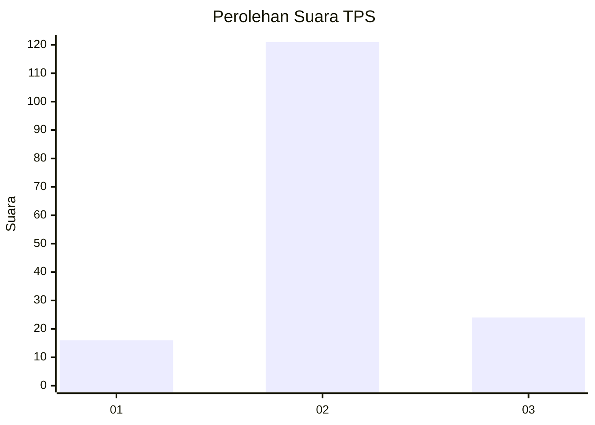

# Hasil

## Grafik

## Tabel

| No. | Nama Paslon    | Suara | Suara (raw) | Persentase |
|:--- |:-------------- | -----:| -----------:| ----------:|
| 1   | ANIES MUHAIMIN | 16    | [16][p-1]   | 9,94       |
| 2   | PRABOWO GIBRAN | 121   | [121][p-2]  | 75,16      |
| 3   | GANJAR MAHFUD  | 24    | [24][p-3]   | 14,91      |

[p-1]: https://github.com/gigit-pemilu/pemilu-2024-12-sumatera-utara/blob/main/pilpres/hitung-suara/sub/12-sumatera-utara/sub/08-simalungun/sub/11-tanah-jawa/sub/1018-pematang-tanah-jawa/sub/001-tps/sub/paslon-1.txt
[p-2]: https://github.com/gigit-pemilu/pemilu-2024-12-sumatera-utara/blob/main/pilpres/hitung-suara/sub/12-sumatera-utara/sub/08-simalungun/sub/11-tanah-jawa/sub/1018-pematang-tanah-jawa/sub/001-tps/sub/paslon-2.txt
[p-3]: https://github.com/gigit-pemilu/pemilu-2024-12-sumatera-utara/blob/main/pilpres/hitung-suara/sub/12-sumatera-utara/sub/08-simalungun/sub/11-tanah-jawa/sub/1018-pematang-tanah-jawa/sub/001-tps/sub/paslon-3.txt

## Foto C Plano

https://sirekap-obj-formc.kpu.go.id/559b/pemilu/ppwp/12/08/11/10/18/1208111018001-20240214-220712--5211c29e-4680-4edf-b156-dba2dcd83d9b.jpg

https://sirekap-obj-formc.kpu.go.id/559b/pemilu/ppwp/12/08/11/10/18/1208111018001-20240214-203808--acaf2419-491a-4d09-be53-54f69665df7d.jpg

https://sirekap-obj-formc.kpu.go.id/559b/pemilu/ppwp/12/08/11/10/18/1208111018001-20240214-203827--fca5a797-f909-47b4-9c48-fe0781022642.jpg

## Metadata

| Key        | Value               |
| ---------- | ------------------- |
| Time Stamp | 2024-02-15 00:41:44 |

