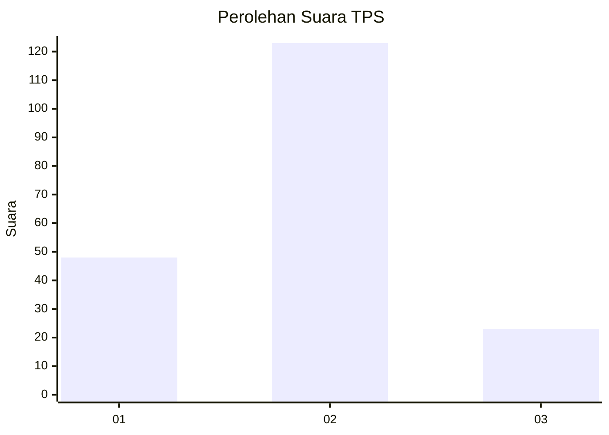
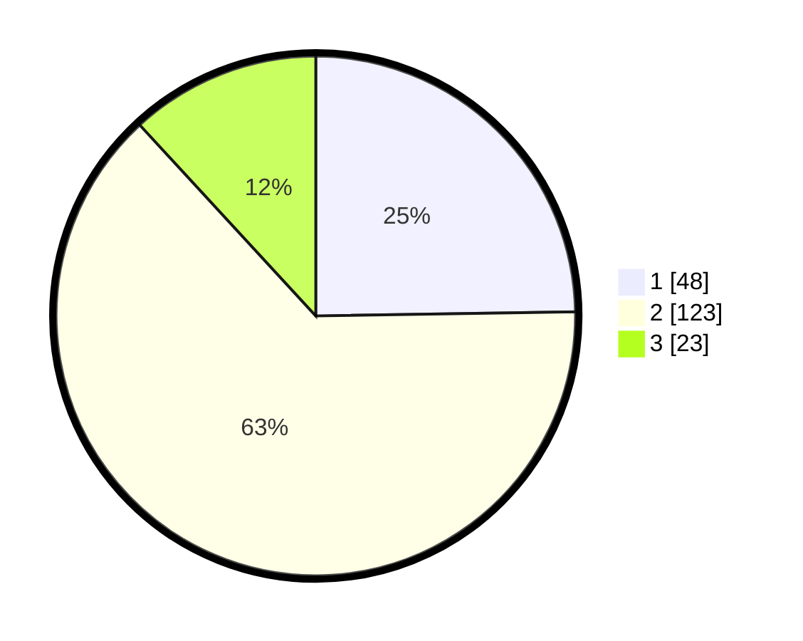

# Hasil

## Grafik

## Tabel

| No. | Nama Paslon    | Suara | Suara (raw) | Persentase |
|:--- |:-------------- | -----:| -----------:| ----------:|
| 1   | ANIES MUHAIMIN | 48    | [48][p-1]   | 24,74      |
| 2   | PRABOWO GIBRAN | 123   | [123][p-2]  | 63,40      |
| 3   | GANJAR MAHFUD  | 23    | [23][p-3]   | 11,86      |

[p-1]: https://github.com/gigit-pemilu/pemilu-2024/blob/main/pilpres/hitung-suara/sub/12-sumatera-utara/sub/08-simalungun/sub/11-tanah-jawa/sub/2001-tanjung-pasir/sub/001-tps/sub/paslon-1.txt
[p-2]: https://github.com/gigit-pemilu/pemilu-2024/blob/main/pilpres/hitung-suara/sub/12-sumatera-utara/sub/08-simalungun/sub/11-tanah-jawa/sub/2001-tanjung-pasir/sub/001-tps/sub/paslon-2.txt
[p-3]: https://github.com/gigit-pemilu/pemilu-2024/blob/main/pilpres/hitung-suara/sub/12-sumatera-utara/sub/08-simalungun/sub/11-tanah-jawa/sub/2001-tanjung-pasir/sub/001-tps/sub/paslon-3.txt

## Foto C Plano

https://sirekap-obj-formc.kpu.go.id/9508/pemilu/ppwp/12/08/11/20/01/1208112001001-20240215-022509--52825c66-5d01-4553-8593-35145be6b4fa.jpg

https://sirekap-obj-formc.kpu.go.id/9508/pemilu/ppwp/12/08/11/20/01/1208112001001-20240215-022524--dea35965-2c17-4097-8bb6-123a9a4f1777.jpg

https://sirekap-obj-formc.kpu.go.id/9508/pemilu/ppwp/12/08/11/20/01/1208112001001-20240215-022540--f3cd28d9-4525-4d82-848a-d734068ed9d0.jpg

## Metadata

| Key        | Value               |
| ---------- | ------------------- |
| Time Stamp | 2024-02-24 22:31:28 |

