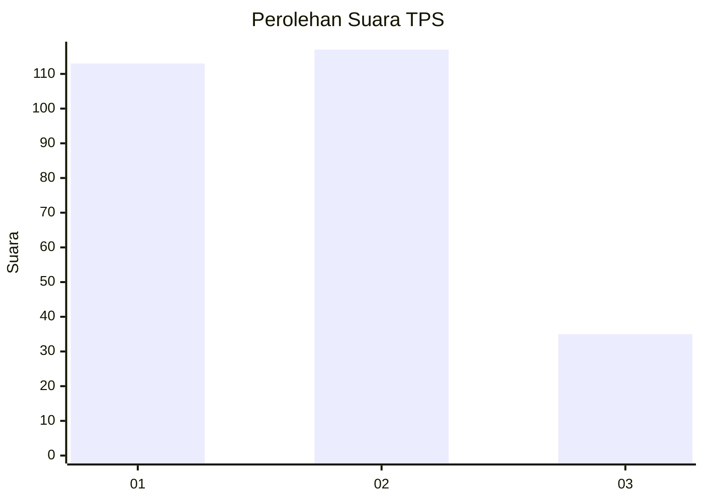
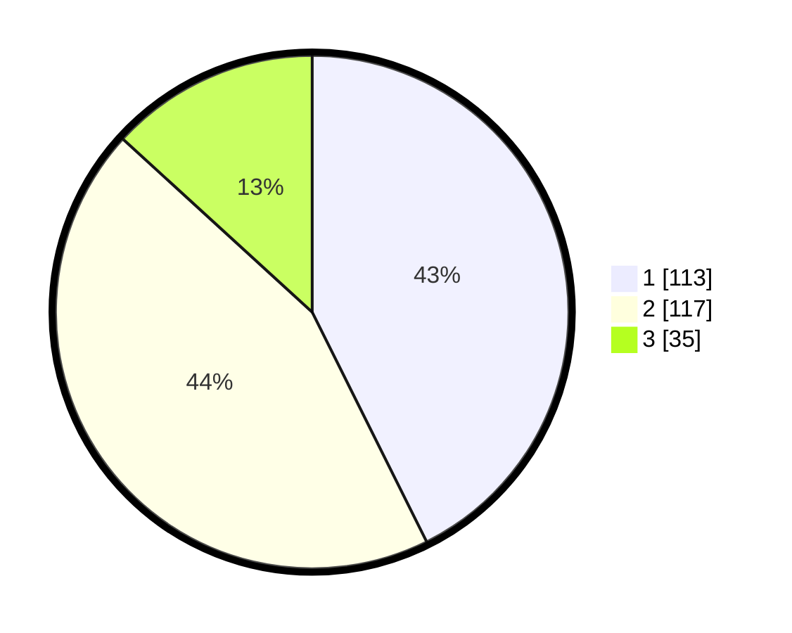

# Hasil

## Grafik

## Tabel

| No. | Nama Paslon    | Suara | Suara (raw) | Persentase |
|:--- |:-------------- | -----:| -----------:| ----------:|
| 1   | ANIES MUHAIMIN | 113   | [113][p-1]  | 42,64      |
| 2   | PRABOWO GIBRAN | 117   | [117][p-2]  | 44,15      |
| 3   | GANJAR MAHFUD  | 35    | [35][p-3]   | 13,21      |

[p-1]: https://github.com/gigit-pemilu/pemilu-2024/blob/main/pilpres/hitung-suara/sub/12-sumatera-utara/sub/08-simalungun/sub/11-tanah-jawa/sub/2005-bosar-galugur/sub/005-tps/sub/paslon-1.txt
[p-2]: https://github.com/gigit-pemilu/pemilu-2024/blob/main/pilpres/hitung-suara/sub/12-sumatera-utara/sub/08-simalungun/sub/11-tanah-jawa/sub/2005-bosar-galugur/sub/005-tps/sub/paslon-2.txt
[p-3]: https://github.com/gigit-pemilu/pemilu-2024/blob/main/pilpres/hitung-suara/sub/12-sumatera-utara/sub/08-simalungun/sub/11-tanah-jawa/sub/2005-bosar-galugur/sub/005-tps/sub/paslon-3.txt

## Foto C Plano

https://sirekap-obj-formc.kpu.go.id/1810/pemilu/ppwp/12/08/11/20/05/1208112005005-20240215-054359--4d80119e-17cd-4237-a5f4-1e08702e0769.jpg

https://sirekap-obj-formc.kpu.go.id/1810/pemilu/ppwp/12/08/11/20/05/1208112005005-20240215-054519--228809aa-04f5-41fc-9a7a-502540b5c2f5.jpg

https://sirekap-obj-formc.kpu.go.id/1810/pemilu/ppwp/12/08/11/20/05/1208112005005-20240215-054627--1531baba-7168-429f-a18f-9e1ef6492a51.jpg

## Metadata

| Key        | Value               |
| ---------- | ------------------- |
| Time Stamp | 2024-02-26 10:00:00 |

