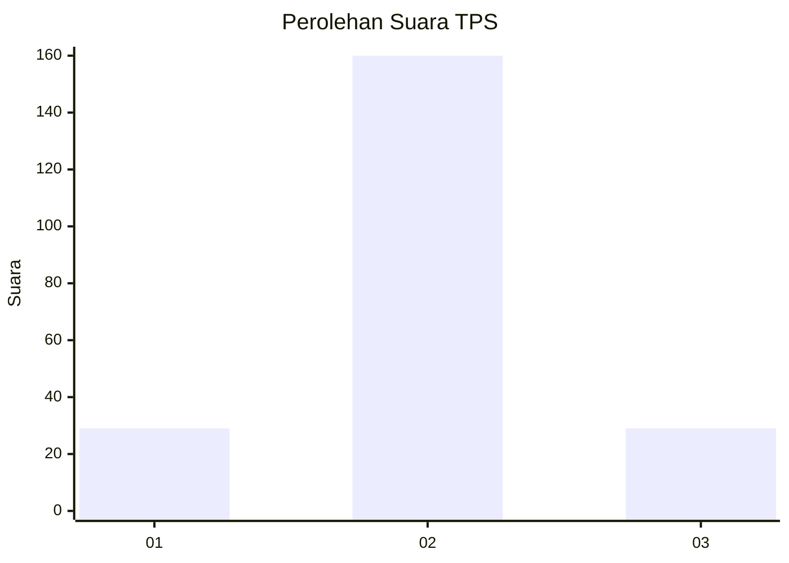
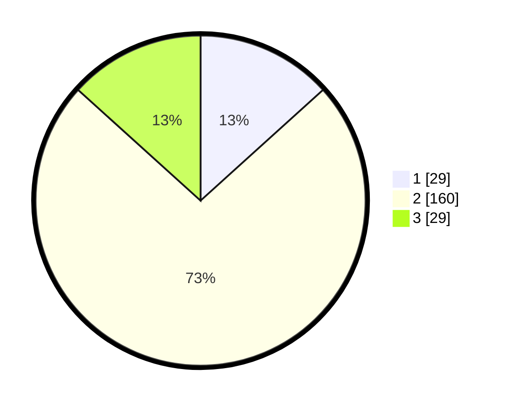

# Hasil

## Grafik

## Tabel

| No. | Nama Paslon    | Suara | Suara (raw) | Persentase |
|:--- |:-------------- | -----:| -----------:| ----------:|
| 1   | ANIES MUHAIMIN | 29    | [29][p-1]   | 13,30      |
| 2   | PRABOWO GIBRAN | 160   | [160][p-2]  | 73,39      |
| 3   | GANJAR MAHFUD  | 29    | [29][p-3]   | 13,30      |

[p-1]: https://github.com/gigit-pemilu/pemilu-2024-12-sumatera-utara/blob/main/pilpres/hitung-suara/sub/12-sumatera-utara/sub/08-simalungun/sub/12-hatonduhan/sub/2001-buntu-bayu/sub/001-tps/sub/paslon-1.txt
[p-2]: https://github.com/gigit-pemilu/pemilu-2024-12-sumatera-utara/blob/main/pilpres/hitung-suara/sub/12-sumatera-utara/sub/08-simalungun/sub/12-hatonduhan/sub/2001-buntu-bayu/sub/001-tps/sub/paslon-2.txt
[p-3]: https://github.com/gigit-pemilu/pemilu-2024-12-sumatera-utara/blob/main/pilpres/hitung-suara/sub/12-sumatera-utara/sub/08-simalungun/sub/12-hatonduhan/sub/2001-buntu-bayu/sub/001-tps/sub/paslon-3.txt

## Foto C Plano

https://sirekap-obj-formc.kpu.go.id/11c1/pemilu/ppwp/12/08/12/20/01/1208122001001-20240215-011544--e6ba477c-34be-4560-a8c3-4c50d871f215.jpg

https://sirekap-obj-formc.kpu.go.id/11c1/pemilu/ppwp/12/08/12/20/01/1208122001001-20240215-011708--2e74cbe9-d24f-4356-a40d-5d7db252bff9.jpg

https://sirekap-obj-formc.kpu.go.id/11c1/pemilu/ppwp/12/08/12/20/01/1208122001001-20240215-011908--9db863a6-1e3c-42c5-8a98-15413d4726e4.jpg

## Metadata

| Key        | Value               |
| ---------- | ------------------- |
| Time Stamp | 2024-02-19 06:16:00 |

