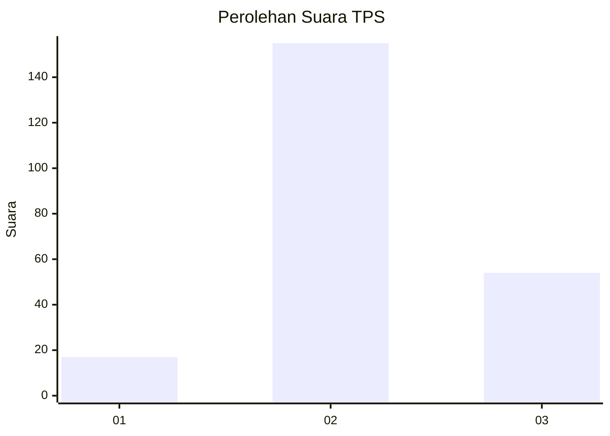
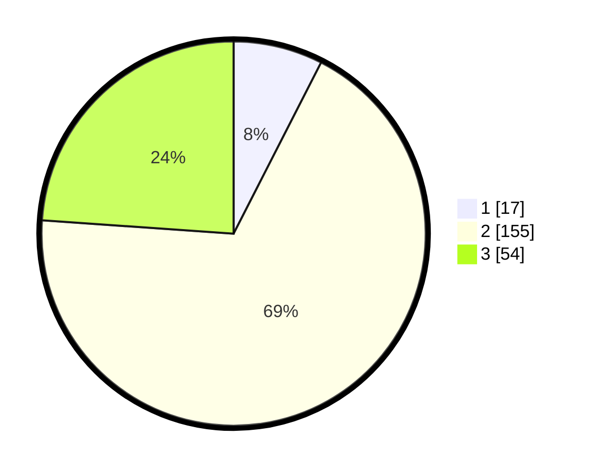

# Hasil

## Grafik

## Tabel

| No. | Nama Paslon    | Suara | Suara (raw) | Persentase |
|:--- |:-------------- | -----:| -----------:| ----------:|
| 1   | ANIES MUHAIMIN | 17    | [17][p-1]   | 7,52       |
| 2   | PRABOWO GIBRAN | 155   | [155][p-2]  | 68,58      |
| 3   | GANJAR MAHFUD  | 54    | [54][p-3]   | 23,89      |

[p-1]: https://github.com/gigit-pemilu/pemilu-2024-12-sumatera-utara/blob/main/pilpres/hitung-suara/sub/12-sumatera-utara/sub/08-simalungun/sub/12-hatonduhan/sub/2001-buntu-bayu/sub/003-tps/sub/paslon-1.txt
[p-2]: https://github.com/gigit-pemilu/pemilu-2024-12-sumatera-utara/blob/main/pilpres/hitung-suara/sub/12-sumatera-utara/sub/08-simalungun/sub/12-hatonduhan/sub/2001-buntu-bayu/sub/003-tps/sub/paslon-2.txt
[p-3]: https://github.com/gigit-pemilu/pemilu-2024-12-sumatera-utara/blob/main/pilpres/hitung-suara/sub/12-sumatera-utara/sub/08-simalungun/sub/12-hatonduhan/sub/2001-buntu-bayu/sub/003-tps/sub/paslon-3.txt

## Foto C Plano

https://sirekap-obj-formc.kpu.go.id/5e2a/pemilu/ppwp/12/08/12/20/01/1208122001003-20240215-094524--4fc5d8fd-f64a-493c-9aab-2d016acb56db.jpg

https://sirekap-obj-formc.kpu.go.id/5e2a/pemilu/ppwp/12/08/12/20/01/1208122001003-20240215-094630--6dee0a96-9f59-4ece-bd22-4efbf9d22bc5.jpg

https://sirekap-obj-formc.kpu.go.id/5e2a/pemilu/ppwp/12/08/12/20/01/1208122001003-20240215-094754--2b043316-9ecb-4a64-8559-a40157a78a07.jpg

## Metadata

| Key        | Value               |
| ---------- | ------------------- |
| Time Stamp | 2024-02-25 11:00:00 |

