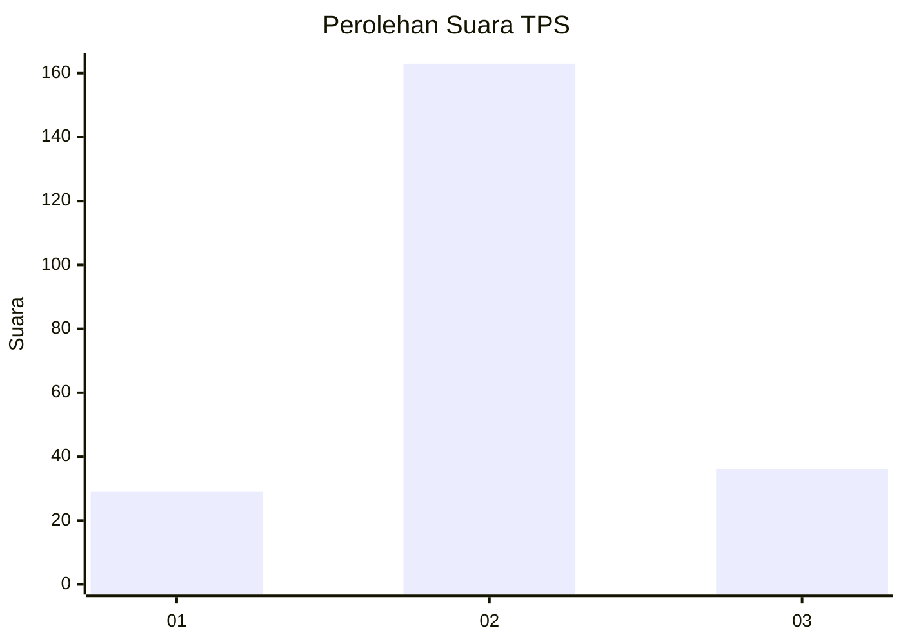
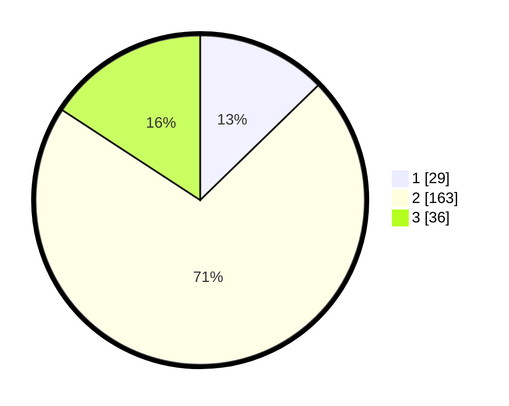

# Hasil

## Grafik

## Tabel

| No. | Nama Paslon    | Suara | Suara (raw) | Persentase |
|:--- |:-------------- | -----:| -----------:| ----------:|
| 1   | ANIES MUHAIMIN | 29    | [29][p-1]   | 12,72      |
| 2   | PRABOWO GIBRAN | 163   | [163][p-2]  | 71,49      |
| 3   | GANJAR MAHFUD  | 36    | [36][p-3]   | 15,79      |

[p-1]: https://github.com/gigit-pemilu/pemilu-2024/blob/main/pilpres/hitung-suara/sub/12-sumatera-utara/sub/08-simalungun/sub/12-hatonduhan/sub/2001-buntu-bayu/sub/006-tps/sub/paslon-1.txt
[p-2]: https://github.com/gigit-pemilu/pemilu-2024/blob/main/pilpres/hitung-suara/sub/12-sumatera-utara/sub/08-simalungun/sub/12-hatonduhan/sub/2001-buntu-bayu/sub/006-tps/sub/paslon-2.txt
[p-3]: https://github.com/gigit-pemilu/pemilu-2024/blob/main/pilpres/hitung-suara/sub/12-sumatera-utara/sub/08-simalungun/sub/12-hatonduhan/sub/2001-buntu-bayu/sub/006-tps/sub/paslon-3.txt

## Foto C Plano

https://sirekap-obj-formc.kpu.go.id/7ba8/pemilu/ppwp/12/08/12/20/01/1208122001006-20240215-023624--332dd2a1-508c-433d-bc20-858853c8a368.jpg

https://sirekap-obj-formc.kpu.go.id/7ba8/pemilu/ppwp/12/08/12/20/01/1208122001006-20240215-023925--8d44176a-eba5-4a04-9811-564af22ac107.jpg

https://sirekap-obj-formc.kpu.go.id/7ba8/pemilu/ppwp/12/08/12/20/01/1208122001006-20240215-024324--8064f2a1-b960-464c-9559-a54ed715e8fc.jpg

## Metadata

| Key        | Value               |
| ---------- | ------------------- |
| Time Stamp | 2024-02-24 22:31:28 |

