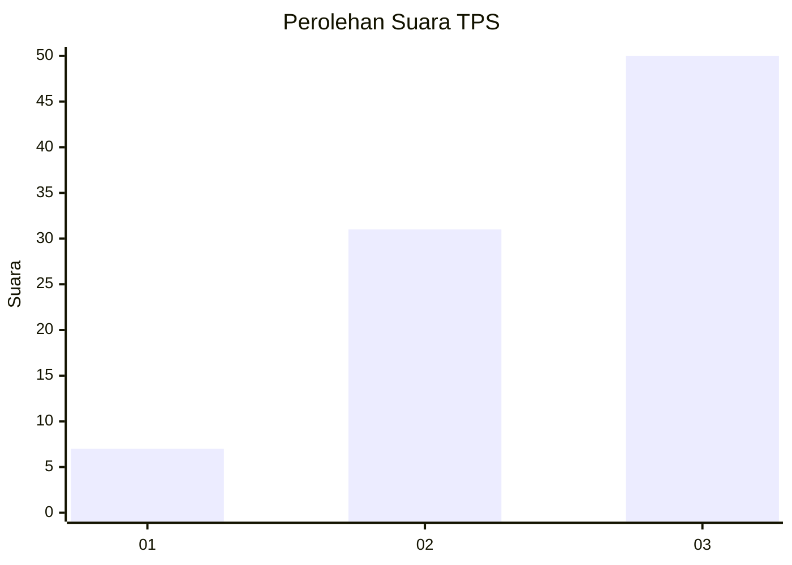
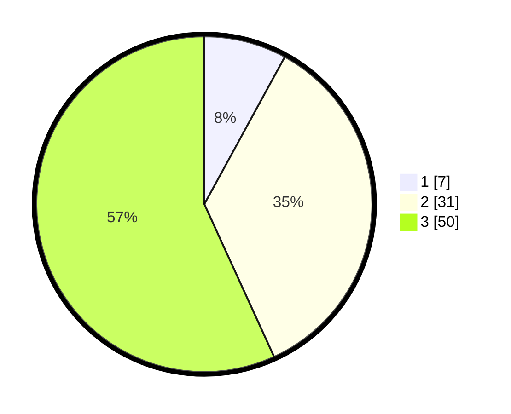

# Hasil

## Grafik

## Tabel

| No. | Nama Paslon    | Suara | Suara (raw) | Persentase |
|:--- |:-------------- | -----:| -----------:| ----------:|
| 1   | ANIES MUHAIMIN | 7     | [7][p-1]    | 7,95       |
| 2   | PRABOWO GIBRAN | 31    | [31][p-2]   | 35,23      |
| 3   | GANJAR MAHFUD  | 50    | [50][p-3]   | 56,82      |

[p-1]: https://github.com/gigit-pemilu/pemilu-2024-12-sumatera-utara/blob/main/pilpres/hitung-suara/sub/12-sumatera-utara/sub/08-simalungun/sub/12-hatonduhan/sub/2003-tangga-batu/sub/011-tps/sub/paslon-1.txt
[p-2]: https://github.com/gigit-pemilu/pemilu-2024-12-sumatera-utara/blob/main/pilpres/hitung-suara/sub/12-sumatera-utara/sub/08-simalungun/sub/12-hatonduhan/sub/2003-tangga-batu/sub/011-tps/sub/paslon-2.txt
[p-3]: https://github.com/gigit-pemilu/pemilu-2024-12-sumatera-utara/blob/main/pilpres/hitung-suara/sub/12-sumatera-utara/sub/08-simalungun/sub/12-hatonduhan/sub/2003-tangga-batu/sub/011-tps/sub/paslon-3.txt

## Foto C Plano

https://sirekap-obj-formc.kpu.go.id/dcd9/pemilu/ppwp/12/08/12/20/03/1208122003011-20240214-223927--209bcf44-4853-4efd-bad8-37a0669f0fcd.jpg

https://sirekap-obj-formc.kpu.go.id/dcd9/pemilu/ppwp/12/08/12/20/03/1208122003011-20240214-223943--b895160e-8a3c-42df-bf54-8f1381fdafa2.jpg

https://sirekap-obj-formc.kpu.go.id/dcd9/pemilu/ppwp/12/08/12/20/03/1208122003011-20240214-223956--cc9cee6c-393d-4920-ab05-3104f21edd68.jpg

## Metadata

| Key        | Value               |
| ---------- | ------------------- |
| Time Stamp | 2024-02-26 16:00:00 |

