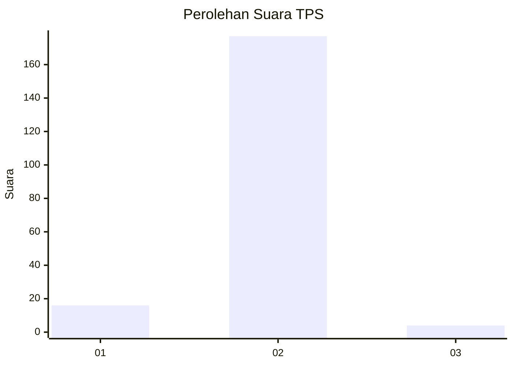
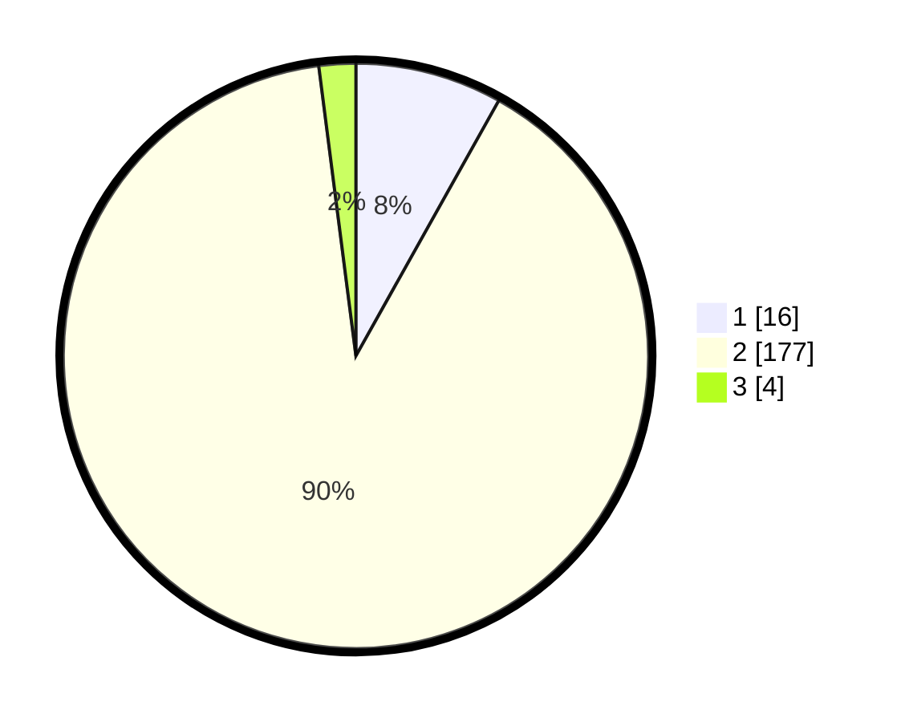

# Hasil

## Grafik

## Tabel

| No. | Nama Paslon    | Suara | Suara (raw) | Persentase |
|:--- |:-------------- | -----:| -----------:| ----------:|
| 1   | ANIES MUHAIMIN | 16    | [16][p-1]   | 8,12       |
| 2   | PRABOWO GIBRAN | 177   | [177][p-2]  | 89,85      |
| 3   | GANJAR MAHFUD  | 4     | [4][p-3]    | 2,03       |

[p-1]: https://github.com/gigit-pemilu/pemilu-2024-12-sumatera-utara/blob/main/pilpres/hitung-suara/sub/12-sumatera-utara/sub/08-simalungun/sub/12-hatonduhan/sub/2004-buntu-turunan/sub/003-tps/sub/paslon-1.txt
[p-2]: https://github.com/gigit-pemilu/pemilu-2024-12-sumatera-utara/blob/main/pilpres/hitung-suara/sub/12-sumatera-utara/sub/08-simalungun/sub/12-hatonduhan/sub/2004-buntu-turunan/sub/003-tps/sub/paslon-2.txt
[p-3]: https://github.com/gigit-pemilu/pemilu-2024-12-sumatera-utara/blob/main/pilpres/hitung-suara/sub/12-sumatera-utara/sub/08-simalungun/sub/12-hatonduhan/sub/2004-buntu-turunan/sub/003-tps/sub/paslon-3.txt

## Foto C Plano

https://sirekap-obj-formc.kpu.go.id/dbb1/pemilu/ppwp/12/08/12/20/04/1208122004003-20240214-195422--c3b89c11-96cf-4122-8881-6542ae3b83ee.jpg

https://sirekap-obj-formc.kpu.go.id/dbb1/pemilu/ppwp/12/08/12/20/04/1208122004003-20240214-195628--fb20c756-03dc-4f22-9a80-094f490bb9f6.jpg

https://sirekap-obj-formc.kpu.go.id/dbb1/pemilu/ppwp/12/08/12/20/04/1208122004003-20240214-195815--1f26537a-3a36-4eb6-beff-6eb454fd6aaf.jpg

## Metadata

| Key        | Value               |
| ---------- | ------------------- |
| Time Stamp | 2024-02-17 19:30:00 |

