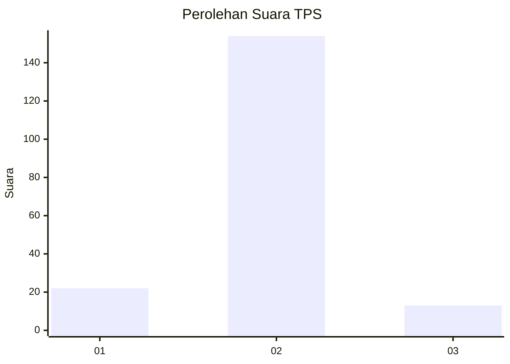
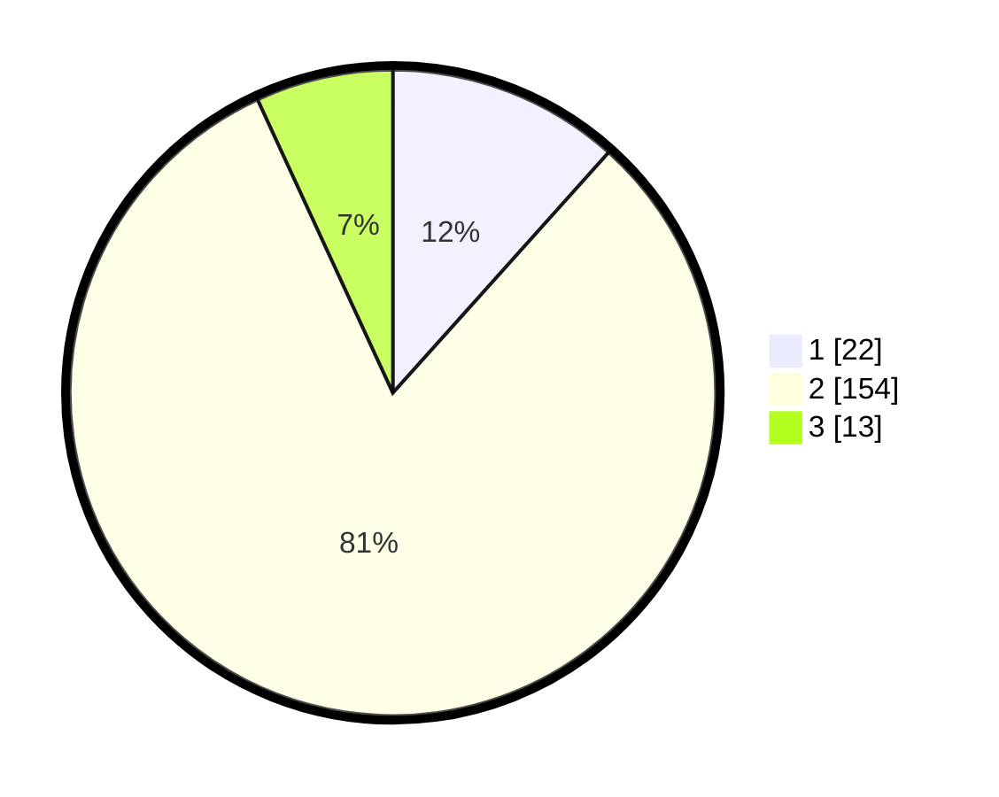

# Hasil

## Grafik

## Tabel

| No. | Nama Paslon    | Suara | Suara (raw) | Persentase |
|:--- |:-------------- | -----:| -----------:| ----------:|
| 1   | ANIES MUHAIMIN | 22    | [22][p-1]   | 11,64      |
| 2   | PRABOWO GIBRAN | 154   | [154][p-2]  | 81,48      |
| 3   | GANJAR MAHFUD  | 13    | [13][p-3]   | 6,88       |

[p-1]: https://github.com/gigit-pemilu/pemilu-2024/blob/main/pilpres/hitung-suara/sub/12-sumatera-utara/sub/08-simalungun/sub/12-hatonduhan/sub/2004-buntu-turunan/sub/004-tps/sub/paslon-1.txt
[p-2]: https://github.com/gigit-pemilu/pemilu-2024/blob/main/pilpres/hitung-suara/sub/12-sumatera-utara/sub/08-simalungun/sub/12-hatonduhan/sub/2004-buntu-turunan/sub/004-tps/sub/paslon-2.txt
[p-3]: https://github.com/gigit-pemilu/pemilu-2024/blob/main/pilpres/hitung-suara/sub/12-sumatera-utara/sub/08-simalungun/sub/12-hatonduhan/sub/2004-buntu-turunan/sub/004-tps/sub/paslon-3.txt

## Foto C Plano

https://sirekap-obj-formc.kpu.go.id/2c79/pemilu/ppwp/12/08/12/20/04/1208122004004-20240214-233724--8c7127f3-2c91-455a-ad0b-7f5a3d6e15a8.jpg

https://sirekap-obj-formc.kpu.go.id/2c79/pemilu/ppwp/12/08/12/20/04/1208122004004-20240214-233921--83885567-87ff-4d3e-a585-3b8936cfc3d4.jpg

https://sirekap-obj-formc.kpu.go.id/2c79/pemilu/ppwp/12/08/12/20/04/1208122004004-20240214-234054--2cfd8483-bf01-4ef8-915c-56e4c794c25d.jpg

## Metadata

| Key        | Value               |
| ---------- | ------------------- |
| Time Stamp | 2024-02-17 19:30:00 |

