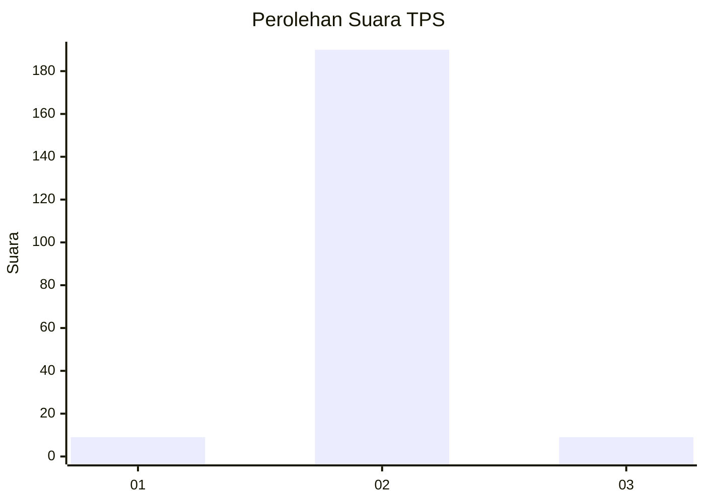
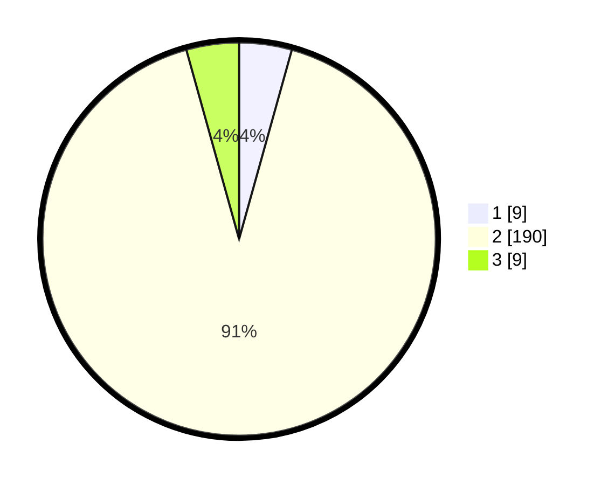

# Hasil

## Grafik

## Tabel

| No. | Nama Paslon    | Suara | Suara (raw) | Persentase |
|:--- |:-------------- | -----:| -----------:| ----------:|
| 1   | ANIES MUHAIMIN | 9     | [9][p-1]    | 4,33       |
| 2   | PRABOWO GIBRAN | 190   | [190][p-2]  | 91,35      |
| 3   | GANJAR MAHFUD  | 9     | [9][p-3]    | 4,33       |

[p-1]: https://github.com/gigit-pemilu/pemilu-2024-12-sumatera-utara/blob/main/pilpres/hitung-suara/sub/12-sumatera-utara/sub/08-simalungun/sub/12-hatonduhan/sub/2004-buntu-turunan/sub/005-tps/sub/paslon-1.txt
[p-2]: https://github.com/gigit-pemilu/pemilu-2024-12-sumatera-utara/blob/main/pilpres/hitung-suara/sub/12-sumatera-utara/sub/08-simalungun/sub/12-hatonduhan/sub/2004-buntu-turunan/sub/005-tps/sub/paslon-2.txt
[p-3]: https://github.com/gigit-pemilu/pemilu-2024-12-sumatera-utara/blob/main/pilpres/hitung-suara/sub/12-sumatera-utara/sub/08-simalungun/sub/12-hatonduhan/sub/2004-buntu-turunan/sub/005-tps/sub/paslon-3.txt

## Foto C Plano

https://sirekap-obj-formc.kpu.go.id/9cfb/pemilu/ppwp/12/08/12/20/04/1208122004005-20240214-221107--6dbe979b-23b4-4bf9-a1c3-cf82b47f56f6.jpg

https://sirekap-obj-formc.kpu.go.id/9cfb/pemilu/ppwp/12/08/12/20/04/1208122004005-20240214-220534--19f61f56-df44-4e99-a8d8-94fb6b56f8ff.jpg

https://sirekap-obj-formc.kpu.go.id/9cfb/pemilu/ppwp/12/08/12/20/04/1208122004005-20240214-220715--e88de3cd-5b8c-4ae5-bd6c-cec8be9fb2d2.jpg

## Metadata

| Key        | Value               |
| ---------- | ------------------- |
| Time Stamp | 2024-02-25 16:00:00 |

