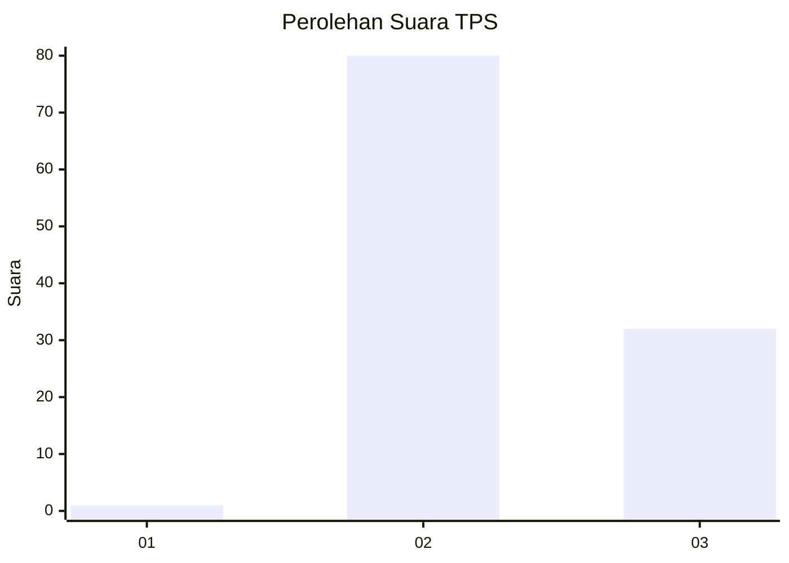
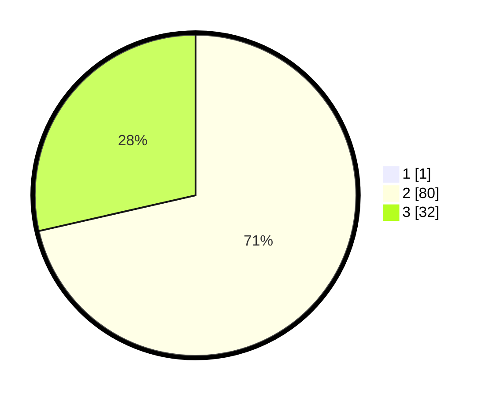

# Hasil

## Grafik

## Tabel

| No. | Nama Paslon    | Suara | Suara (raw) | Persentase |
|:--- |:-------------- | -----:| -----------:| ----------:|
| 1   | ANIES MUHAIMIN | 1     | [1][p-1]    | 0,88       |
| 2   | PRABOWO GIBRAN | 80    | [80][p-2]   | 70,80      |
| 3   | GANJAR MAHFUD  | 32    | [32][p-3]   | 28,32      |

[p-1]: https://github.com/gigit-pemilu/pemilu-2024-12-sumatera-utara/blob/main/pilpres/hitung-suara/sub/12-sumatera-utara/sub/08-simalungun/sub/13-dolok-panribuan/sub/2004-marihat-dolok/sub/002-tps/sub/paslon-1.txt
[p-2]: https://github.com/gigit-pemilu/pemilu-2024-12-sumatera-utara/blob/main/pilpres/hitung-suara/sub/12-sumatera-utara/sub/08-simalungun/sub/13-dolok-panribuan/sub/2004-marihat-dolok/sub/002-tps/sub/paslon-2.txt
[p-3]: https://github.com/gigit-pemilu/pemilu-2024-12-sumatera-utara/blob/main/pilpres/hitung-suara/sub/12-sumatera-utara/sub/08-simalungun/sub/13-dolok-panribuan/sub/2004-marihat-dolok/sub/002-tps/sub/paslon-3.txt

## Foto C Plano

https://sirekap-obj-formc.kpu.go.id/2518/pemilu/ppwp/12/08/13/20/04/1208132004002-20240215-105649--ca12462c-f898-442d-81a5-9a366600b133.jpg

https://sirekap-obj-formc.kpu.go.id/2518/pemilu/ppwp/12/08/13/20/04/1208132004002-20240215-105958--8a1b7636-293d-45b5-ba0e-af229e2f868b.jpg

https://sirekap-obj-formc.kpu.go.id/2518/pemilu/ppwp/12/08/13/20/04/1208132004002-20240215-110505--dd9c38ad-9097-47d5-baea-b419684e5e47.jpg

## Metadata

| Key        | Value               |
| ---------- | ------------------- |
| Time Stamp | 2024-02-17 08:30:03 |

