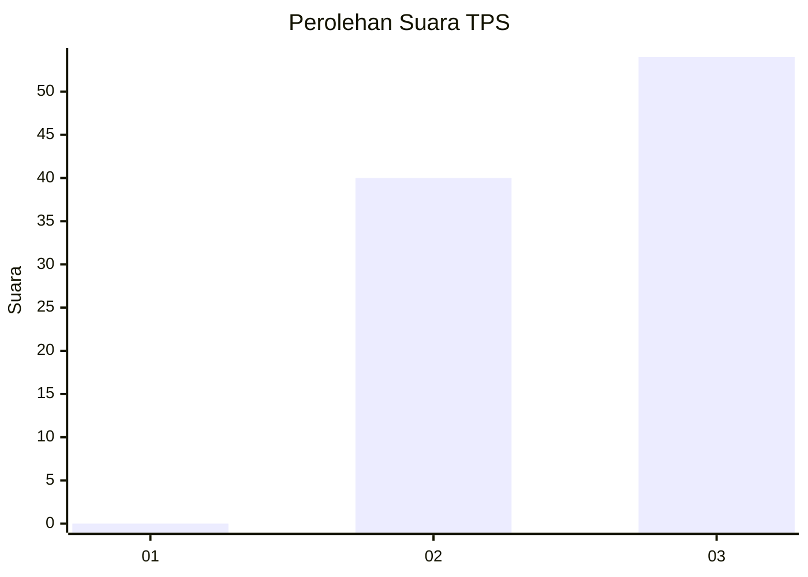
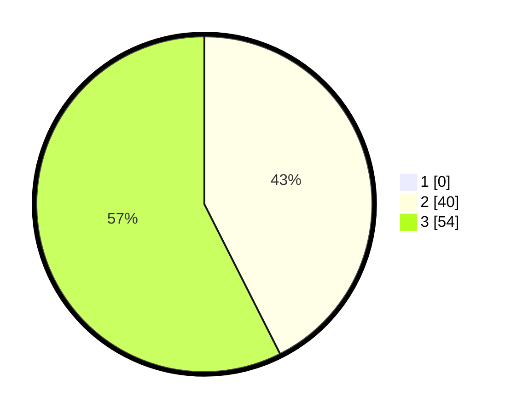

# Hasil

## Grafik

## Tabel

| No. | Nama Paslon    | Suara | Suara (raw) | Persentase |
|:--- |:-------------- | -----:| -----------:| ----------:|
| 1   | ANIES MUHAIMIN | 0     | [0][p-1]    | 0,00       |
| 2   | PRABOWO GIBRAN | 40    | [40][p-2]   | 42,55      |
| 3   | GANJAR MAHFUD  | 54    | [54][p-3]   | 57,45      |

[p-1]: https://github.com/gigit-pemilu/pemilu-2024/blob/main/pilpres/hitung-suara/sub/12-sumatera-utara/sub/08-simalungun/sub/13-dolok-panribuan/sub/2011-marihat-marsada/sub/003-tps/sub/paslon-1.txt
[p-2]: https://github.com/gigit-pemilu/pemilu-2024/blob/main/pilpres/hitung-suara/sub/12-sumatera-utara/sub/08-simalungun/sub/13-dolok-panribuan/sub/2011-marihat-marsada/sub/003-tps/sub/paslon-2.txt
[p-3]: https://github.com/gigit-pemilu/pemilu-2024/blob/main/pilpres/hitung-suara/sub/12-sumatera-utara/sub/08-simalungun/sub/13-dolok-panribuan/sub/2011-marihat-marsada/sub/003-tps/sub/paslon-3.txt

## Foto C Plano

https://sirekap-obj-formc.kpu.go.id/068f/pemilu/ppwp/12/08/13/20/11/1208132011003-20240215-110826--0d945ec1-94de-448c-b237-ca5431847984.jpg

https://sirekap-obj-formc.kpu.go.id/068f/pemilu/ppwp/12/08/13/20/11/1208132011003-20240215-110448--484550f9-bdbf-45cb-845c-d7ac4c41cd5b.jpg

https://sirekap-obj-formc.kpu.go.id/068f/pemilu/ppwp/12/08/13/20/11/1208132011003-20240215-110804--9978b1f0-68f4-48d4-aa96-93170794f11d.jpg

## Metadata

| Key        | Value               |
| ---------- | ------------------- |
| Time Stamp | 2024-02-16 21:01:00 |

