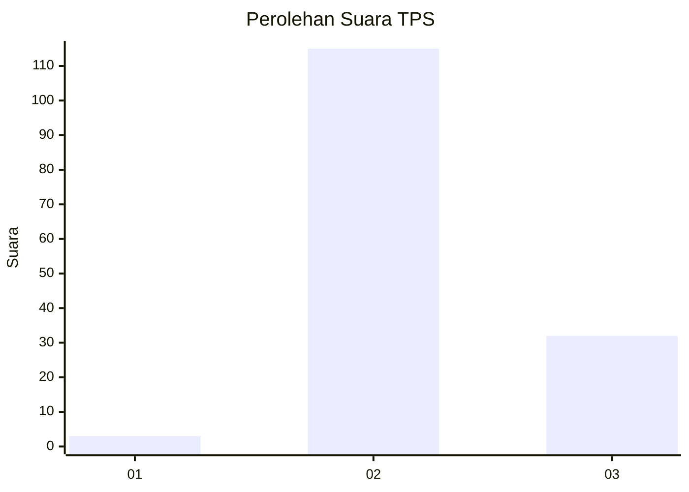

# Hasil

## Grafik

## Tabel

| No. | Nama Paslon    | Suara | Suara (raw) | Persentase |
|:--- |:-------------- | -----:| -----------:| ----------:|
| 1   | ANIES MUHAIMIN | 3     | [3][p-1]    | 2,00       |
| 2   | PRABOWO GIBRAN | 115   | [115][p-2]  | 76,67      |
| 3   | GANJAR MAHFUD  | 32    | [32][p-3]   | 21,33      |

[p-1]: https://github.com/gigit-pemilu/pemilu-2024-12-sumatera-utara/blob/main/pilpres/hitung-suara/sub/12-sumatera-utara/sub/08-simalungun/sub/14-purba/sub/1008-tiga-runggu/sub/004-tps/sub/paslon-1.txt
[p-2]: https://github.com/gigit-pemilu/pemilu-2024-12-sumatera-utara/blob/main/pilpres/hitung-suara/sub/12-sumatera-utara/sub/08-simalungun/sub/14-purba/sub/1008-tiga-runggu/sub/004-tps/sub/paslon-2.txt
[p-3]: https://github.com/gigit-pemilu/pemilu-2024-12-sumatera-utara/blob/main/pilpres/hitung-suara/sub/12-sumatera-utara/sub/08-simalungun/sub/14-purba/sub/1008-tiga-runggu/sub/004-tps/sub/paslon-3.txt

## Foto C Plano

https://sirekap-obj-formc.kpu.go.id/7df7/pemilu/ppwp/12/08/14/10/08/1208141008004-20240215-003703--408ab86b-10ff-41af-ba48-1a7aac8f7615.jpg

https://sirekap-obj-formc.kpu.go.id/7df7/pemilu/ppwp/12/08/14/10/08/1208141008004-20240215-003800--8c69ee0d-8bc7-4262-8301-173ec540d917.jpg

https://sirekap-obj-formc.kpu.go.id/7df7/pemilu/ppwp/12/08/14/10/08/1208141008004-20240215-003853--0e67e810-1553-4387-b60a-818674f1c647.jpg

## Metadata

| Key        | Value               |
| ---------- | ------------------- |
| Time Stamp | 2024-02-25 13:00:00 |

