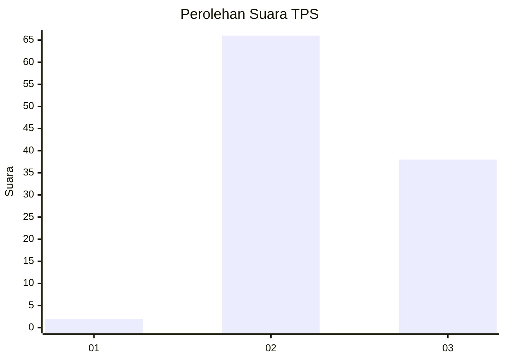
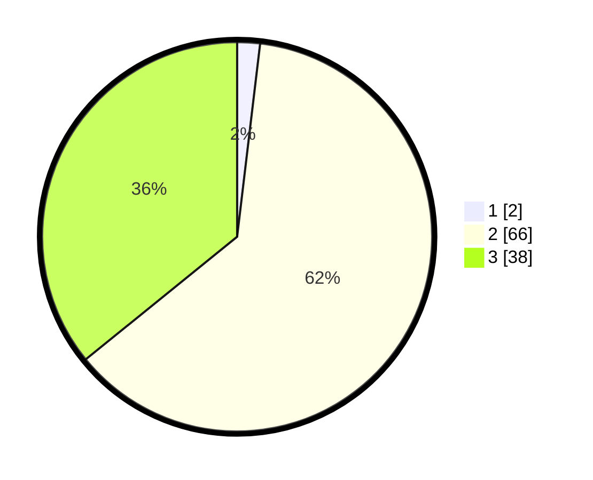

# Hasil

## Grafik

## Tabel

| No. | Nama Paslon    | Suara | Suara (raw) | Persentase |
|:--- |:-------------- | -----:| -----------:| ----------:|
| 1   | ANIES MUHAIMIN | 2     | [2][p-1]    | 1,89       |
| 2   | PRABOWO GIBRAN | 66    | [66][p-2]   | 62,26      |
| 3   | GANJAR MAHFUD  | 38    | [38][p-3]   | 35,85      |

[p-1]: https://github.com/gigit-pemilu/pemilu-2024-12-sumatera-utara/blob/main/pilpres/hitung-suara/sub/12-sumatera-utara/sub/08-simalungun/sub/14-purba/sub/2001-purba-tongah/sub/005-tps/sub/paslon-1.txt
[p-2]: https://github.com/gigit-pemilu/pemilu-2024-12-sumatera-utara/blob/main/pilpres/hitung-suara/sub/12-sumatera-utara/sub/08-simalungun/sub/14-purba/sub/2001-purba-tongah/sub/005-tps/sub/paslon-2.txt
[p-3]: https://github.com/gigit-pemilu/pemilu-2024-12-sumatera-utara/blob/main/pilpres/hitung-suara/sub/12-sumatera-utara/sub/08-simalungun/sub/14-purba/sub/2001-purba-tongah/sub/005-tps/sub/paslon-3.txt

## Foto C Plano

https://sirekap-obj-formc.kpu.go.id/2faf/pemilu/ppwp/12/08/14/20/01/1208142001005-20240214-141542--15d39fb3-091f-4d7a-bf40-73c1e88cc1e3.jpg

https://sirekap-obj-formc.kpu.go.id/2faf/pemilu/ppwp/12/08/14/20/01/1208142001005-20240214-141709--30e15247-8de1-4bbc-b220-702a0e3e4c7b.jpg

https://sirekap-obj-formc.kpu.go.id/2faf/pemilu/ppwp/12/08/14/20/01/1208142001005-20240214-220245--2383aa10-6730-4b12-a91b-ae27a5cc1409.jpg

## Metadata

| Key        | Value               |
| ---------- | ------------------- |
| Time Stamp | 2024-02-15 00:41:44 |

