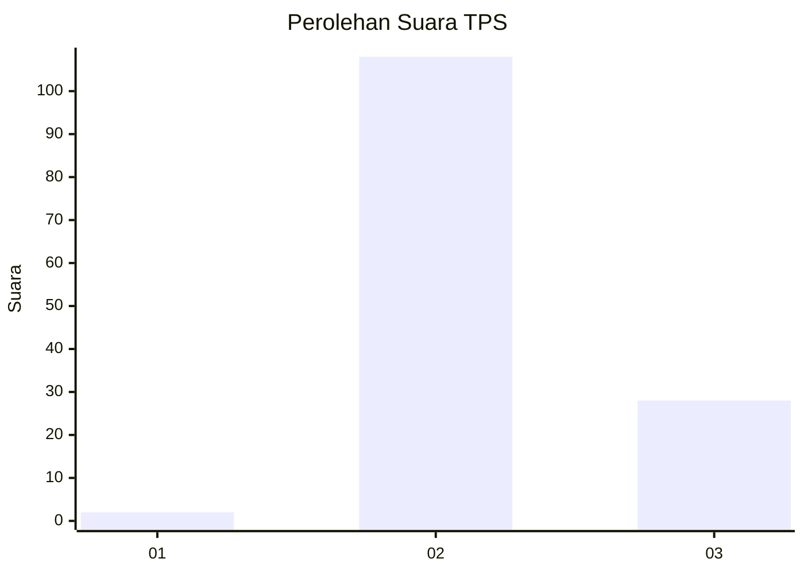

# Hasil

## Grafik

## Tabel

| No. | Nama Paslon    | Suara | Suara (raw) | Persentase |
|:--- |:-------------- | -----:| -----------:| ----------:|
| 1   | ANIES MUHAIMIN | 2     | [2][p-1]    | 1,45       |
| 2   | PRABOWO GIBRAN | 108   | [108][p-2]  | 78,26      |
| 3   | GANJAR MAHFUD  | 28    | [28][p-3]   | 20,29      |

[p-1]: https://github.com/gigit-pemilu/pemilu-2024-12-sumatera-utara/blob/main/pilpres/hitung-suara/sub/12-sumatera-utara/sub/08-simalungun/sub/14-purba/sub/2007-tano-tinggir/sub/001-tps/sub/paslon-1.txt
[p-2]: https://github.com/gigit-pemilu/pemilu-2024-12-sumatera-utara/blob/main/pilpres/hitung-suara/sub/12-sumatera-utara/sub/08-simalungun/sub/14-purba/sub/2007-tano-tinggir/sub/001-tps/sub/paslon-2.txt
[p-3]: https://github.com/gigit-pemilu/pemilu-2024-12-sumatera-utara/blob/main/pilpres/hitung-suara/sub/12-sumatera-utara/sub/08-simalungun/sub/14-purba/sub/2007-tano-tinggir/sub/001-tps/sub/paslon-3.txt

## Foto C Plano

https://sirekap-obj-formc.kpu.go.id/c212/pemilu/ppwp/12/08/14/20/07/1208142007001-20240214-221024--2616582a-ffb8-44b3-8dae-853308ff3fc8.jpg

https://sirekap-obj-formc.kpu.go.id/c212/pemilu/ppwp/12/08/14/20/07/1208142007001-20240214-221143--0e4d81b9-a3fb-46b2-8808-2840b8c7b7af.jpg

https://sirekap-obj-formc.kpu.go.id/c212/pemilu/ppwp/12/08/14/20/07/1208142007001-20240214-220705--77201089-f8f4-4b63-ba5f-e4383b10d6ce.jpg

## Metadata

| Key        | Value               |
| ---------- | ------------------- |
| Time Stamp | 2024-02-24 22:31:28 |

