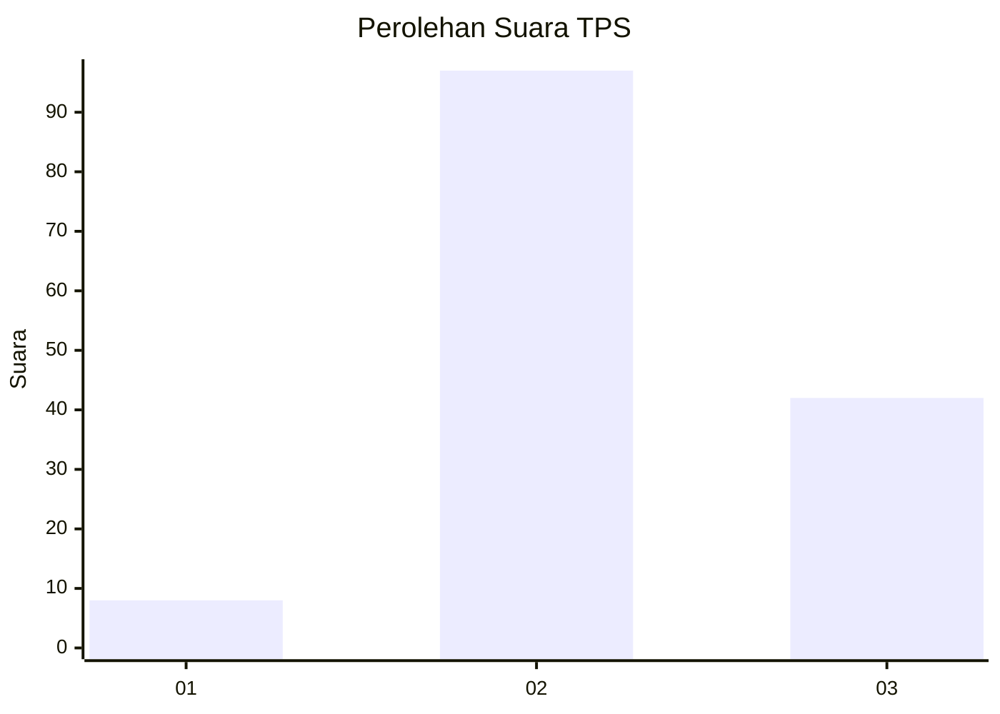
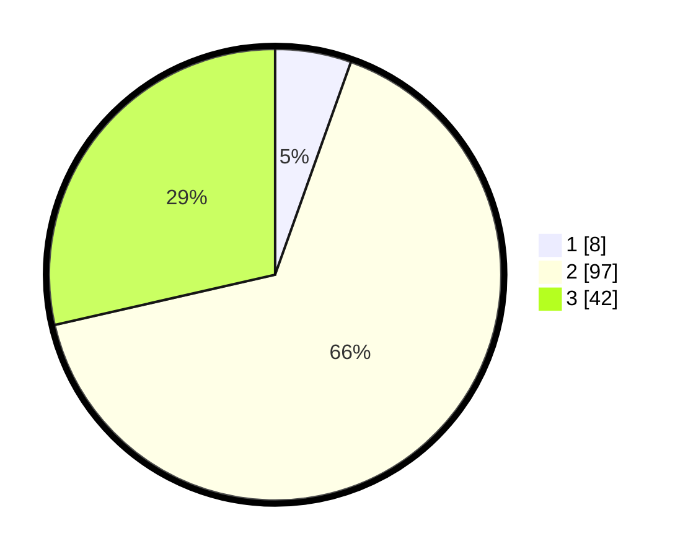

# Hasil

## Grafik

## Tabel

| No. | Nama Paslon    | Suara | Suara (raw) | Persentase |
|:--- |:-------------- | -----:| -----------:| ----------:|
| 1   | ANIES MUHAIMIN | 8     | [8][p-1]    | 5,44       |
| 2   | PRABOWO GIBRAN | 97    | [97][p-2]   | 65,99      |
| 3   | GANJAR MAHFUD  | 42    | [42][p-3]   | 28,57      |

[p-1]: https://github.com/gigit-pemilu/pemilu-2024/blob/main/pilpres/hitung-suara/sub/12-sumatera-utara/sub/08-simalungun/sub/14-purba/sub/2007-tano-tinggir/sub/004-tps/sub/paslon-1.txt
[p-2]: https://github.com/gigit-pemilu/pemilu-2024/blob/main/pilpres/hitung-suara/sub/12-sumatera-utara/sub/08-simalungun/sub/14-purba/sub/2007-tano-tinggir/sub/004-tps/sub/paslon-2.txt
[p-3]: https://github.com/gigit-pemilu/pemilu-2024/blob/main/pilpres/hitung-suara/sub/12-sumatera-utara/sub/08-simalungun/sub/14-purba/sub/2007-tano-tinggir/sub/004-tps/sub/paslon-3.txt

## Foto C Plano

https://sirekap-obj-formc.kpu.go.id/5419/pemilu/ppwp/12/08/14/20/07/1208142007004-20240214-141429--e2b6b0a7-0a24-4416-9dae-8f4b1498f2ab.jpg

https://sirekap-obj-formc.kpu.go.id/5419/pemilu/ppwp/12/08/14/20/07/1208142007004-20240214-141550--79045435-651e-4b85-a7d9-3d618e3f59ee.jpg

https://sirekap-obj-formc.kpu.go.id/5419/pemilu/ppwp/12/08/14/20/07/1208142007004-20240214-231710--b37c75f7-c19f-4111-941d-aab6c4a22462.jpg

## Metadata

| Key        | Value               |
| ---------- | ------------------- |
| Time Stamp | 2024-02-25 18:00:00 |

