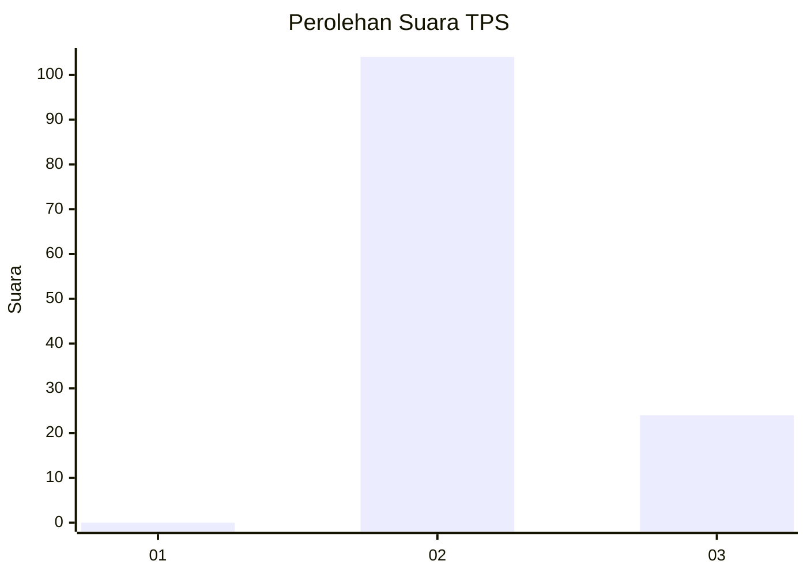
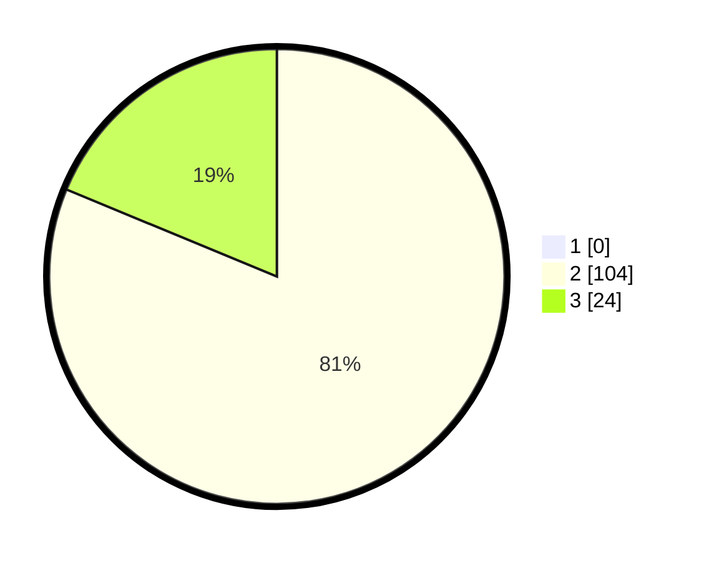

# Hasil

## Grafik

## Tabel

| No. | Nama Paslon    | Suara | Suara (raw) | Persentase |
|:--- |:-------------- | -----:| -----------:| ----------:|
| 1   | ANIES MUHAIMIN | 0     | [0][p-1]    | 0,00       |
| 2   | PRABOWO GIBRAN | 104   | [104][p-2]  | 81,25      |
| 3   | GANJAR MAHFUD  | 24    | [24][p-3]   | 18,75      |

[p-1]: https://github.com/gigit-pemilu/pemilu-2024/blob/main/pilpres/hitung-suara/sub/12-sumatera-utara/sub/08-simalungun/sub/14-purba/sub/2014-urung-pane/sub/003-tps/sub/paslon-1.txt
[p-2]: https://github.com/gigit-pemilu/pemilu-2024/blob/main/pilpres/hitung-suara/sub/12-sumatera-utara/sub/08-simalungun/sub/14-purba/sub/2014-urung-pane/sub/003-tps/sub/paslon-2.txt
[p-3]: https://github.com/gigit-pemilu/pemilu-2024/blob/main/pilpres/hitung-suara/sub/12-sumatera-utara/sub/08-simalungun/sub/14-purba/sub/2014-urung-pane/sub/003-tps/sub/paslon-3.txt

## Foto C Plano

https://sirekap-obj-formc.kpu.go.id/bd83/pemilu/ppwp/12/08/14/20/14/1208142014003-20240217-181753--6dabc6f8-9537-4b32-9a10-4002bc408c1e.jpg

https://sirekap-obj-formc.kpu.go.id/bd83/pemilu/ppwp/12/08/14/20/14/1208142014003-20240215-011542--fcaa4a31-7282-4ef0-912b-08641eddef04.jpg

https://sirekap-obj-formc.kpu.go.id/bd83/pemilu/ppwp/12/08/14/20/14/1208142014003-20240216-111258--f885421d-e7c8-4f03-86cb-c747cbd5e063.jpg

## Metadata

| Key        | Value               |
| ---------- | ------------------- |
| Time Stamp | 2024-02-17 18:30:00 |

