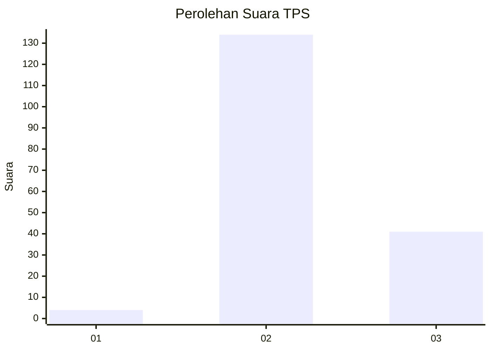
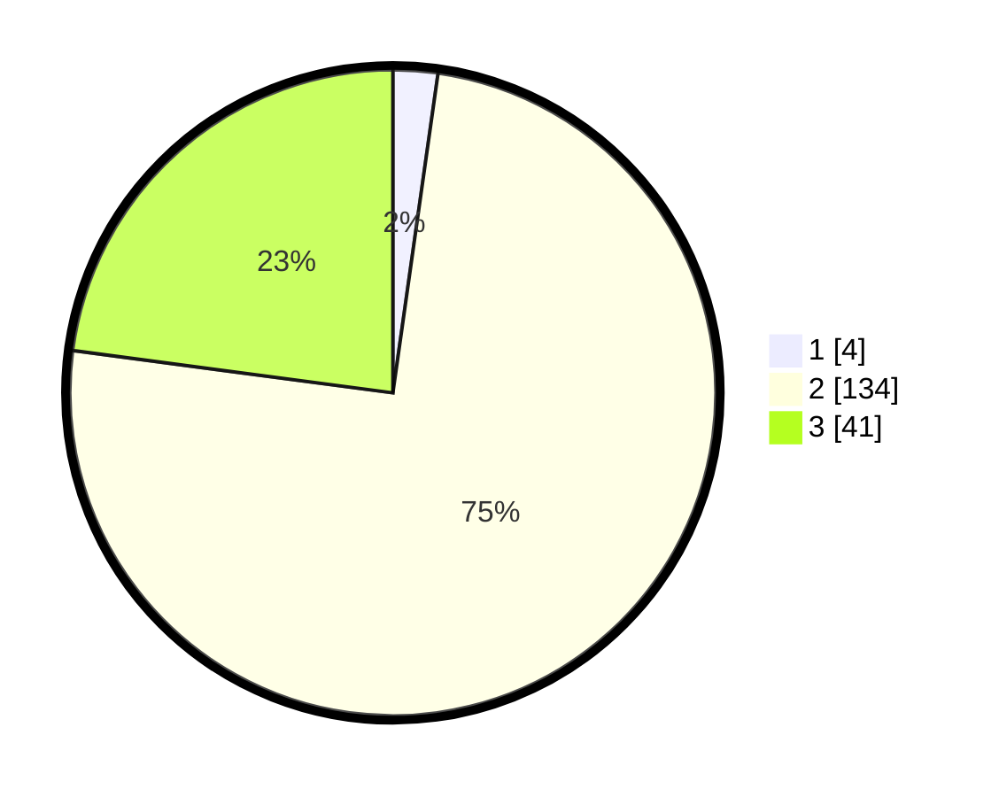

# Hasil

## Grafik

## Tabel

| No. | Nama Paslon    | Suara | Suara (raw) | Persentase |
|:--- |:-------------- | -----:| -----------:| ----------:|
| 1   | ANIES MUHAIMIN | 4     | [4][p-1]    | 2,23       |
| 2   | PRABOWO GIBRAN | 134   | [134][p-2]  | 74,86      |
| 3   | GANJAR MAHFUD  | 41    | [41][p-3]   | 22,91      |

[p-1]: https://github.com/gigit-pemilu/pemilu-2024/blob/main/pilpres/hitung-suara/sub/12-sumatera-utara/sub/08-simalungun/sub/14-purba/sub/2014-urung-pane/sub/006-tps/sub/paslon-1.txt
[p-2]: https://github.com/gigit-pemilu/pemilu-2024/blob/main/pilpres/hitung-suara/sub/12-sumatera-utara/sub/08-simalungun/sub/14-purba/sub/2014-urung-pane/sub/006-tps/sub/paslon-2.txt
[p-3]: https://github.com/gigit-pemilu/pemilu-2024/blob/main/pilpres/hitung-suara/sub/12-sumatera-utara/sub/08-simalungun/sub/14-purba/sub/2014-urung-pane/sub/006-tps/sub/paslon-3.txt

## Foto C Plano

https://sirekap-obj-formc.kpu.go.id/7359/pemilu/ppwp/12/08/14/20/14/1208142014006-20240214-223558--f8760787-ac4c-4bf6-bedb-3acfa6621834.jpg

https://sirekap-obj-formc.kpu.go.id/7359/pemilu/ppwp/12/08/14/20/14/1208142014006-20240214-223539--90a9852c-3a03-4f11-83eb-1fc3ef33bbc8.jpg

https://sirekap-obj-formc.kpu.go.id/7359/pemilu/ppwp/12/08/14/20/14/1208142014006-20240214-203300--9b47bbc4-79a4-4542-bb3a-c7e1b41c6b37.jpg

## Metadata

| Key        | Value               |
| ---------- | ------------------- |
| Time Stamp | 2024-02-26 16:00:00 |

