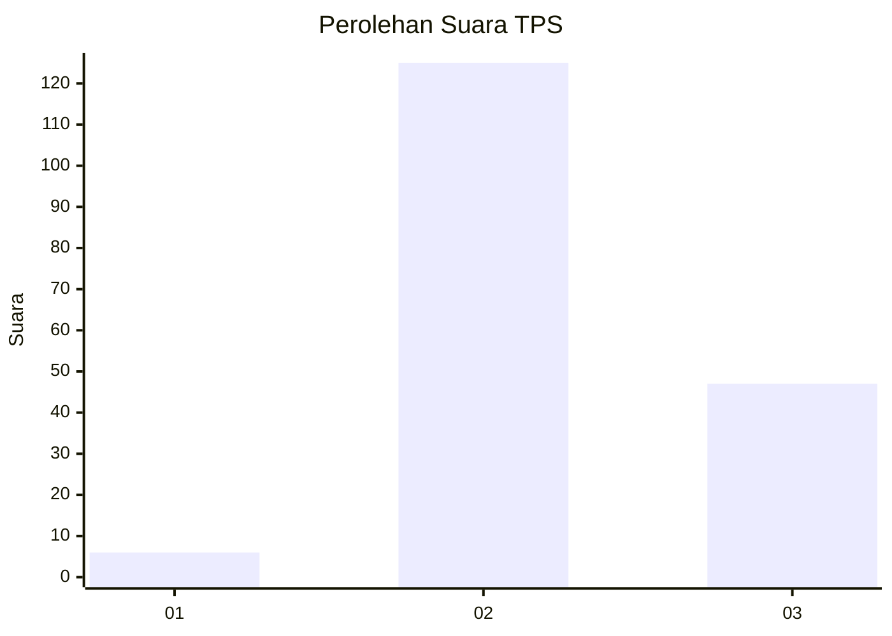
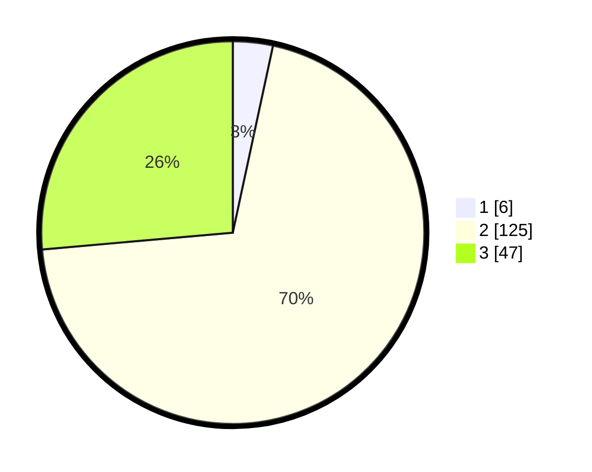

# Hasil

## Grafik

## Tabel

| No. | Nama Paslon    | Suara | Suara (raw) | Persentase |
|:--- |:-------------- | -----:| -----------:| ----------:|
| 1   | ANIES MUHAIMIN | 6     | [6][p-1]    | 3,37       |
| 2   | PRABOWO GIBRAN | 125   | [125][p-2]  | 70,22      |
| 3   | GANJAR MAHFUD  | 47    | [47][p-3]   | 26,40      |

[p-1]: https://github.com/gigit-pemilu/pemilu-2024/blob/main/pilpres/hitung-suara/sub/12-sumatera-utara/sub/08-simalungun/sub/18-huta-bayu-raja/sub/1013-huta-bayu/sub/001-tps/sub/paslon-1.txt
[p-2]: https://github.com/gigit-pemilu/pemilu-2024/blob/main/pilpres/hitung-suara/sub/12-sumatera-utara/sub/08-simalungun/sub/18-huta-bayu-raja/sub/1013-huta-bayu/sub/001-tps/sub/paslon-2.txt
[p-3]: https://github.com/gigit-pemilu/pemilu-2024/blob/main/pilpres/hitung-suara/sub/12-sumatera-utara/sub/08-simalungun/sub/18-huta-bayu-raja/sub/1013-huta-bayu/sub/001-tps/sub/paslon-3.txt

## Foto C Plano

https://sirekap-obj-formc.kpu.go.id/b8f9/pemilu/ppwp/12/08/18/10/13/1208181013001-20240215-024959--e0d1f627-7e11-44e6-9912-9e8e65291fce.jpg

https://sirekap-obj-formc.kpu.go.id/b8f9/pemilu/ppwp/12/08/18/10/13/1208181013001-20240215-023741--c6d000db-a14e-4080-825a-5a8c38a198e4.jpg

https://sirekap-obj-formc.kpu.go.id/b8f9/pemilu/ppwp/12/08/18/10/13/1208181013001-20240215-023912--b1ea3d7e-aff0-4f89-9a54-8434ff125217.jpg

## Metadata

| Key        | Value               |
| ---------- | ------------------- |
| Time Stamp | 2024-02-25 12:00:00 |

