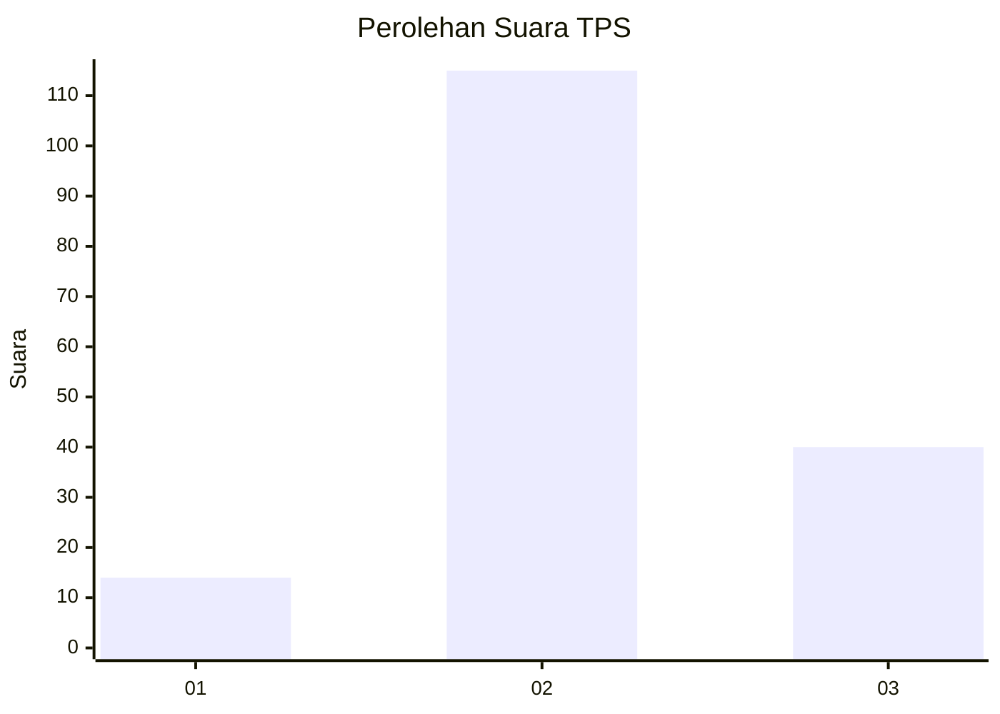
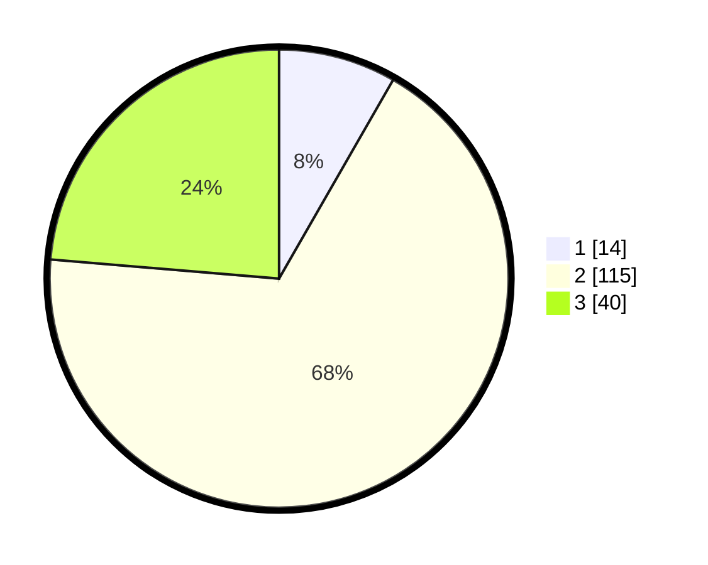

# Hasil

## Grafik

## Tabel

| No. | Nama Paslon    | Suara | Suara (raw) | Persentase |
|:--- |:-------------- | -----:| -----------:| ----------:|
| 1   | ANIES MUHAIMIN | 14    | [14][p-1]   | 8,28       |
| 2   | PRABOWO GIBRAN | 115   | [115][p-2]  | 68,05      |
| 3   | GANJAR MAHFUD  | 40    | [40][p-3]   | 23,67      |

[p-1]: https://github.com/gigit-pemilu/pemilu-2024-12-sumatera-utara/blob/main/pilpres/hitung-suara/sub/12-sumatera-utara/sub/08-simalungun/sub/18-huta-bayu-raja/sub/1013-huta-bayu/sub/006-tps/sub/paslon-1.txt
[p-2]: https://github.com/gigit-pemilu/pemilu-2024-12-sumatera-utara/blob/main/pilpres/hitung-suara/sub/12-sumatera-utara/sub/08-simalungun/sub/18-huta-bayu-raja/sub/1013-huta-bayu/sub/006-tps/sub/paslon-2.txt
[p-3]: https://github.com/gigit-pemilu/pemilu-2024-12-sumatera-utara/blob/main/pilpres/hitung-suara/sub/12-sumatera-utara/sub/08-simalungun/sub/18-huta-bayu-raja/sub/1013-huta-bayu/sub/006-tps/sub/paslon-3.txt

## Foto C Plano

https://sirekap-obj-formc.kpu.go.id/4862/pemilu/ppwp/12/08/18/10/13/1208181013006-20240214-194406--7e045c21-5420-4906-ae49-7ed857c3e7c8.jpg

https://sirekap-obj-formc.kpu.go.id/4862/pemilu/ppwp/12/08/18/10/13/1208181013006-20240214-193520--eec66450-ed3e-45aa-8422-122b3afb0ae2.jpg

https://sirekap-obj-formc.kpu.go.id/4862/pemilu/ppwp/12/08/18/10/13/1208181013006-20240214-193657--3fad45a5-d1c4-46af-ab01-174f23e1f1d8.jpg

## Metadata

| Key        | Value               |
| ---------- | ------------------- |
| Time Stamp | 2024-02-14 21:46:01 |

