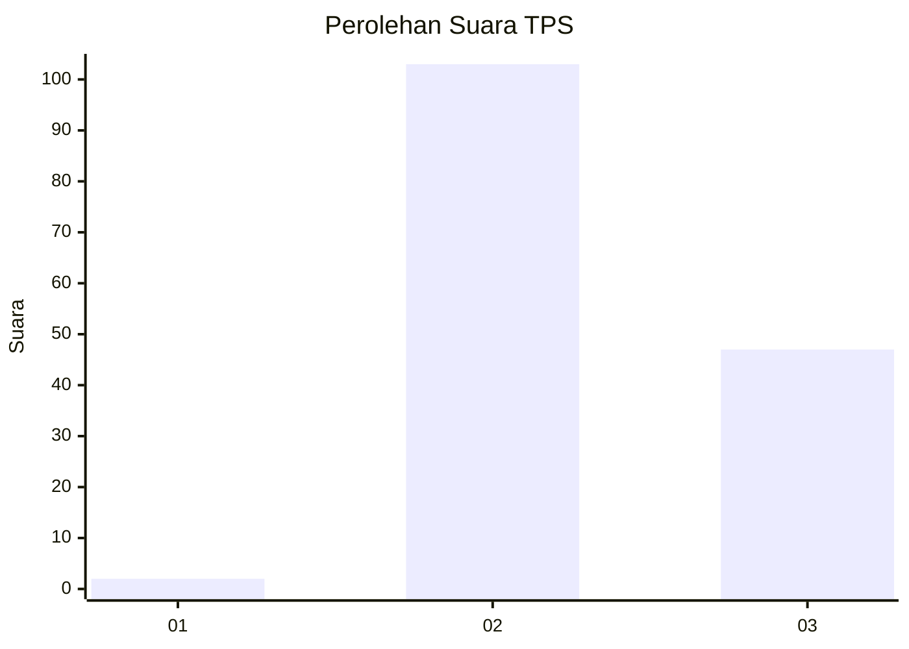
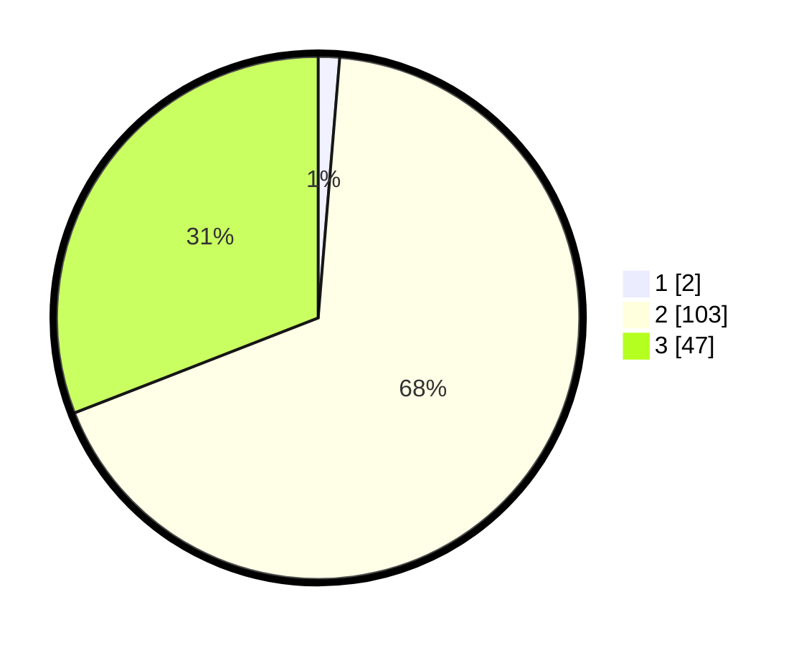

# Hasil

## Grafik

## Tabel

| No. | Nama Paslon    | Suara | Suara (raw) | Persentase |
|:--- |:-------------- | -----:| -----------:| ----------:|
| 1   | ANIES MUHAIMIN | 2     | [2][p-1]    | 1,32       |
| 2   | PRABOWO GIBRAN | 103   | [103][p-2]  | 67,76      |
| 3   | GANJAR MAHFUD  | 47    | [47][p-3]   | 30,92      |

[p-1]: https://github.com/gigit-pemilu/pemilu-2024-12-sumatera-utara/blob/main/pilpres/hitung-suara/sub/12-sumatera-utara/sub/08-simalungun/sub/18-huta-bayu-raja/sub/1013-huta-bayu/sub/008-tps/sub/paslon-1.txt
[p-2]: https://github.com/gigit-pemilu/pemilu-2024-12-sumatera-utara/blob/main/pilpres/hitung-suara/sub/12-sumatera-utara/sub/08-simalungun/sub/18-huta-bayu-raja/sub/1013-huta-bayu/sub/008-tps/sub/paslon-2.txt
[p-3]: https://github.com/gigit-pemilu/pemilu-2024-12-sumatera-utara/blob/main/pilpres/hitung-suara/sub/12-sumatera-utara/sub/08-simalungun/sub/18-huta-bayu-raja/sub/1013-huta-bayu/sub/008-tps/sub/paslon-3.txt

## Foto C Plano

https://sirekap-obj-formc.kpu.go.id/d10f/pemilu/ppwp/12/08/18/10/13/1208181013008-20240215-025751--51c70128-21d3-4c9f-9734-ce73094b03e1.jpg

https://sirekap-obj-formc.kpu.go.id/d10f/pemilu/ppwp/12/08/18/10/13/1208181013008-20240215-025637--eef7f3ba-2a07-4fae-a3fb-c0b1f752bc99.jpg

https://sirekap-obj-formc.kpu.go.id/d10f/pemilu/ppwp/12/08/18/10/13/1208181013008-20240215-025428--2e012e09-77c2-4986-83fb-5b8d56fd7251.jpg

## Metadata

| Key        | Value               |
| ---------- | ------------------- |
| Time Stamp | 2024-02-25 14:00:00 |

