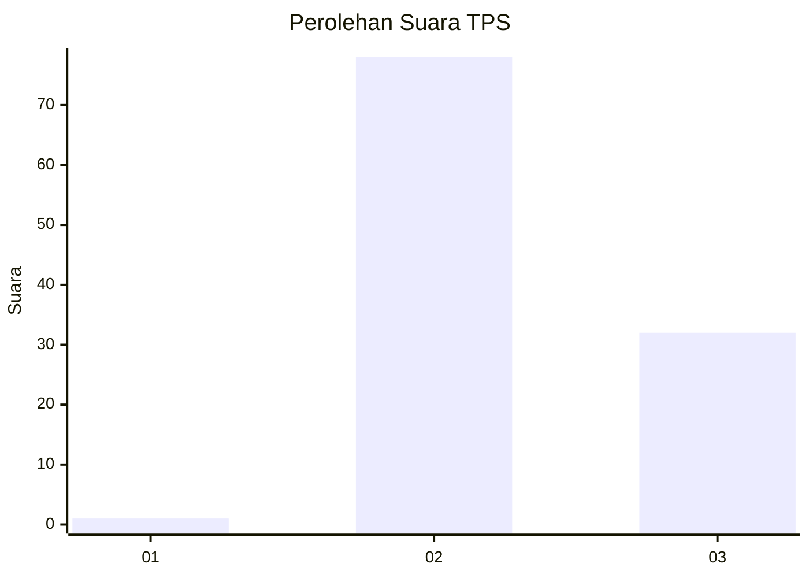
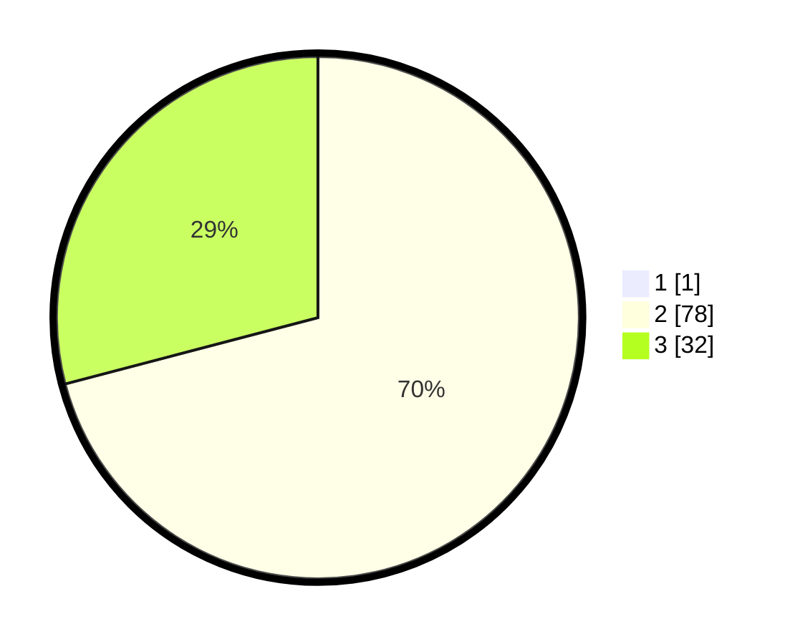

# Hasil

## Grafik

## Tabel

| No. | Nama Paslon    | Suara | Suara (raw) | Persentase |
|:--- |:-------------- | -----:| -----------:| ----------:|
| 1   | ANIES MUHAIMIN | 1     | [1][p-1]    | 0,90       |
| 2   | PRABOWO GIBRAN | 78    | [78][p-2]   | 70,27      |
| 3   | GANJAR MAHFUD  | 32    | [32][p-3]   | 28,83      |

[p-1]: https://github.com/gigit-pemilu/pemilu-2024/blob/main/pilpres/hitung-suara/sub/12-sumatera-utara/sub/08-simalungun/sub/18-huta-bayu-raja/sub/2003-silakkidir/sub/009-tps/sub/paslon-1.txt
[p-2]: https://github.com/gigit-pemilu/pemilu-2024/blob/main/pilpres/hitung-suara/sub/12-sumatera-utara/sub/08-simalungun/sub/18-huta-bayu-raja/sub/2003-silakkidir/sub/009-tps/sub/paslon-2.txt
[p-3]: https://github.com/gigit-pemilu/pemilu-2024/blob/main/pilpres/hitung-suara/sub/12-sumatera-utara/sub/08-simalungun/sub/18-huta-bayu-raja/sub/2003-silakkidir/sub/009-tps/sub/paslon-3.txt

## Foto C Plano

https://sirekap-obj-formc.kpu.go.id/de74/pemilu/ppwp/12/08/18/20/03/1208182003009-20240214-222116--bf68d8f8-47f0-4ee1-9cd4-1c3b5dc400e5.jpg

https://sirekap-obj-formc.kpu.go.id/de74/pemilu/ppwp/12/08/18/20/03/1208182003009-20240214-223329--bb6ae0bf-3ea9-4cda-a76e-a434791f1c56.jpg

https://sirekap-obj-formc.kpu.go.id/de74/pemilu/ppwp/12/08/18/20/03/1208182003009-20240214-223718--e50b7189-d96d-461f-ab1b-b482f9a489b8.jpg

## Metadata

| Key        | Value               |
| ---------- | ------------------- |
| Time Stamp | 2024-02-25 15:00:00 |

