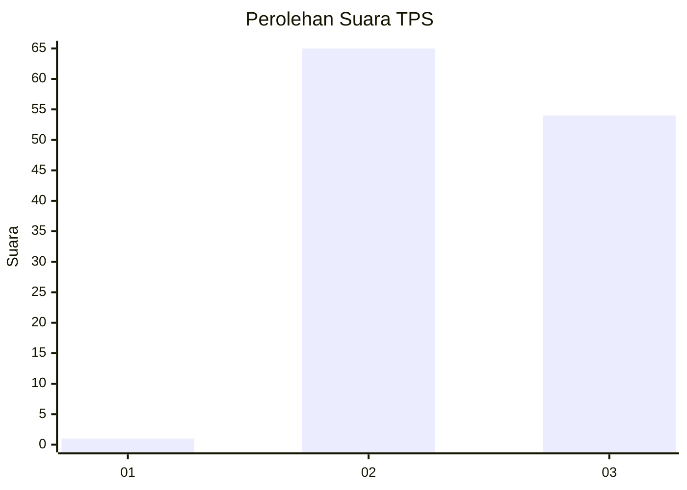
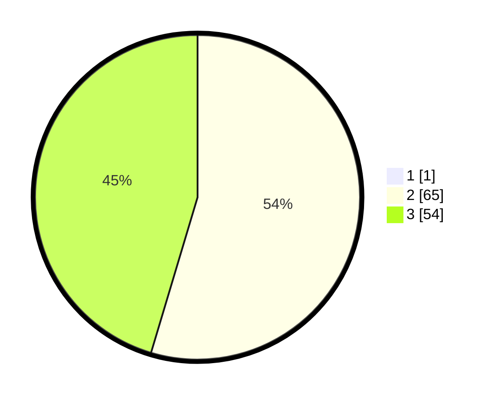

# Hasil

## Grafik

## Tabel

| No. | Nama Paslon    | Suara | Suara (raw) | Persentase |
|:--- |:-------------- | -----:| -----------:| ----------:|
| 1   | ANIES MUHAIMIN | 1     | [1][p-1]    | 0,83       |
| 2   | PRABOWO GIBRAN | 65    | [65][p-2]   | 54,17      |
| 3   | GANJAR MAHFUD  | 54    | [54][p-3]   | 45,00      |

[p-1]: https://github.com/gigit-pemilu/pemilu-2024/blob/main/pilpres/hitung-suara/sub/12-sumatera-utara/sub/08-simalungun/sub/18-huta-bayu-raja/sub/2015-manrayap-bayu/sub/002-tps/sub/paslon-1.txt
[p-2]: https://github.com/gigit-pemilu/pemilu-2024/blob/main/pilpres/hitung-suara/sub/12-sumatera-utara/sub/08-simalungun/sub/18-huta-bayu-raja/sub/2015-manrayap-bayu/sub/002-tps/sub/paslon-2.txt
[p-3]: https://github.com/gigit-pemilu/pemilu-2024/blob/main/pilpres/hitung-suara/sub/12-sumatera-utara/sub/08-simalungun/sub/18-huta-bayu-raja/sub/2015-manrayap-bayu/sub/002-tps/sub/paslon-3.txt

## Foto C Plano

https://sirekap-obj-formc.kpu.go.id/f6d7/pemilu/ppwp/12/08/18/20/15/1208182015002-20240215-010329--84d9e78c-8716-4929-9c82-8bf82c2b8d07.jpg

https://sirekap-obj-formc.kpu.go.id/f6d7/pemilu/ppwp/12/08/18/20/15/1208182015002-20240217-125207--c4c60caa-50ce-40c0-b79f-55877e7ea9a2.jpg

https://sirekap-obj-formc.kpu.go.id/f6d7/pemilu/ppwp/12/08/18/20/15/1208182015002-20240215-010418--afe9b72f-b4c0-460f-bdd3-52a673fddd5f.jpg

## Metadata

| Key        | Value               |
| ---------- | ------------------- |
| Time Stamp | 2024-02-25 22:00:00 |

