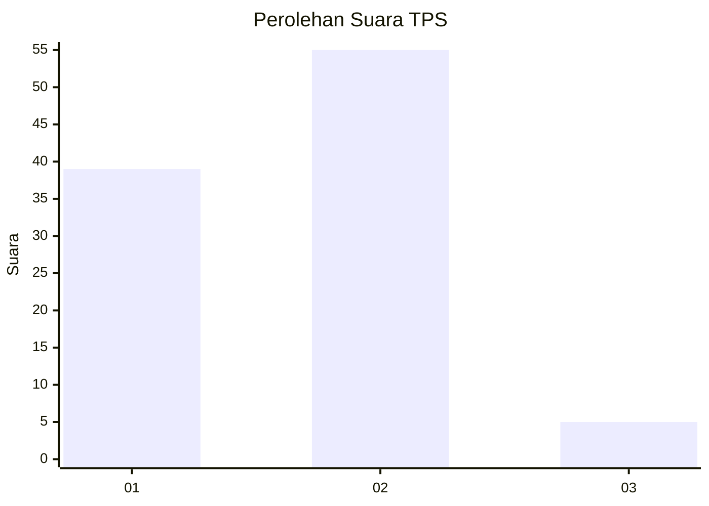
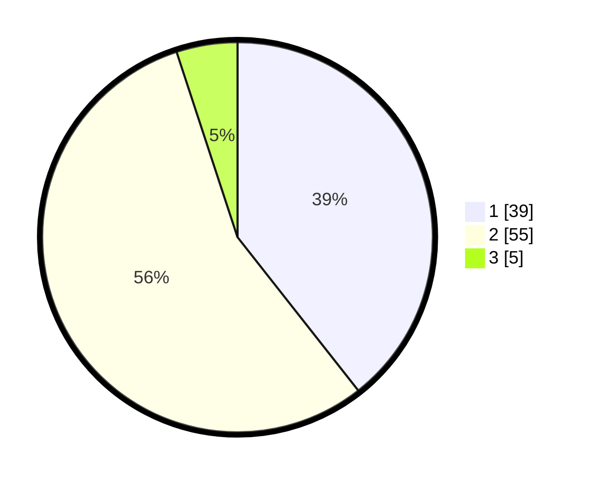

# Hasil

## Grafik

## Tabel

| No. | Nama Paslon    | Suara | Suara (raw) | Persentase |
|:--- |:-------------- | -----:| -----------:| ----------:|
| 1   | ANIES MUHAIMIN | 39    | [39][p-1]   | 39,39      |
| 2   | PRABOWO GIBRAN | 55    | [55][p-2]   | 55,56      |
| 3   | GANJAR MAHFUD  | 5     | [5][p-3]    | 5,05       |

[p-1]: https://github.com/gigit-pemilu/pemilu-2024/blob/main/pilpres/hitung-suara/sub/12-sumatera-utara/sub/08-simalungun/sub/19-jawa-maraja-bah-jambi/sub/2006-mariah-jambi/sub/004-tps/sub/paslon-1.txt
[p-2]: https://github.com/gigit-pemilu/pemilu-2024/blob/main/pilpres/hitung-suara/sub/12-sumatera-utara/sub/08-simalungun/sub/19-jawa-maraja-bah-jambi/sub/2006-mariah-jambi/sub/004-tps/sub/paslon-2.txt
[p-3]: https://github.com/gigit-pemilu/pemilu-2024/blob/main/pilpres/hitung-suara/sub/12-sumatera-utara/sub/08-simalungun/sub/19-jawa-maraja-bah-jambi/sub/2006-mariah-jambi/sub/004-tps/sub/paslon-3.txt

## Foto C Plano

https://sirekap-obj-formc.kpu.go.id/8df0/pemilu/ppwp/12/08/19/20/06/1208192006004-20240215-021355--10cb9d3b-da68-4b08-82ec-fd1ad831c20b.jpg

https://sirekap-obj-formc.kpu.go.id/8df0/pemilu/ppwp/12/08/19/20/06/1208192006004-20240215-021511--11402d87-117d-4848-9715-3c9e5ee91006.jpg

https://sirekap-obj-formc.kpu.go.id/8df0/pemilu/ppwp/12/08/19/20/06/1208192006004-20240215-021605--e38af19f-76e3-4d90-a2ef-b94bb6319fda.jpg

## Metadata

| Key        | Value               |
| ---------- | ------------------- |
| Time Stamp | 2024-02-25 15:00:00 |

