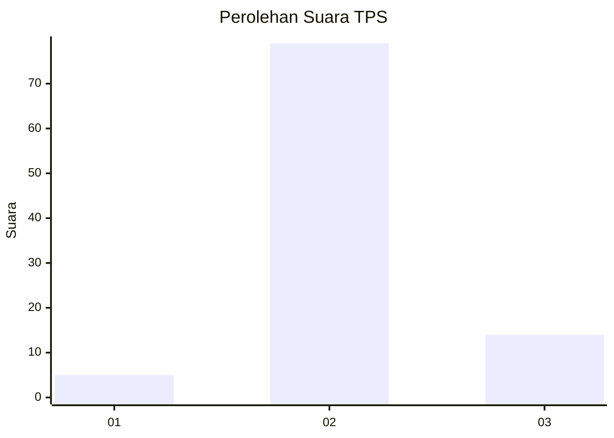
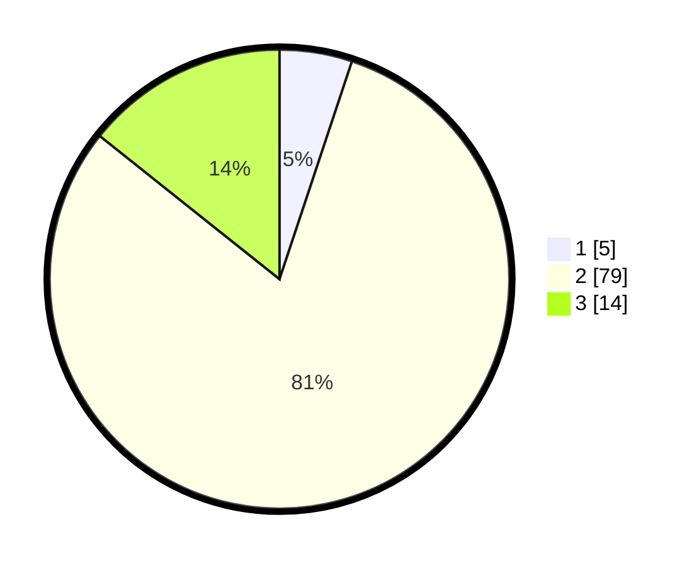

# Hasil

## Grafik

## Tabel

| No. | Nama Paslon    | Suara | Suara (raw) | Persentase |
|:--- |:-------------- | -----:| -----------:| ----------:|
| 1   | ANIES MUHAIMIN | 5     | [5][p-1]    | 5,10       |
| 2   | PRABOWO GIBRAN | 79    | [79][p-2]   | 80,61      |
| 3   | GANJAR MAHFUD  | 14    | [14][p-3]   | 14,29      |

[p-1]: https://github.com/gigit-pemilu/pemilu-2024-12-sumatera-utara/blob/main/pilpres/hitung-suara/sub/12-sumatera-utara/sub/08-simalungun/sub/20-dolok-pardamean/sub/2007-buntu-bayu-panei-raja/sub/001-tps/sub/paslon-1.txt
[p-2]: https://github.com/gigit-pemilu/pemilu-2024-12-sumatera-utara/blob/main/pilpres/hitung-suara/sub/12-sumatera-utara/sub/08-simalungun/sub/20-dolok-pardamean/sub/2007-buntu-bayu-panei-raja/sub/001-tps/sub/paslon-2.txt
[p-3]: https://github.com/gigit-pemilu/pemilu-2024-12-sumatera-utara/blob/main/pilpres/hitung-suara/sub/12-sumatera-utara/sub/08-simalungun/sub/20-dolok-pardamean/sub/2007-buntu-bayu-panei-raja/sub/001-tps/sub/paslon-3.txt

## Foto C Plano

https://sirekap-obj-formc.kpu.go.id/fb0f/pemilu/ppwp/12/08/20/20/07/1208202007001-20240216-104201--22ce31e5-a1cb-4b8a-9db6-b4cf0bc12602.jpg

https://sirekap-obj-formc.kpu.go.id/fb0f/pemilu/ppwp/12/08/20/20/07/1208202007001-20240216-102153--977fac21-d80d-4606-a57c-ef998b89f02e.jpg

https://sirekap-obj-formc.kpu.go.id/fb0f/pemilu/ppwp/12/08/20/20/07/1208202007001-20240215-093548--86e2e072-fde4-42f9-9f99-49afeab2dd7a.jpg

## Metadata

| Key        | Value               |
| ---------- | ------------------- |
| Time Stamp | 2024-02-17 16:00:02 |

