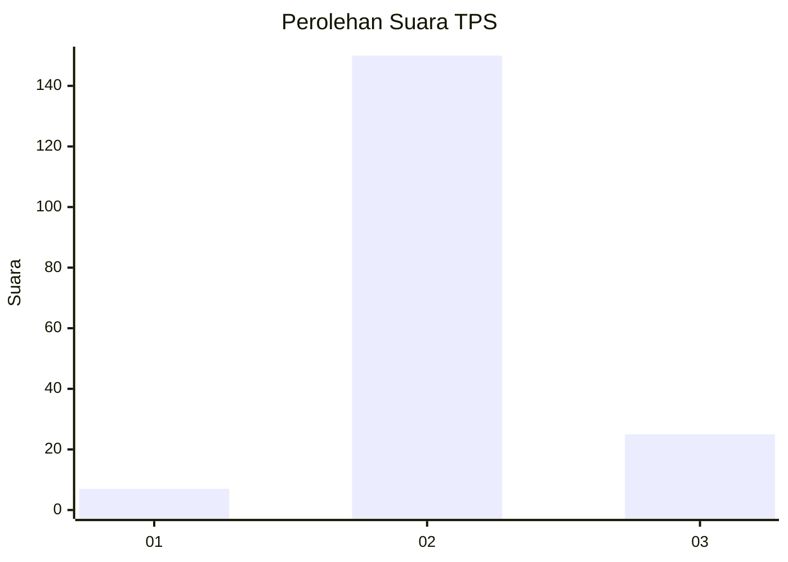
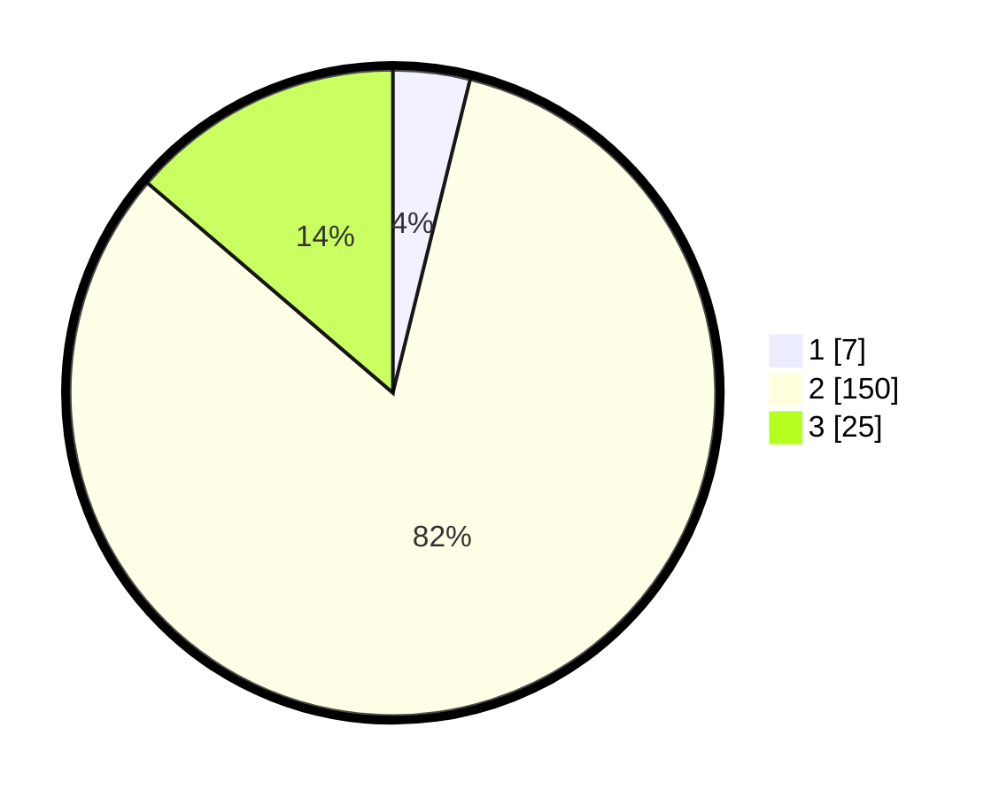

# Hasil

## Grafik

## Tabel

| No. | Nama Paslon    | Suara | Suara (raw) | Persentase |
|:--- |:-------------- | -----:| -----------:| ----------:|
| 1   | ANIES MUHAIMIN | 7     | [7][p-1]    | 3,85       |
| 2   | PRABOWO GIBRAN | 150   | [150][p-2]  | 82,42      |
| 3   | GANJAR MAHFUD  | 25    | [25][p-3]   | 13,74      |

[p-1]: https://github.com/gigit-pemilu/pemilu-2024/blob/main/pilpres/hitung-suara/sub/12-sumatera-utara/sub/08-simalungun/sub/21-pematang-bandar/sub/2002-talun-madear/sub/002-tps/sub/paslon-1.txt
[p-2]: https://github.com/gigit-pemilu/pemilu-2024/blob/main/pilpres/hitung-suara/sub/12-sumatera-utara/sub/08-simalungun/sub/21-pematang-bandar/sub/2002-talun-madear/sub/002-tps/sub/paslon-2.txt
[p-3]: https://github.com/gigit-pemilu/pemilu-2024/blob/main/pilpres/hitung-suara/sub/12-sumatera-utara/sub/08-simalungun/sub/21-pematang-bandar/sub/2002-talun-madear/sub/002-tps/sub/paslon-3.txt

## Foto C Plano

https://sirekap-obj-formc.kpu.go.id/6eb4/pemilu/ppwp/12/08/21/20/02/1208212002002-20240214-223636--8da56796-6d1e-4e1f-acaf-a3990be62732.jpg

https://sirekap-obj-formc.kpu.go.id/6eb4/pemilu/ppwp/12/08/21/20/02/1208212002002-20240215-151143--55e5a8e4-e22b-49fc-b6f0-623baa10acca.jpg

https://sirekap-obj-formc.kpu.go.id/6eb4/pemilu/ppwp/12/08/21/20/02/1208212002002-20240214-223236--74768e22-6080-4b29-a3e8-605ebbdb94aa.jpg

## Metadata

| Key        | Value               |
| ---------- | ------------------- |
| Time Stamp | 2024-02-16 00:00:26 |

