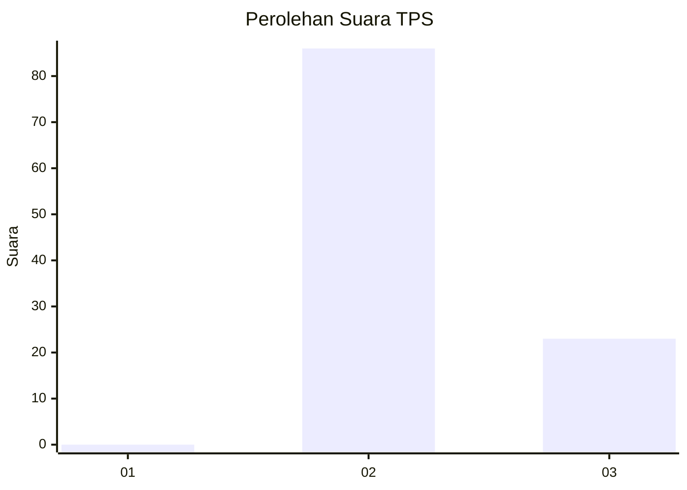
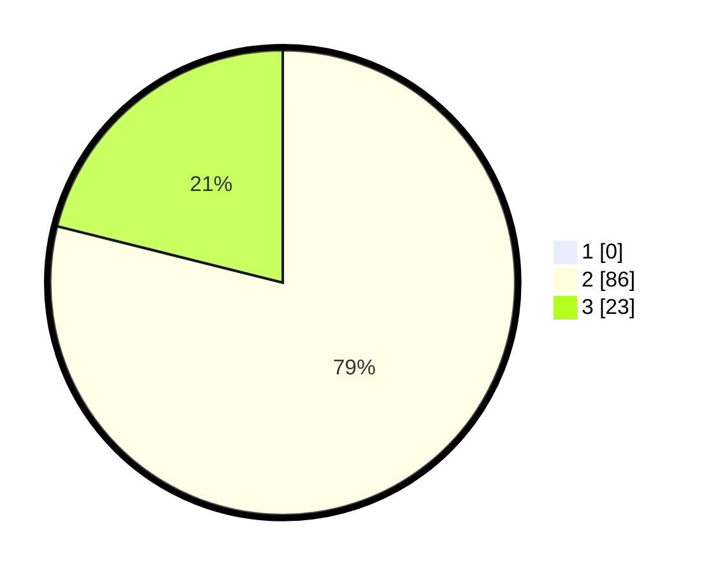

# Hasil

## Grafik

## Tabel

| No. | Nama Paslon    | Suara | Suara (raw) | Persentase |
|:--- |:-------------- | -----:| -----------:| ----------:|
| 1   | ANIES MUHAIMIN | 0     | [0][p-1]    | 0,00       |
| 2   | PRABOWO GIBRAN | 86    | [86][p-2]   | 78,90      |
| 3   | GANJAR MAHFUD  | 23    | [23][p-3]   | 21,10      |

[p-1]: https://github.com/gigit-pemilu/pemilu-2024/blob/main/pilpres/hitung-suara/sub/12-sumatera-utara/sub/08-simalungun/sub/21-pematang-bandar/sub/2005-pardomuan-nauli/sub/006-tps/sub/paslon-1.txt
[p-2]: https://github.com/gigit-pemilu/pemilu-2024/blob/main/pilpres/hitung-suara/sub/12-sumatera-utara/sub/08-simalungun/sub/21-pematang-bandar/sub/2005-pardomuan-nauli/sub/006-tps/sub/paslon-2.txt
[p-3]: https://github.com/gigit-pemilu/pemilu-2024/blob/main/pilpres/hitung-suara/sub/12-sumatera-utara/sub/08-simalungun/sub/21-pematang-bandar/sub/2005-pardomuan-nauli/sub/006-tps/sub/paslon-3.txt

## Foto C Plano

https://sirekap-obj-formc.kpu.go.id/a343/pemilu/ppwp/12/08/21/20/05/1208212005006-20240215-011631--c2027e81-a472-4d85-ac59-8f2cfd21b384.jpg

https://sirekap-obj-formc.kpu.go.id/a343/pemilu/ppwp/12/08/21/20/05/1208212005006-20240215-022409--a2adf173-08cd-4e9e-a33f-9b9ca8645609.jpg

https://sirekap-obj-formc.kpu.go.id/a343/pemilu/ppwp/12/08/21/20/05/1208212005006-20240215-022545--04053b0b-ee4a-491e-9db8-410064fd3075.jpg

## Metadata

| Key        | Value               |
| ---------- | ------------------- |
| Time Stamp | 2024-02-15 21:01:18 |

