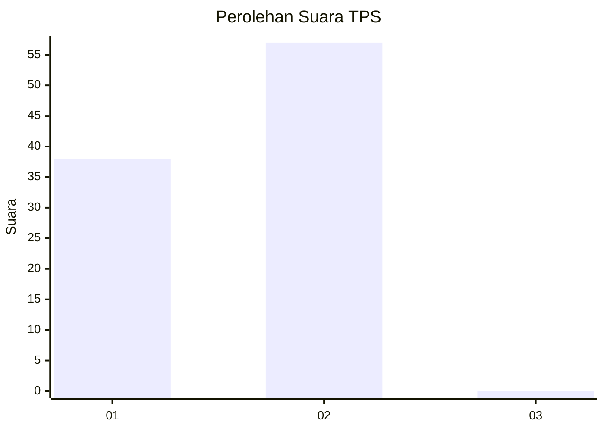
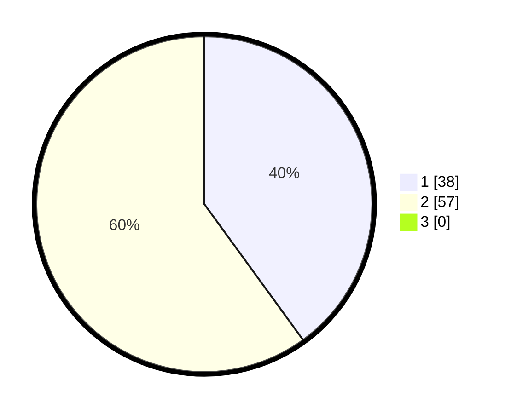

# Hasil

## Grafik

## Tabel

| No. | Nama Paslon    | Suara | Suara (raw) | Persentase |
|:--- |:-------------- | -----:| -----------:| ----------:|
| 1   | ANIES MUHAIMIN | 38    | [38][p-1]   | 40,00      |
| 2   | PRABOWO GIBRAN | 57    | [57][p-2]   | 60,00      |
| 3   | GANJAR MAHFUD  | 0     | [0][p-3]    | 0,00       |

[p-1]: https://github.com/gigit-pemilu/pemilu-2024/blob/main/pilpres/hitung-suara/sub/12-sumatera-utara/sub/08-simalungun/sub/22-bandar-huluan/sub/2003-bandar-tongah/sub/014-tps/sub/paslon-1.txt
[p-2]: https://github.com/gigit-pemilu/pemilu-2024/blob/main/pilpres/hitung-suara/sub/12-sumatera-utara/sub/08-simalungun/sub/22-bandar-huluan/sub/2003-bandar-tongah/sub/014-tps/sub/paslon-2.txt
[p-3]: https://github.com/gigit-pemilu/pemilu-2024/blob/main/pilpres/hitung-suara/sub/12-sumatera-utara/sub/08-simalungun/sub/22-bandar-huluan/sub/2003-bandar-tongah/sub/014-tps/sub/paslon-3.txt

## Foto C Plano

https://sirekap-obj-formc.kpu.go.id/58b4/pemilu/ppwp/12/08/22/20/03/1208222003014-20240214-235930--9a7d69e3-26b9-407c-88e6-1c1edb7cb427.jpg

https://sirekap-obj-formc.kpu.go.id/58b4/pemilu/ppwp/12/08/22/20/03/1208222003014-20240215-021724--8b6a3470-05da-48e8-9d78-f9519d301dec.jpg

https://sirekap-obj-formc.kpu.go.id/58b4/pemilu/ppwp/12/08/22/20/03/1208222003014-20240215-021824--3cc9d796-4940-418e-8946-5a02446ce773.jpg

## Metadata

| Key        | Value               |
| ---------- | ------------------- |
| Time Stamp | 2024-02-15 15:00:29 |

