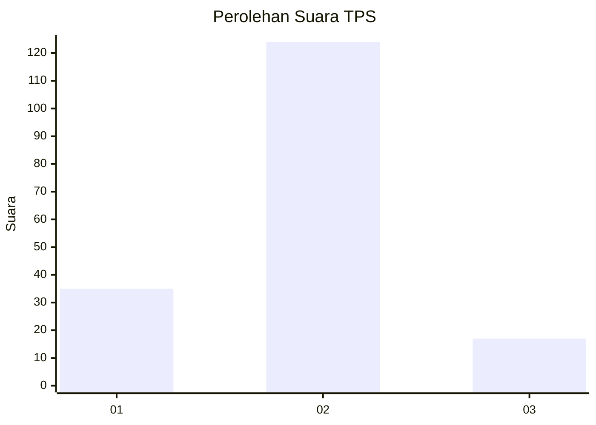

# Hasil

## Grafik

## Tabel

| No. | Nama Paslon    | Suara | Suara (raw) | Persentase |
|:--- |:-------------- | -----:| -----------:| ----------:|
| 1   | ANIES MUHAIMIN | 35    | [35][p-1]   | 19,89      |
| 2   | PRABOWO GIBRAN | 124   | [124][p-2]  | 70,45      |
| 3   | GANJAR MAHFUD  | 17    | [17][p-3]   | 9,66       |

[p-1]: https://github.com/gigit-pemilu/pemilu-2024/blob/main/pilpres/hitung-suara/sub/12-sumatera-utara/sub/08-simalungun/sub/23-bandar/sub/1014-perdagangan-i/sub/005-tps/sub/paslon-1.txt
[p-2]: https://github.com/gigit-pemilu/pemilu-2024/blob/main/pilpres/hitung-suara/sub/12-sumatera-utara/sub/08-simalungun/sub/23-bandar/sub/1014-perdagangan-i/sub/005-tps/sub/paslon-2.txt
[p-3]: https://github.com/gigit-pemilu/pemilu-2024/blob/main/pilpres/hitung-suara/sub/12-sumatera-utara/sub/08-simalungun/sub/23-bandar/sub/1014-perdagangan-i/sub/005-tps/sub/paslon-3.txt

## Foto C Plano

https://sirekap-obj-formc.kpu.go.id/e144/pemilu/ppwp/12/08/23/10/14/1208231014005-20240214-155507--56a76beb-2763-4f4c-a47a-549ffc56320a.jpg

https://sirekap-obj-formc.kpu.go.id/e144/pemilu/ppwp/12/08/23/10/14/1208231014005-20240214-160118--6223778d-6fcc-4afd-87fa-5b8800927d8b.jpg

https://sirekap-obj-formc.kpu.go.id/e144/pemilu/ppwp/12/08/23/10/14/1208231014005-20240215-014422--2a77645f-24c6-491f-b84c-8e77406faaa2.jpg

## Metadata

| Key        | Value               |
| ---------- | ------------------- |
| Time Stamp | 2024-02-15 01:47:43 |

