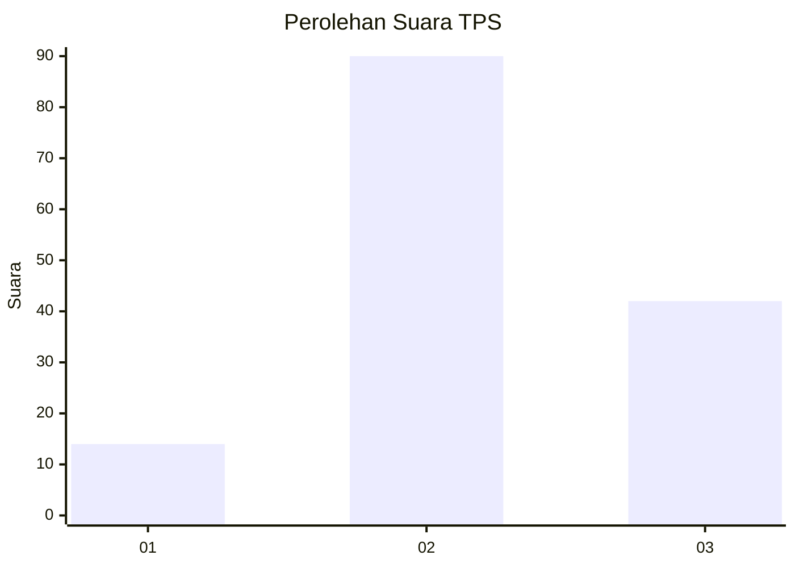
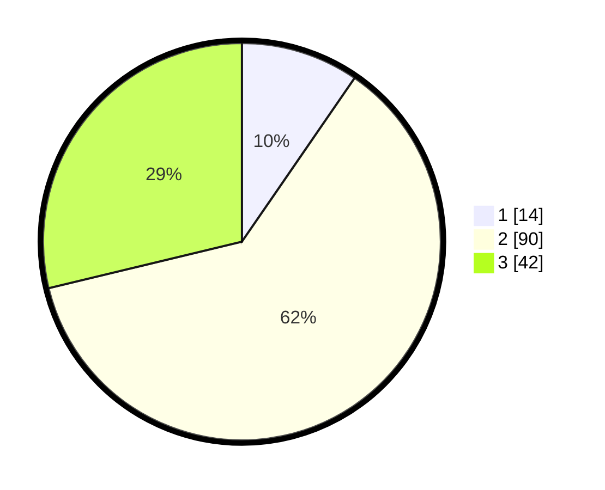

# Hasil

## Grafik

## Tabel

| No. | Nama Paslon    | Suara | Suara (raw) | Persentase |
|:--- |:-------------- | -----:| -----------:| ----------:|
| 1   | ANIES MUHAIMIN | 14    | [14][p-1]   | 9,59       |
| 2   | PRABOWO GIBRAN | 90    | [90][p-2]   | 61,64      |
| 3   | GANJAR MAHFUD  | 42    | [42][p-3]   | 28,77      |

[p-1]: https://github.com/gigit-pemilu/pemilu-2024/blob/main/pilpres/hitung-suara/sub/12-sumatera-utara/sub/08-simalungun/sub/23-bandar/sub/1014-perdagangan-i/sub/013-tps/sub/paslon-1.txt
[p-2]: https://github.com/gigit-pemilu/pemilu-2024/blob/main/pilpres/hitung-suara/sub/12-sumatera-utara/sub/08-simalungun/sub/23-bandar/sub/1014-perdagangan-i/sub/013-tps/sub/paslon-2.txt
[p-3]: https://github.com/gigit-pemilu/pemilu-2024/blob/main/pilpres/hitung-suara/sub/12-sumatera-utara/sub/08-simalungun/sub/23-bandar/sub/1014-perdagangan-i/sub/013-tps/sub/paslon-3.txt

## Foto C Plano

https://sirekap-obj-formc.kpu.go.id/2333/pemilu/ppwp/12/08/23/10/14/1208231014013-20240214-230536--add60496-bccb-48cf-88ac-7972e3d371d1.jpg

https://sirekap-obj-formc.kpu.go.id/2333/pemilu/ppwp/12/08/23/10/14/1208231014013-20240214-230728--f1c2fc2b-a451-4b1e-acaa-247326a471bb.jpg

https://sirekap-obj-formc.kpu.go.id/2333/pemilu/ppwp/12/08/23/10/14/1208231014013-20240214-230946--6968e202-96bd-42d2-aa15-7ebe10f5c6f7.jpg

## Metadata

| Key        | Value               |
| ---------- | ------------------- |
| Time Stamp | 2024-02-24 22:31:28 |

