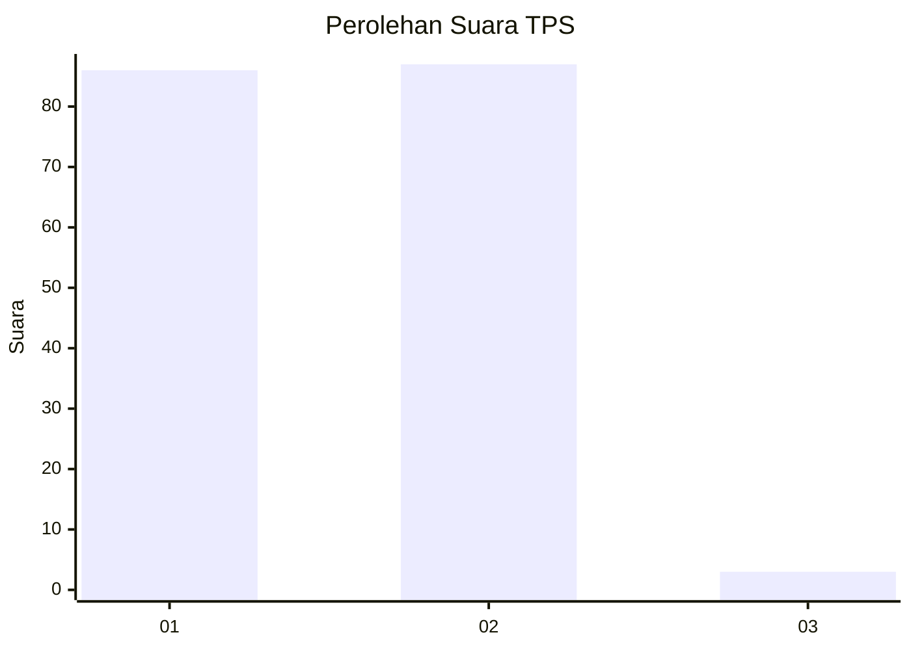
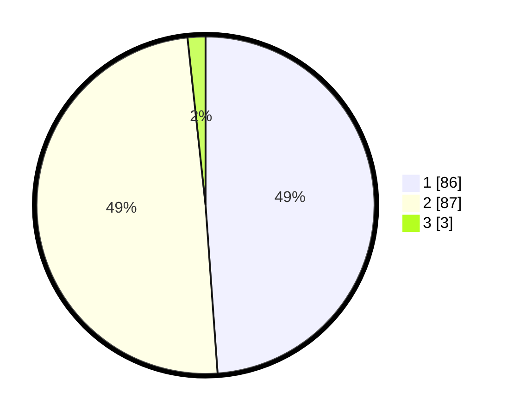

# Hasil

## Grafik

## Tabel

| No. | Nama Paslon    | Suara | Suara (raw) | Persentase |
|:--- |:-------------- | -----:| -----------:| ----------:|
| 1   | ANIES MUHAIMIN | 86    | [86][p-1]   | 48,86      |
| 2   | PRABOWO GIBRAN | 87    | [87][p-2]   | 49,43      |
| 3   | GANJAR MAHFUD  | 3     | [3][p-3]    | 1,70       |

[p-1]: https://github.com/gigit-pemilu/pemilu-2024/blob/main/pilpres/hitung-suara/sub/12-sumatera-utara/sub/08-simalungun/sub/23-bandar/sub/1014-perdagangan-i/sub/018-tps/sub/paslon-1.txt
[p-2]: https://github.com/gigit-pemilu/pemilu-2024/blob/main/pilpres/hitung-suara/sub/12-sumatera-utara/sub/08-simalungun/sub/23-bandar/sub/1014-perdagangan-i/sub/018-tps/sub/paslon-2.txt
[p-3]: https://github.com/gigit-pemilu/pemilu-2024/blob/main/pilpres/hitung-suara/sub/12-sumatera-utara/sub/08-simalungun/sub/23-bandar/sub/1014-perdagangan-i/sub/018-tps/sub/paslon-3.txt

## Foto C Plano

https://sirekap-obj-formc.kpu.go.id/9bc1/pemilu/ppwp/12/08/23/10/14/1208231014018-20240214-214732--d09f4091-b1fd-409e-a5e3-5157a4038ba6.jpg

https://sirekap-obj-formc.kpu.go.id/9bc1/pemilu/ppwp/12/08/23/10/14/1208231014018-20240214-214917--c7da9642-3bce-47c7-984a-a1ded0904c87.jpg

https://sirekap-obj-formc.kpu.go.id/9bc1/pemilu/ppwp/12/08/23/10/14/1208231014018-20240214-215139--e5ab604d-6076-4029-aa31-d63f5258a26a.jpg

## Metadata

| Key        | Value               |
| ---------- | ------------------- |
| Time Stamp | 2024-02-25 16:00:00 |

