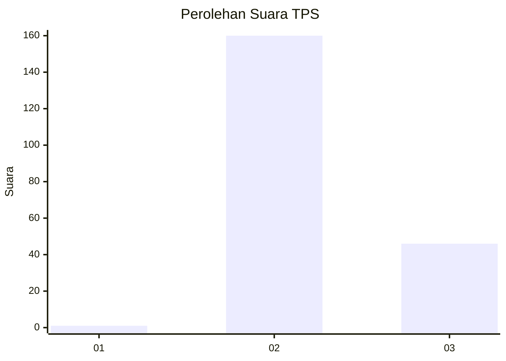
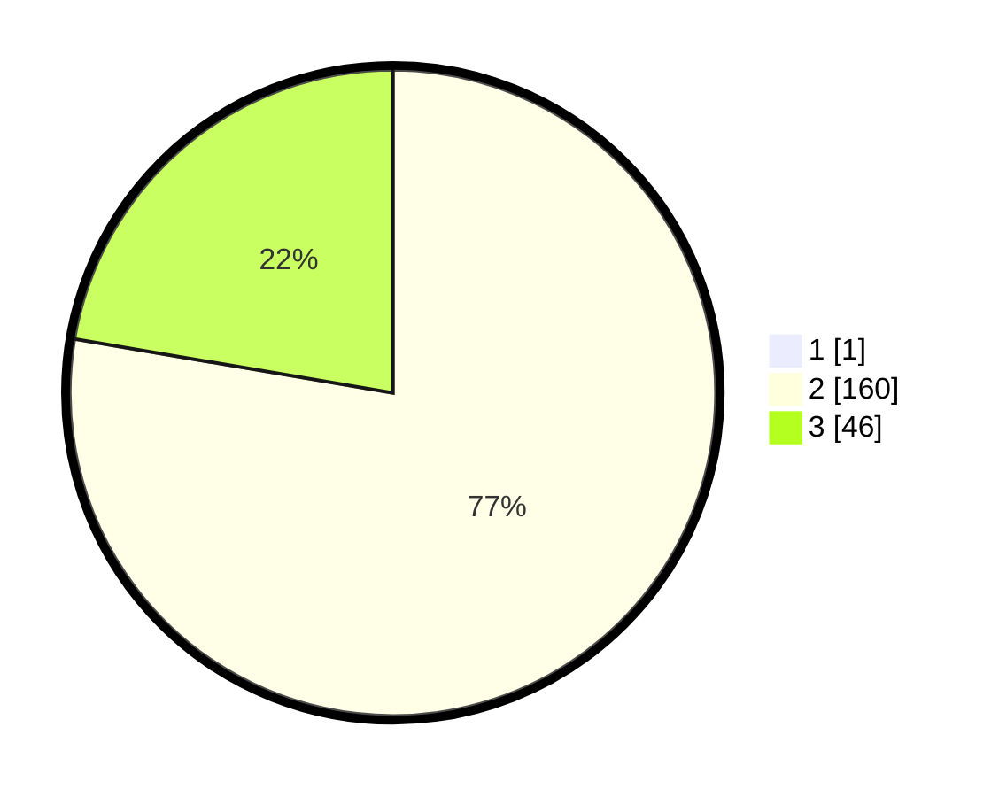

# Hasil

## Grafik

## Tabel

| No. | Nama Paslon    | Suara | Suara (raw) | Persentase |
|:--- |:-------------- | -----:| -----------:| ----------:|
| 1   | ANIES MUHAIMIN | 1     | [1][p-1]    | 0,48       |
| 2   | PRABOWO GIBRAN | 160   | [160][p-2]  | 77,29      |
| 3   | GANJAR MAHFUD  | 46    | [46][p-3]   | 22,22      |

[p-1]: https://github.com/gigit-pemilu/pemilu-2024/blob/main/pilpres/hitung-suara/sub/12-sumatera-utara/sub/08-simalungun/sub/23-bandar/sub/1015-perdagangan-iii/sub/007-tps/sub/paslon-1.txt
[p-2]: https://github.com/gigit-pemilu/pemilu-2024/blob/main/pilpres/hitung-suara/sub/12-sumatera-utara/sub/08-simalungun/sub/23-bandar/sub/1015-perdagangan-iii/sub/007-tps/sub/paslon-2.txt
[p-3]: https://github.com/gigit-pemilu/pemilu-2024/blob/main/pilpres/hitung-suara/sub/12-sumatera-utara/sub/08-simalungun/sub/23-bandar/sub/1015-perdagangan-iii/sub/007-tps/sub/paslon-3.txt

## Foto C Plano

https://sirekap-obj-formc.kpu.go.id/c3b6/pemilu/ppwp/12/08/23/10/15/1208231015007-20240214-195450--d187c21f-5420-425c-bf1a-f4e39da450f0.jpg

https://sirekap-obj-formc.kpu.go.id/c3b6/pemilu/ppwp/12/08/23/10/15/1208231015007-20240214-195258--b703e2b8-c79f-462c-bbac-bea5ddd74843.jpg

https://sirekap-obj-formc.kpu.go.id/c3b6/pemilu/ppwp/12/08/23/10/15/1208231015007-20240214-205603--fafbee0c-c26a-480d-8ce0-8a2acff039ba.jpg

## Metadata

| Key        | Value               |
| ---------- | ------------------- |
| Time Stamp | 2024-02-25 21:00:00 |

