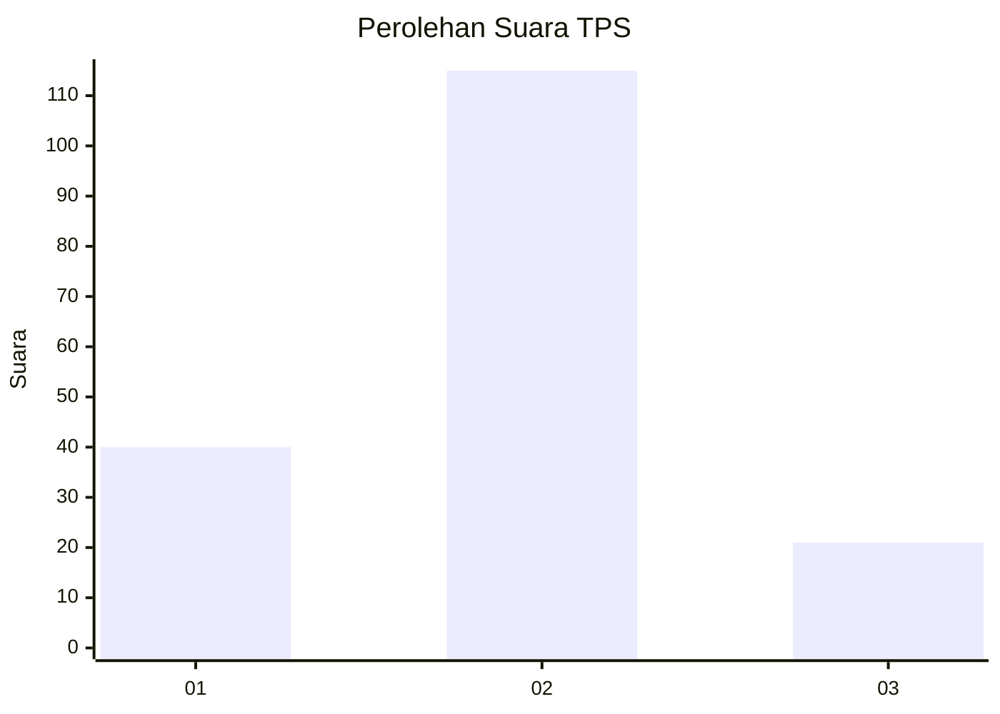
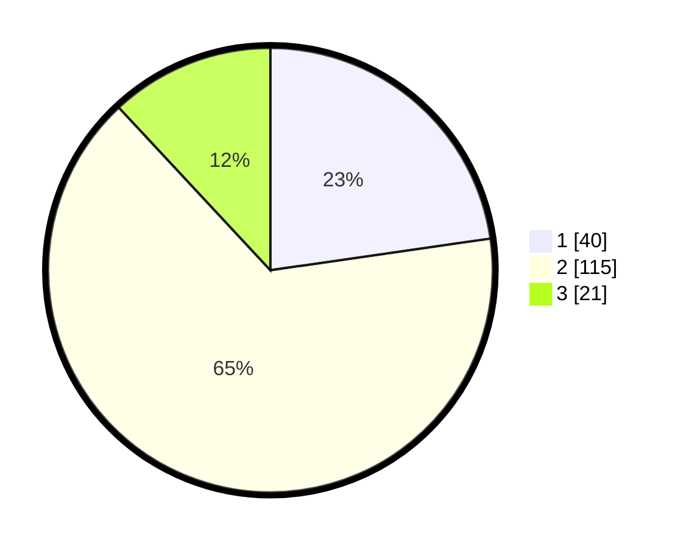

# Hasil

## Grafik

## Tabel

| No. | Nama Paslon    | Suara | Suara (raw) | Persentase |
|:--- |:-------------- | -----:| -----------:| ----------:|
| 1   | ANIES MUHAIMIN | 40    | [40][p-1]   | 22,73      |
| 2   | PRABOWO GIBRAN | 115   | [115][p-2]  | 65,34      |
| 3   | GANJAR MAHFUD  | 21    | [21][p-3]   | 11,93      |

[p-1]: https://github.com/gigit-pemilu/pemilu-2024/blob/main/pilpres/hitung-suara/sub/12-sumatera-utara/sub/08-simalungun/sub/23-bandar/sub/2001-pematang-kerasaan/sub/006-tps/sub/paslon-1.txt
[p-2]: https://github.com/gigit-pemilu/pemilu-2024/blob/main/pilpres/hitung-suara/sub/12-sumatera-utara/sub/08-simalungun/sub/23-bandar/sub/2001-pematang-kerasaan/sub/006-tps/sub/paslon-2.txt
[p-3]: https://github.com/gigit-pemilu/pemilu-2024/blob/main/pilpres/hitung-suara/sub/12-sumatera-utara/sub/08-simalungun/sub/23-bandar/sub/2001-pematang-kerasaan/sub/006-tps/sub/paslon-3.txt

## Foto C Plano

https://sirekap-obj-formc.kpu.go.id/a822/pemilu/ppwp/12/08/23/20/01/1208232001006-20240215-000323--9b1f5f82-1ac3-4221-8bfd-b72d601f73e3.jpg

https://sirekap-obj-formc.kpu.go.id/a822/pemilu/ppwp/12/08/23/20/01/1208232001006-20240215-001043--90f85fa0-b0bd-4a24-a461-746eb07f5831.jpg

https://sirekap-obj-formc.kpu.go.id/a822/pemilu/ppwp/12/08/23/20/01/1208232001006-20240215-001422--c0bc1911-1be9-4515-b745-0258fe1579e6.jpg

## Metadata

| Key        | Value               |
| ---------- | ------------------- |
| Time Stamp | 2024-02-24 23:00:00 |

