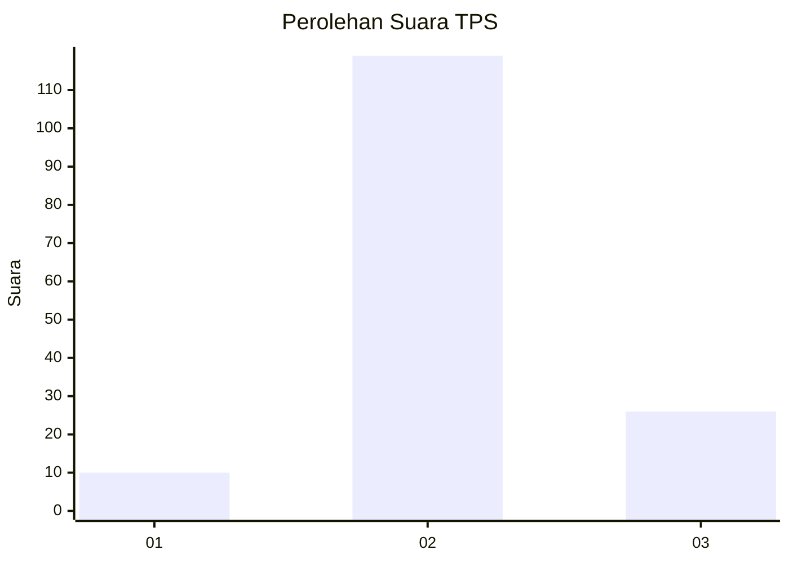
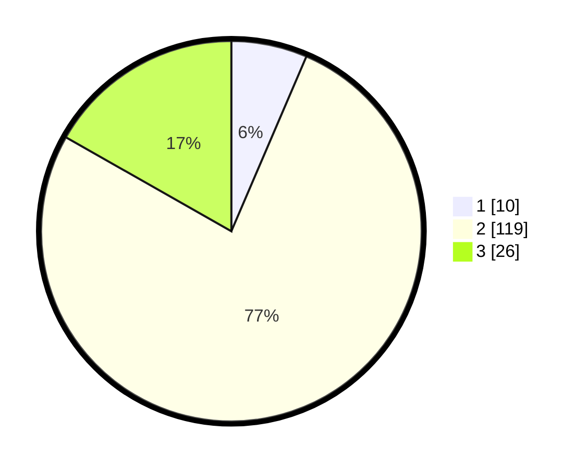

# Hasil

## Grafik

## Tabel

| No. | Nama Paslon    | Suara | Suara (raw) | Persentase |
|:--- |:-------------- | -----:| -----------:| ----------:|
| 1   | ANIES MUHAIMIN | 10    | [10][p-1]   | 6,45       |
| 2   | PRABOWO GIBRAN | 119   | [119][p-2]  | 76,77      |
| 3   | GANJAR MAHFUD  | 26    | [26][p-3]   | 16,77      |

[p-1]: https://github.com/gigit-pemilu/pemilu-2024/blob/main/pilpres/hitung-suara/sub/12-sumatera-utara/sub/08-simalungun/sub/23-bandar/sub/2003-nagori-bandar/sub/008-tps/sub/paslon-1.txt
[p-2]: https://github.com/gigit-pemilu/pemilu-2024/blob/main/pilpres/hitung-suara/sub/12-sumatera-utara/sub/08-simalungun/sub/23-bandar/sub/2003-nagori-bandar/sub/008-tps/sub/paslon-2.txt
[p-3]: https://github.com/gigit-pemilu/pemilu-2024/blob/main/pilpres/hitung-suara/sub/12-sumatera-utara/sub/08-simalungun/sub/23-bandar/sub/2003-nagori-bandar/sub/008-tps/sub/paslon-3.txt

## Foto C Plano

https://sirekap-obj-formc.kpu.go.id/a786/pemilu/ppwp/12/08/23/20/03/1208232003008-20240214-230057--0545e4d4-1783-4a4f-9c83-d5846568c4ac.jpg

https://sirekap-obj-formc.kpu.go.id/a786/pemilu/ppwp/12/08/23/20/03/1208232003008-20240214-230644--c29ac344-957d-4652-88a0-cbfc31745e83.jpg

https://sirekap-obj-formc.kpu.go.id/a786/pemilu/ppwp/12/08/23/20/03/1208232003008-20240214-230928--92ec9f18-a4ed-4671-9d06-c9ff561ccd23.jpg

## Metadata

| Key        | Value               |
| ---------- | ------------------- |
| Time Stamp | 2024-02-25 14:00:00 |

