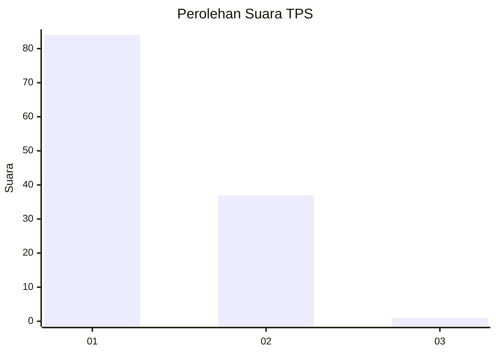
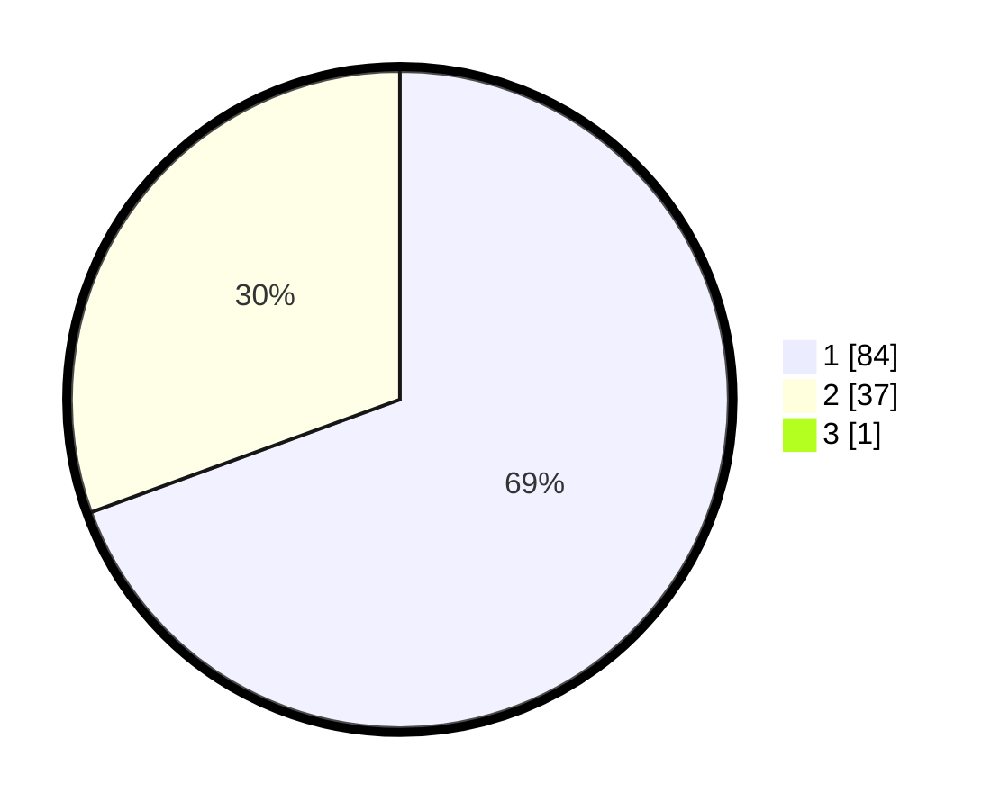

# Hasil

## Grafik

## Tabel

| No. | Nama Paslon    | Suara | Suara (raw) | Persentase |
|:--- |:-------------- | -----:| -----------:| ----------:|
| 1   | ANIES MUHAIMIN | 84    | [84][p-1]   | 68,85      |
| 2   | PRABOWO GIBRAN | 37    | [37][p-2]   | 30,33      |
| 3   | GANJAR MAHFUD  | 1     | [1][p-3]    | 0,82       |

[p-1]: https://github.com/gigit-pemilu/pemilu-2024-12-sumatera-utara/blob/main/pilpres/hitung-suara/sub/12-sumatera-utara/sub/08-simalungun/sub/23-bandar/sub/2006-bah-lias/sub/007-tps/sub/paslon-1.txt
[p-2]: https://github.com/gigit-pemilu/pemilu-2024-12-sumatera-utara/blob/main/pilpres/hitung-suara/sub/12-sumatera-utara/sub/08-simalungun/sub/23-bandar/sub/2006-bah-lias/sub/007-tps/sub/paslon-2.txt
[p-3]: https://github.com/gigit-pemilu/pemilu-2024-12-sumatera-utara/blob/main/pilpres/hitung-suara/sub/12-sumatera-utara/sub/08-simalungun/sub/23-bandar/sub/2006-bah-lias/sub/007-tps/sub/paslon-3.txt

## Foto C Plano

https://sirekap-obj-formc.kpu.go.id/fc2e/pemilu/ppwp/12/08/23/20/06/1208232006007-20240214-215151--78da43c8-7e15-488e-bb7d-98b2d46e7451.jpg

https://sirekap-obj-formc.kpu.go.id/fc2e/pemilu/ppwp/12/08/23/20/06/1208232006007-20240214-215030--02d00db6-28ec-4f90-b1a7-36a596409ecc.jpg

https://sirekap-obj-formc.kpu.go.id/fc2e/pemilu/ppwp/12/08/23/20/06/1208232006007-20240214-214959--59de5f84-43c3-4f7f-ae0f-356827db99ca.jpg

## Metadata

| Key        | Value               |
| ---------- | ------------------- |
| Time Stamp | 2024-02-25 11:00:00 |

