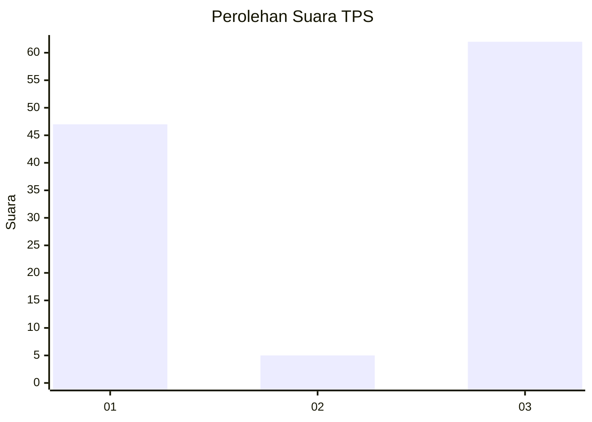
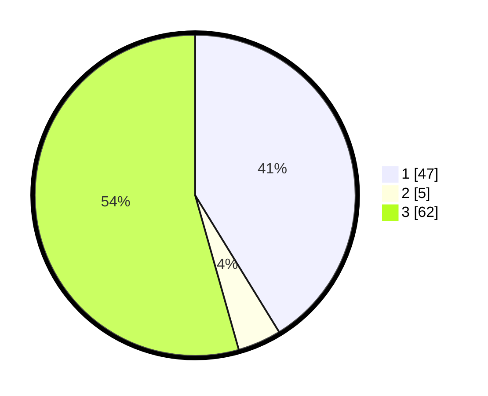

# Hasil

## Grafik

## Tabel

| No. | Nama Paslon    | Suara | Suara (raw) | Persentase |
|:--- |:-------------- | -----:| -----------:| ----------:|
| 1   | ANIES MUHAIMIN | 47    | [47][p-1]   | 41,23      |
| 2   | PRABOWO GIBRAN | 5     | [5][p-2]    | 4,39       |
| 3   | GANJAR MAHFUD  | 62    | [62][p-3]   | 54,39      |

[p-1]: https://github.com/gigit-pemilu/pemilu-2024-12-sumatera-utara/blob/main/pilpres/hitung-suara/sub/12-sumatera-utara/sub/08-simalungun/sub/23-bandar/sub/2007-perdagangan-ii/sub/013-tps/sub/paslon-1.txt
[p-2]: https://github.com/gigit-pemilu/pemilu-2024-12-sumatera-utara/blob/main/pilpres/hitung-suara/sub/12-sumatera-utara/sub/08-simalungun/sub/23-bandar/sub/2007-perdagangan-ii/sub/013-tps/sub/paslon-2.txt
[p-3]: https://github.com/gigit-pemilu/pemilu-2024-12-sumatera-utara/blob/main/pilpres/hitung-suara/sub/12-sumatera-utara/sub/08-simalungun/sub/23-bandar/sub/2007-perdagangan-ii/sub/013-tps/sub/paslon-3.txt

## Foto C Plano

https://sirekap-obj-formc.kpu.go.id/cfd6/pemilu/ppwp/12/08/23/20/07/1208232007013-20240219-153654--260a4fd8-2e86-4b89-839d-ecafc99a39d3.jpg

https://sirekap-obj-formc.kpu.go.id/cfd6/pemilu/ppwp/12/08/23/20/07/1208232007013-20240219-153321--8a8b25ba-854f-45fd-980c-fa97f50128e9.jpg

https://sirekap-obj-formc.kpu.go.id/cfd6/pemilu/ppwp/12/08/23/20/07/1208232007013-20240219-153537--3c8a112b-3399-48aa-b7c6-aa1d10a0286d.jpg

## Metadata

| Key        | Value               |
| ---------- | ------------------- |
| Time Stamp | 2024-02-25 22:00:00 |

