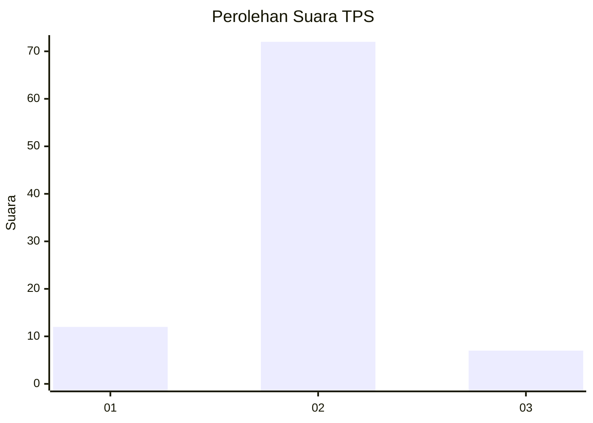
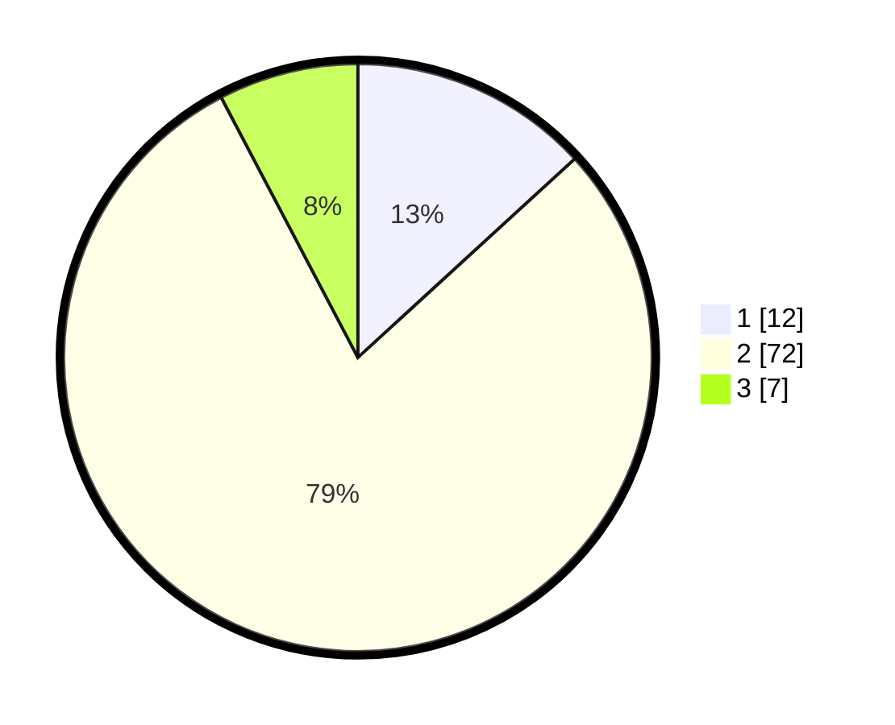

# Hasil

## Grafik

## Tabel

| No. | Nama Paslon    | Suara | Suara (raw) | Persentase |
|:--- |:-------------- | -----:| -----------:| ----------:|
| 1   | ANIES MUHAIMIN | 12    | [12][p-1]   | 13,19      |
| 2   | PRABOWO GIBRAN | 72    | [72][p-2]   | 79,12      |
| 3   | GANJAR MAHFUD  | 7     | [7][p-3]    | 7,69       |

[p-1]: https://github.com/gigit-pemilu/pemilu-2024/blob/main/pilpres/hitung-suara/sub/12-sumatera-utara/sub/08-simalungun/sub/23-bandar/sub/2013-sidotani/sub/012-tps/sub/paslon-1.txt
[p-2]: https://github.com/gigit-pemilu/pemilu-2024/blob/main/pilpres/hitung-suara/sub/12-sumatera-utara/sub/08-simalungun/sub/23-bandar/sub/2013-sidotani/sub/012-tps/sub/paslon-2.txt
[p-3]: https://github.com/gigit-pemilu/pemilu-2024/blob/main/pilpres/hitung-suara/sub/12-sumatera-utara/sub/08-simalungun/sub/23-bandar/sub/2013-sidotani/sub/012-tps/sub/paslon-3.txt

## Foto C Plano

https://sirekap-obj-formc.kpu.go.id/ce1b/pemilu/ppwp/12/08/23/20/13/1208232013012-20240219-101022--a8a68d0f-f0f1-4d3a-9380-5c5198de4a10.jpg

https://sirekap-obj-formc.kpu.go.id/ce1b/pemilu/ppwp/12/08/23/20/13/1208232013012-20240219-082311--c7eba926-9aa3-40dc-944b-20d5292f5db6.jpg

https://sirekap-obj-formc.kpu.go.id/ce1b/pemilu/ppwp/12/08/23/20/13/1208232013012-20240219-082028--9571f47d-1843-48d7-b3c4-4bd7c0a08a15.jpg

## Metadata

| Key        | Value               |
| ---------- | ------------------- |
| Time Stamp | 2024-02-24 22:31:28 |

