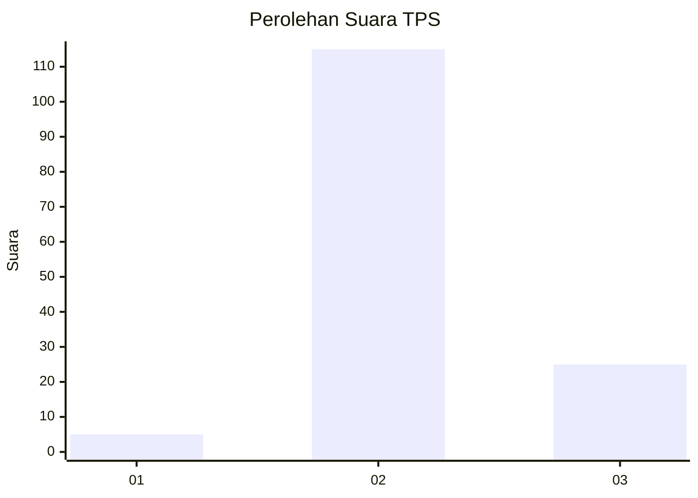

# Hasil

## Grafik

## Tabel

| No. | Nama Paslon    | Suara | Suara (raw) | Persentase |
|:--- |:-------------- | -----:| -----------:| ----------:|
| 1   | ANIES MUHAIMIN | 5     | [5][p-1]    | 3,45       |
| 2   | PRABOWO GIBRAN | 115   | [115][p-2]  | 79,31      |
| 3   | GANJAR MAHFUD  | 25    | [25][p-3]   | 17,24      |

[p-1]: https://github.com/gigit-pemilu/pemilu-2024/blob/main/pilpres/hitung-suara/sub/12-sumatera-utara/sub/08-simalungun/sub/25-silimakuta/sub/1012-saribu-dolok/sub/005-tps/sub/paslon-1.txt
[p-2]: https://github.com/gigit-pemilu/pemilu-2024/blob/main/pilpres/hitung-suara/sub/12-sumatera-utara/sub/08-simalungun/sub/25-silimakuta/sub/1012-saribu-dolok/sub/005-tps/sub/paslon-2.txt
[p-3]: https://github.com/gigit-pemilu/pemilu-2024/blob/main/pilpres/hitung-suara/sub/12-sumatera-utara/sub/08-simalungun/sub/25-silimakuta/sub/1012-saribu-dolok/sub/005-tps/sub/paslon-3.txt

## Foto C Plano

https://sirekap-obj-formc.kpu.go.id/06d6/pemilu/ppwp/12/08/25/10/12/1208251012005-20240215-152051--46177257-aacb-4756-adc1-1133d8266ef8.jpg

https://sirekap-obj-formc.kpu.go.id/06d6/pemilu/ppwp/12/08/25/10/12/1208251012005-20240215-152056--4066df78-4f42-40a4-9f81-ec1abf64832b.jpg

https://sirekap-obj-formc.kpu.go.id/06d6/pemilu/ppwp/12/08/25/10/12/1208251012005-20240215-152100--6fded526-0861-44c5-94fc-35222ec66f77.jpg

## Metadata

| Key        | Value               |
| ---------- | ------------------- |
| Time Stamp | 2024-02-25 14:00:00 |

