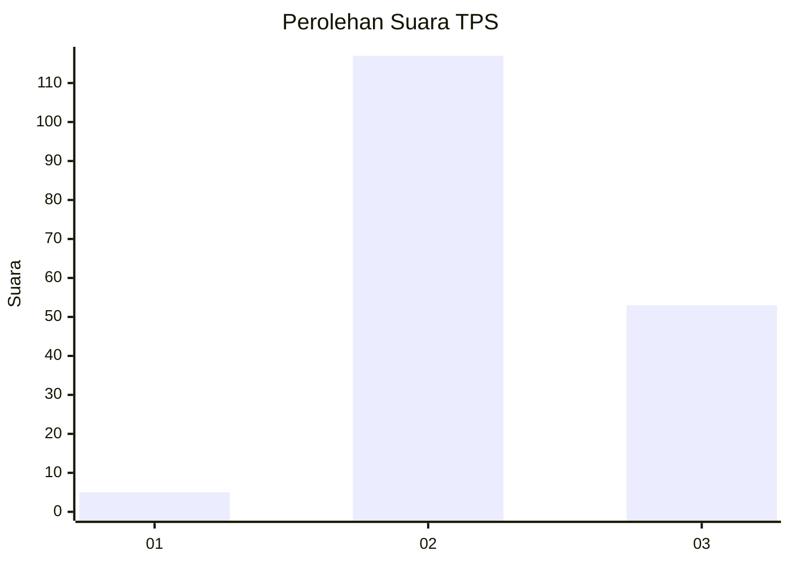

# Hasil

## Grafik

## Tabel

| No. | Nama Paslon    | Suara | Suara (raw) | Persentase |
|:--- |:-------------- | -----:| -----------:| ----------:|
| 1   | ANIES MUHAIMIN | 5     | [5][p-1]    | 2,86       |
| 2   | PRABOWO GIBRAN | 117   | [117][p-2]  | 66,86      |
| 3   | GANJAR MAHFUD  | 53    | [53][p-3]   | 30,29      |

[p-1]: https://github.com/gigit-pemilu/pemilu-2024/blob/main/pilpres/hitung-suara/sub/12-sumatera-utara/sub/08-simalungun/sub/25-silimakuta/sub/1012-saribu-dolok/sub/011-tps/sub/paslon-1.txt
[p-2]: https://github.com/gigit-pemilu/pemilu-2024/blob/main/pilpres/hitung-suara/sub/12-sumatera-utara/sub/08-simalungun/sub/25-silimakuta/sub/1012-saribu-dolok/sub/011-tps/sub/paslon-2.txt
[p-3]: https://github.com/gigit-pemilu/pemilu-2024/blob/main/pilpres/hitung-suara/sub/12-sumatera-utara/sub/08-simalungun/sub/25-silimakuta/sub/1012-saribu-dolok/sub/011-tps/sub/paslon-3.txt

## Foto C Plano

https://sirekap-obj-formc.kpu.go.id/a303/pemilu/ppwp/12/08/25/10/12/1208251012011-20240215-023609--5127c6ee-1901-40a9-b136-fa106de1e13e.jpg

https://sirekap-obj-formc.kpu.go.id/a303/pemilu/ppwp/12/08/25/10/12/1208251012011-20240215-023658--1b7f8442-3e7e-4ac9-8cd5-06b157fd25b4.jpg

https://sirekap-obj-formc.kpu.go.id/a303/pemilu/ppwp/12/08/25/10/12/1208251012011-20240215-023756--6680c403-2c30-4214-8e3f-30e5d53dc495.jpg

## Metadata

| Key        | Value               |
| ---------- | ------------------- |
| Time Stamp | 2024-02-24 22:31:28 |

