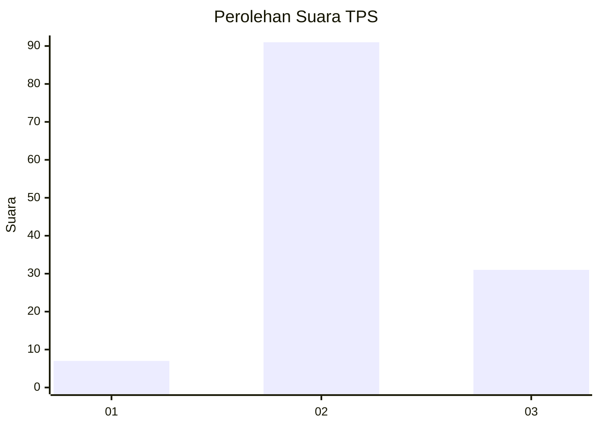
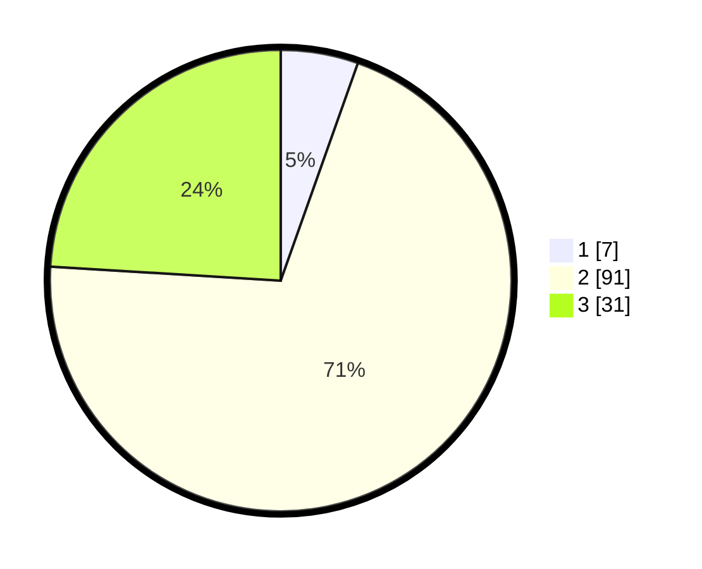

# Hasil

## Grafik

## Tabel

| No. | Nama Paslon    | Suara | Suara (raw) | Persentase |
|:--- |:-------------- | -----:| -----------:| ----------:|
| 1   | ANIES MUHAIMIN | 7     | [7][p-1]    | 5,43       |
| 2   | PRABOWO GIBRAN | 91    | [91][p-2]   | 70,54      |
| 3   | GANJAR MAHFUD  | 31    | [31][p-3]   | 24,03      |

[p-1]: https://github.com/gigit-pemilu/pemilu-2024-12-sumatera-utara/blob/main/pilpres/hitung-suara/sub/12-sumatera-utara/sub/08-simalungun/sub/25-silimakuta/sub/1012-saribu-dolok/sub/017-tps/sub/paslon-1.txt
[p-2]: https://github.com/gigit-pemilu/pemilu-2024-12-sumatera-utara/blob/main/pilpres/hitung-suara/sub/12-sumatera-utara/sub/08-simalungun/sub/25-silimakuta/sub/1012-saribu-dolok/sub/017-tps/sub/paslon-2.txt
[p-3]: https://github.com/gigit-pemilu/pemilu-2024-12-sumatera-utara/blob/main/pilpres/hitung-suara/sub/12-sumatera-utara/sub/08-simalungun/sub/25-silimakuta/sub/1012-saribu-dolok/sub/017-tps/sub/paslon-3.txt

## Foto C Plano

https://sirekap-obj-formc.kpu.go.id/79c4/pemilu/ppwp/12/08/25/10/12/1208251012017-20240215-120716--72396d00-b348-43c7-8076-74d7dd980844.jpg

https://sirekap-obj-formc.kpu.go.id/79c4/pemilu/ppwp/12/08/25/10/12/1208251012017-20240215-120721--1ec342db-5f1d-41e2-b295-6baf4043d45a.jpg

https://sirekap-obj-formc.kpu.go.id/79c4/pemilu/ppwp/12/08/25/10/12/1208251012017-20240215-120726--a6127941-10e3-4b32-8fa3-f3064f97a988.jpg

## Metadata

| Key        | Value               |
| ---------- | ------------------- |
| Time Stamp | 2024-02-24 22:31:28 |

