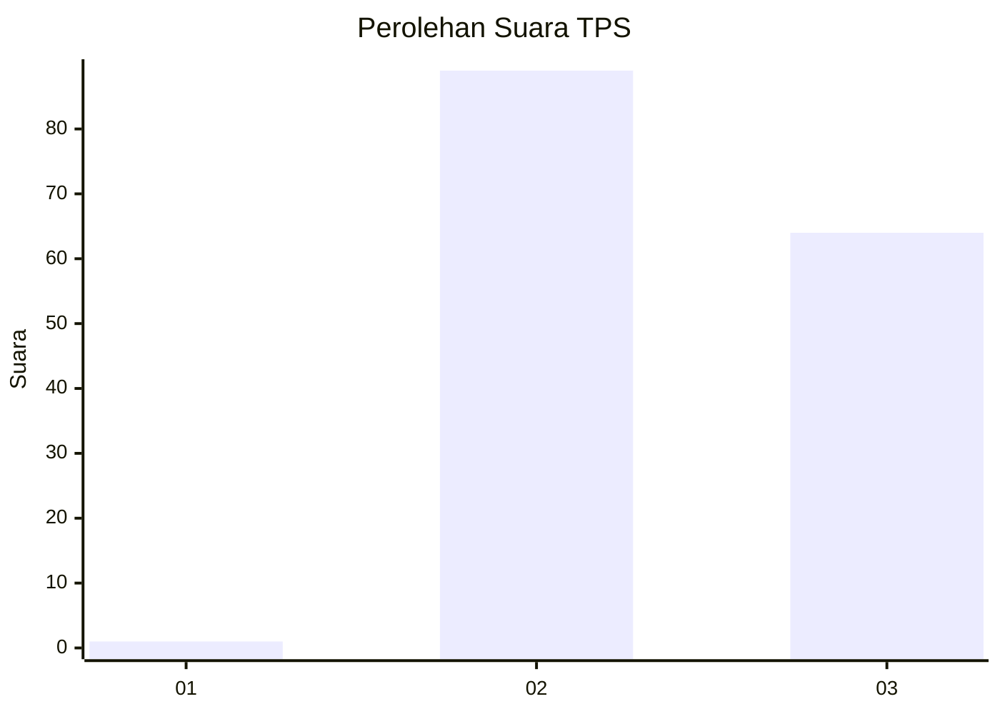
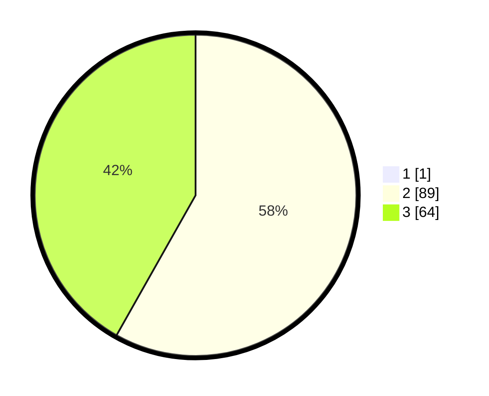

# Hasil

## Grafik

## Tabel

| No. | Nama Paslon    | Suara | Suara (raw) | Persentase |
|:--- |:-------------- | -----:| -----------:| ----------:|
| 1   | ANIES MUHAIMIN | 1     | [1][p-1]    | 0,65       |
| 2   | PRABOWO GIBRAN | 89    | [89][p-2]   | 57,79      |
| 3   | GANJAR MAHFUD  | 64    | [64][p-3]   | 41,56      |

[p-1]: https://github.com/gigit-pemilu/pemilu-2024/blob/main/pilpres/hitung-suara/sub/12-sumatera-utara/sub/08-simalungun/sub/25-silimakuta/sub/2003-bangun-mariah/sub/005-tps/sub/paslon-1.txt
[p-2]: https://github.com/gigit-pemilu/pemilu-2024/blob/main/pilpres/hitung-suara/sub/12-sumatera-utara/sub/08-simalungun/sub/25-silimakuta/sub/2003-bangun-mariah/sub/005-tps/sub/paslon-2.txt
[p-3]: https://github.com/gigit-pemilu/pemilu-2024/blob/main/pilpres/hitung-suara/sub/12-sumatera-utara/sub/08-simalungun/sub/25-silimakuta/sub/2003-bangun-mariah/sub/005-tps/sub/paslon-3.txt

## Foto C Plano

https://sirekap-obj-formc.kpu.go.id/e6b9/pemilu/ppwp/12/08/25/20/03/1208252003005-20240214-212417--4727dfef-8c14-46bd-af08-79b95747263f.jpg

https://sirekap-obj-formc.kpu.go.id/e6b9/pemilu/ppwp/12/08/25/20/03/1208252003005-20240214-212530--b5a90125-13ef-4ad5-82e2-5342c0aabfdc.jpg

https://sirekap-obj-formc.kpu.go.id/e6b9/pemilu/ppwp/12/08/25/20/03/1208252003005-20240214-212640--dedeb142-4127-4f1d-8e79-7c8fbbdcd396.jpg

## Metadata

| Key        | Value               |
| ---------- | ------------------- |
| Time Stamp | 2024-02-25 14:00:00 |

