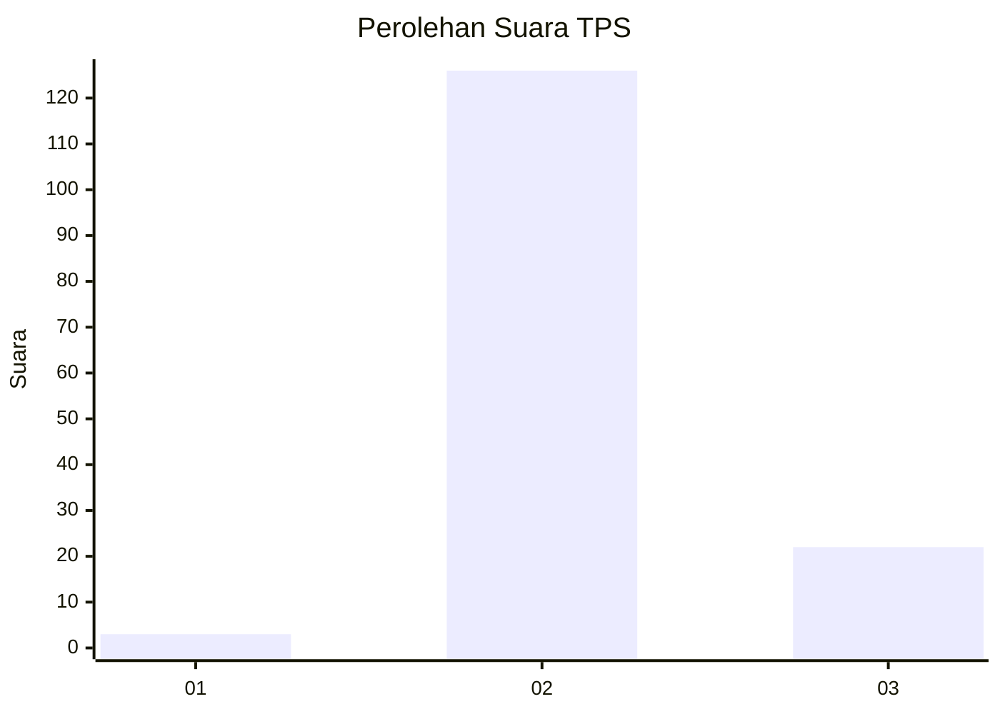
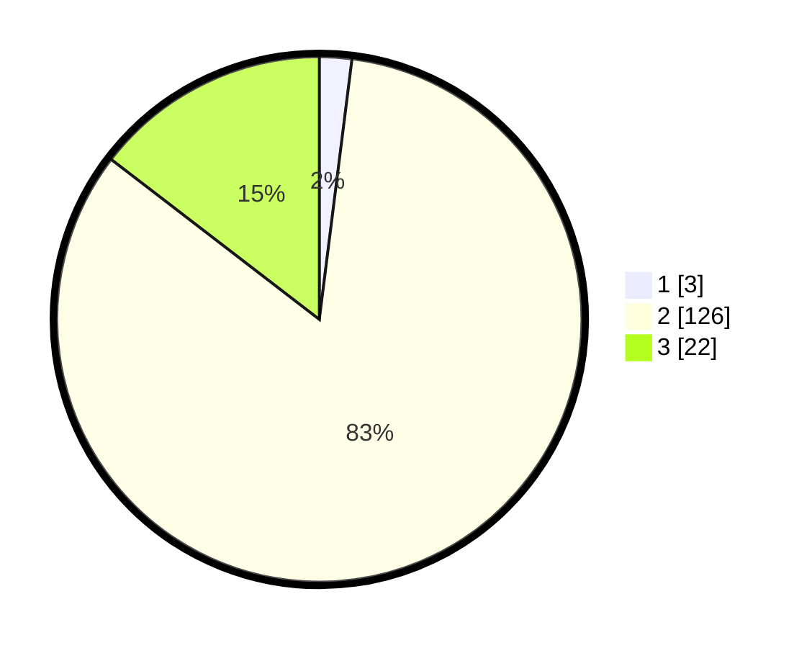

# Hasil

## Grafik

## Tabel

| No. | Nama Paslon    | Suara | Suara (raw) | Persentase |
|:--- |:-------------- | -----:| -----------:| ----------:|
| 1   | ANIES MUHAIMIN | 3     | [3][p-1]    | 1,99       |
| 2   | PRABOWO GIBRAN | 126   | [126][p-2]  | 83,44      |
| 3   | GANJAR MAHFUD  | 22    | [22][p-3]   | 14,57      |

[p-1]: https://github.com/gigit-pemilu/pemilu-2024/blob/main/pilpres/hitung-suara/sub/12-sumatera-utara/sub/08-simalungun/sub/26-dolok-silou/sub/2001-cingkes/sub/005-tps/sub/paslon-1.txt
[p-2]: https://github.com/gigit-pemilu/pemilu-2024/blob/main/pilpres/hitung-suara/sub/12-sumatera-utara/sub/08-simalungun/sub/26-dolok-silou/sub/2001-cingkes/sub/005-tps/sub/paslon-2.txt
[p-3]: https://github.com/gigit-pemilu/pemilu-2024/blob/main/pilpres/hitung-suara/sub/12-sumatera-utara/sub/08-simalungun/sub/26-dolok-silou/sub/2001-cingkes/sub/005-tps/sub/paslon-3.txt

## Foto C Plano

https://sirekap-obj-formc.kpu.go.id/7ece/pemilu/ppwp/12/08/26/20/01/1208262001005-20240214-195514--30311932-d6f0-4213-bdc9-6ef5f5e51dbb.jpg

https://sirekap-obj-formc.kpu.go.id/7ece/pemilu/ppwp/12/08/26/20/01/1208262001005-20240214-195519--d9bab325-2c30-4a07-9480-740c9fdeabe9.jpg

https://sirekap-obj-formc.kpu.go.id/7ece/pemilu/ppwp/12/08/26/20/01/1208262001005-20240214-195522--2d8707b2-f828-42e1-bbdb-66f4cd9e1c05.jpg

## Metadata

| Key        | Value               |
| ---------- | ------------------- |
| Time Stamp | 2024-02-15 04:00:24 |

