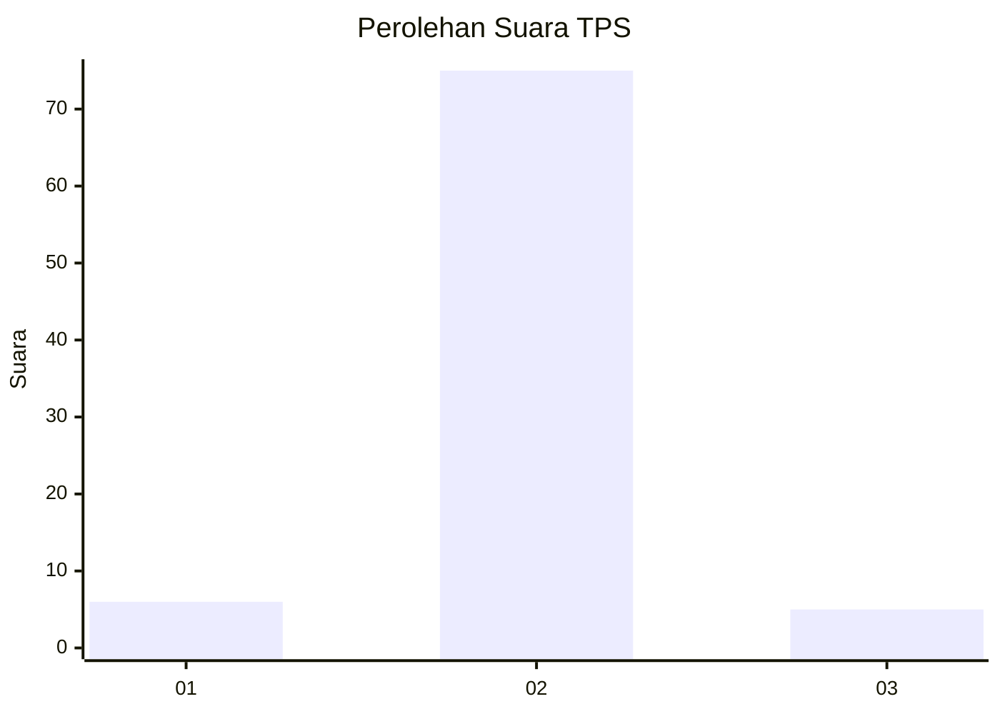
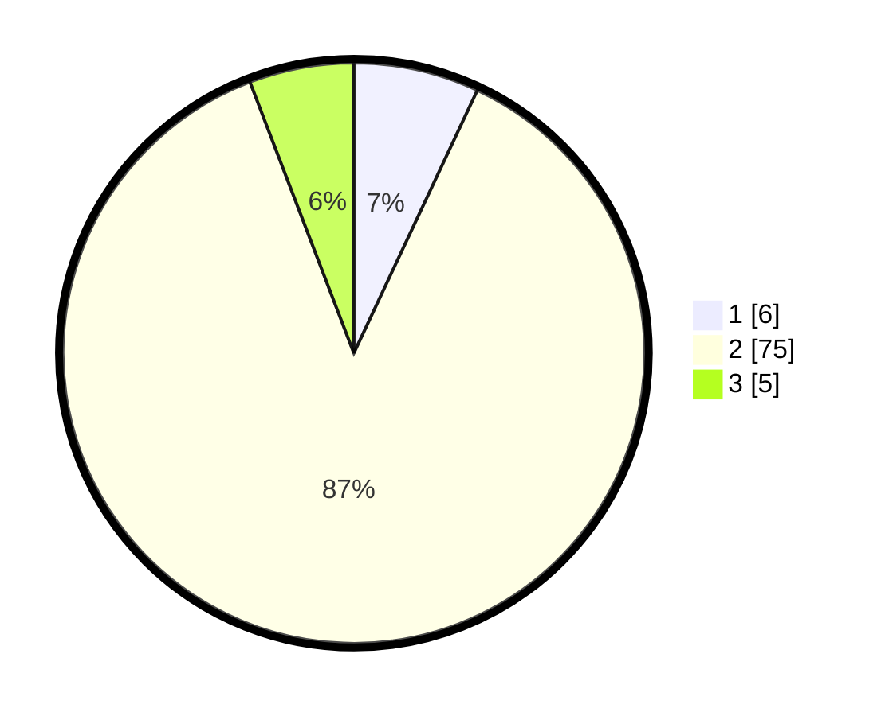

# Hasil

## Grafik

## Tabel

| No. | Nama Paslon    | Suara | Suara (raw) | Persentase |
|:--- |:-------------- | -----:| -----------:| ----------:|
| 1   | ANIES MUHAIMIN | 6     | [6][p-1]    | 6,98       |
| 2   | PRABOWO GIBRAN | 75    | [75][p-2]   | 87,21      |
| 3   | GANJAR MAHFUD  | 5     | [5][p-3]    | 5,81       |

[p-1]: https://github.com/gigit-pemilu/pemilu-2024-12-sumatera-utara/blob/main/pilpres/hitung-suara/sub/12-sumatera-utara/sub/08-simalungun/sub/27-silou-kahean/sub/2004-bandar-maruhur/sub/005-tps/sub/paslon-1.txt
[p-2]: https://github.com/gigit-pemilu/pemilu-2024-12-sumatera-utara/blob/main/pilpres/hitung-suara/sub/12-sumatera-utara/sub/08-simalungun/sub/27-silou-kahean/sub/2004-bandar-maruhur/sub/005-tps/sub/paslon-2.txt
[p-3]: https://github.com/gigit-pemilu/pemilu-2024-12-sumatera-utara/blob/main/pilpres/hitung-suara/sub/12-sumatera-utara/sub/08-simalungun/sub/27-silou-kahean/sub/2004-bandar-maruhur/sub/005-tps/sub/paslon-3.txt

## Foto C Plano

https://sirekap-obj-formc.kpu.go.id/9edd/pemilu/ppwp/12/08/27/20/04/1208272004005-20240215-100810--3617259e-74c4-4ead-8c41-e5f83bf9aa22.jpg

https://sirekap-obj-formc.kpu.go.id/9edd/pemilu/ppwp/12/08/27/20/04/1208272004005-20240215-101156--a260e177-2ec5-45c9-9edc-1d59e2f37cbe.jpg

https://sirekap-obj-formc.kpu.go.id/9edd/pemilu/ppwp/12/08/27/20/04/1208272004005-20240215-101312--2d63fc5f-3cfa-4143-9755-25e1b4bb8c3a.jpg

## Metadata

| Key        | Value               |
| ---------- | ------------------- |
| Time Stamp | 2024-02-25 16:00:00 |

