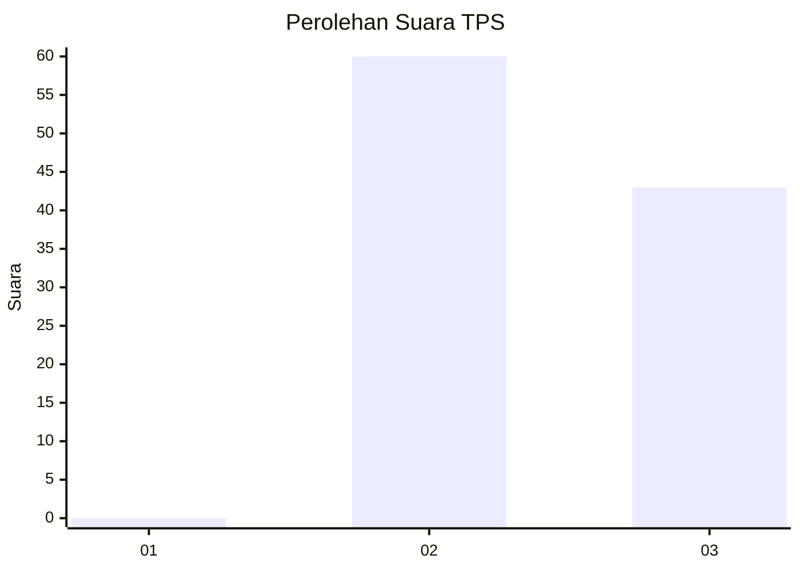
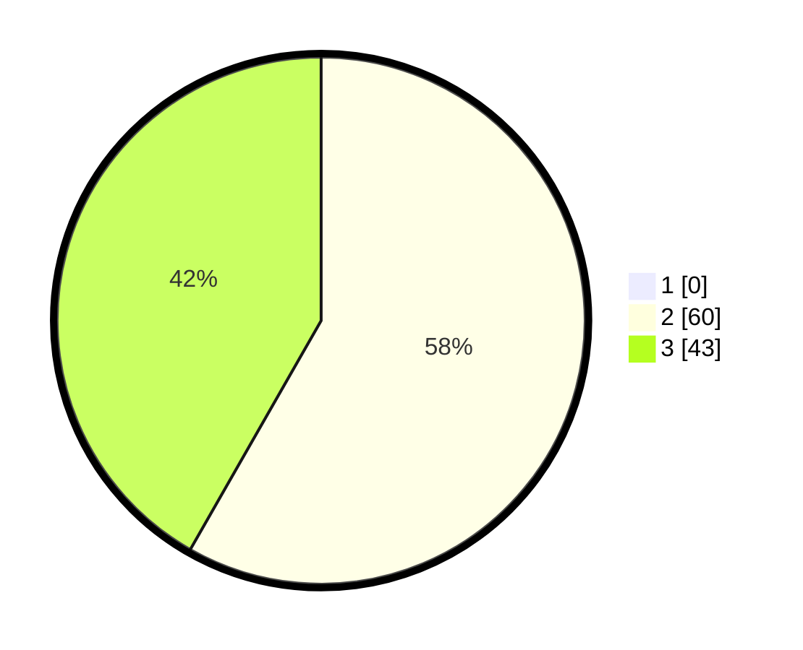

# Hasil

## Grafik

## Tabel

| No. | Nama Paslon    | Suara | Suara (raw) | Persentase |
|:--- |:-------------- | -----:| -----------:| ----------:|
| 1   | ANIES MUHAIMIN | 0     | [0][p-1]    | 0,00       |
| 2   | PRABOWO GIBRAN | 60    | [60][p-2]   | 58,25      |
| 3   | GANJAR MAHFUD  | 43    | [43][p-3]   | 41,75      |

[p-1]: https://github.com/gigit-pemilu/pemilu-2024-12-sumatera-utara/blob/main/pilpres/hitung-suara/sub/12-sumatera-utara/sub/08-simalungun/sub/27-silou-kahean/sub/2015-sinasih/sub/003-tps/sub/paslon-1.txt
[p-2]: https://github.com/gigit-pemilu/pemilu-2024-12-sumatera-utara/blob/main/pilpres/hitung-suara/sub/12-sumatera-utara/sub/08-simalungun/sub/27-silou-kahean/sub/2015-sinasih/sub/003-tps/sub/paslon-2.txt
[p-3]: https://github.com/gigit-pemilu/pemilu-2024-12-sumatera-utara/blob/main/pilpres/hitung-suara/sub/12-sumatera-utara/sub/08-simalungun/sub/27-silou-kahean/sub/2015-sinasih/sub/003-tps/sub/paslon-3.txt

## Foto C Plano

https://sirekap-obj-formc.kpu.go.id/2eea/pemilu/ppwp/12/08/27/20/15/1208272015003-20240215-010555--fcf8a22c-7147-4517-bc12-9a5b56887125.jpg

https://sirekap-obj-formc.kpu.go.id/2eea/pemilu/ppwp/12/08/27/20/15/1208272015003-20240214-193432--a7ad1e62-8e83-4152-8e7c-5693a4ec1027.jpg

https://sirekap-obj-formc.kpu.go.id/2eea/pemilu/ppwp/12/08/27/20/15/1208272015003-20240215-010649--897079f0-1962-4420-a40f-cf323c655c12.jpg

## Metadata

| Key        | Value               |
| ---------- | ------------------- |
| Time Stamp | 2024-02-25 11:00:00 |

