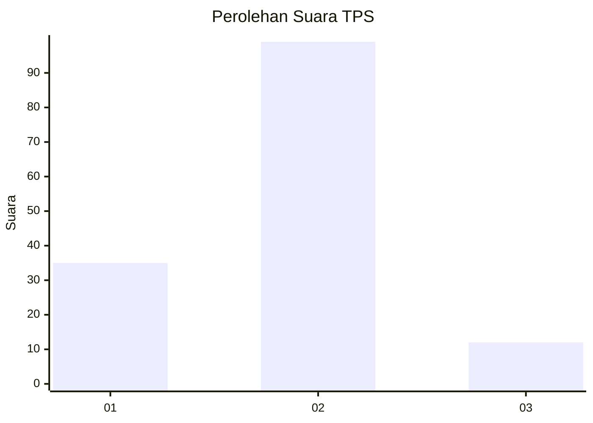
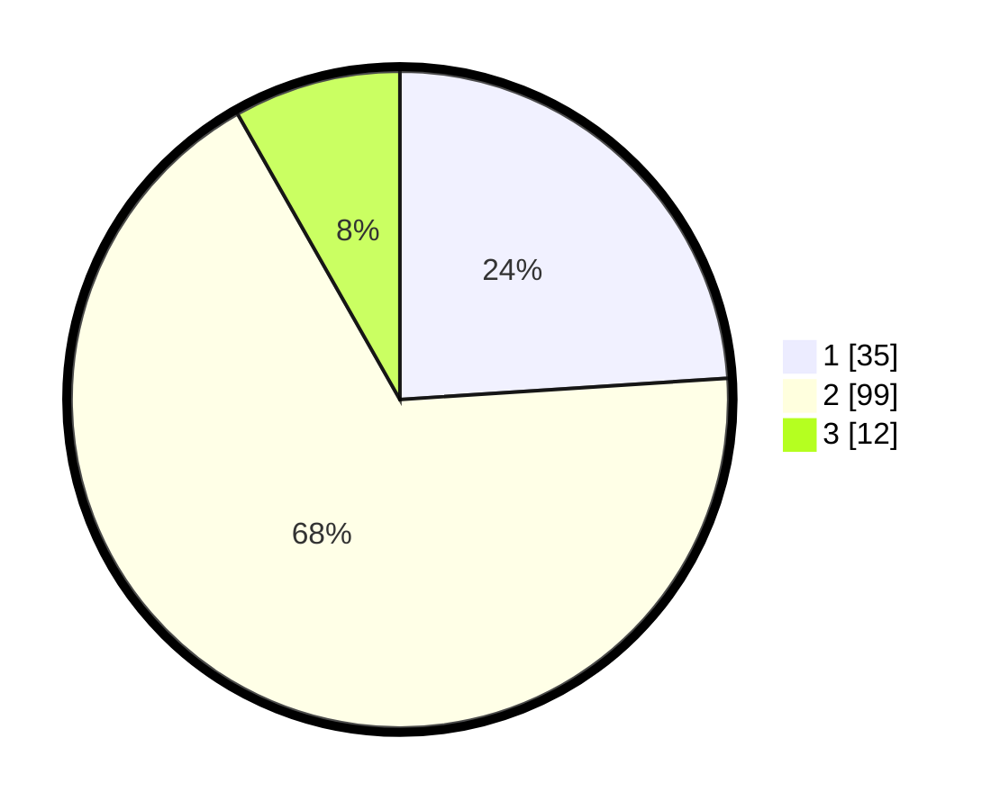

# Hasil

## Grafik

## Tabel

| No. | Nama Paslon    | Suara | Suara (raw) | Persentase |
|:--- |:-------------- | -----:| -----------:| ----------:|
| 1   | ANIES MUHAIMIN | 35    | [35][p-1]   | 23,97      |
| 2   | PRABOWO GIBRAN | 99    | [99][p-2]   | 67,81      |
| 3   | GANJAR MAHFUD  | 12    | [12][p-3]   | 8,22       |

[p-1]: https://github.com/gigit-pemilu/pemilu-2024-12-sumatera-utara/blob/main/pilpres/hitung-suara/sub/12-sumatera-utara/sub/08-simalungun/sub/28-tapian-dolok/sub/1009-sinaksak/sub/007-tps/sub/paslon-1.txt
[p-2]: https://github.com/gigit-pemilu/pemilu-2024-12-sumatera-utara/blob/main/pilpres/hitung-suara/sub/12-sumatera-utara/sub/08-simalungun/sub/28-tapian-dolok/sub/1009-sinaksak/sub/007-tps/sub/paslon-2.txt
[p-3]: https://github.com/gigit-pemilu/pemilu-2024-12-sumatera-utara/blob/main/pilpres/hitung-suara/sub/12-sumatera-utara/sub/08-simalungun/sub/28-tapian-dolok/sub/1009-sinaksak/sub/007-tps/sub/paslon-3.txt

## Foto C Plano

https://sirekap-obj-formc.kpu.go.id/aef5/pemilu/ppwp/12/08/28/10/09/1208281009007-20240214-224028--9c4c0662-dcfa-442a-9db3-ad00aad38688.jpg

https://sirekap-obj-formc.kpu.go.id/aef5/pemilu/ppwp/12/08/28/10/09/1208281009007-20240214-224210--c78b8b9e-9dc0-4850-8cb5-2188ab1080ca.jpg

https://sirekap-obj-formc.kpu.go.id/aef5/pemilu/ppwp/12/08/28/10/09/1208281009007-20240214-224419--9ca5d1a6-248a-44e8-9b4c-5699de2fb9fd.jpg

## Metadata

| Key        | Value               |
| ---------- | ------------------- |
| Time Stamp | 2024-02-24 22:31:28 |

