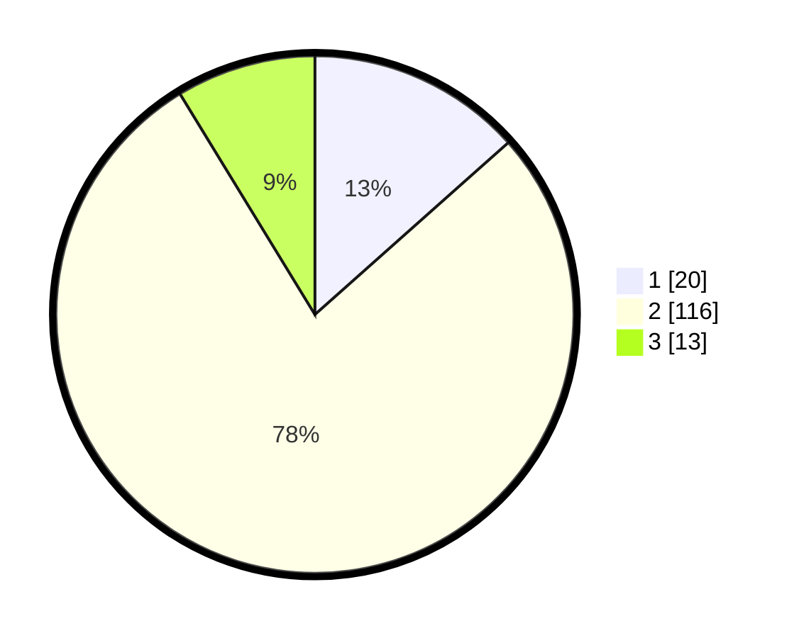

# Hasil

## Grafik

## Tabel

| No. | Nama Paslon    | Suara | Suara (raw) | Persentase |
|:--- |:-------------- | -----:| -----------:| ----------:|
| 1   | ANIES MUHAIMIN | 20    | [20][p-1]   | 13,42      |
| 2   | PRABOWO GIBRAN | 116   | [116][p-2]  | 77,85      |
| 3   | GANJAR MAHFUD  | 13    | [13][p-3]   | 8,72       |

[p-1]: https://github.com/gigit-pemilu/pemilu-2024/blob/main/pilpres/hitung-suara/sub/12-sumatera-utara/sub/08-simalungun/sub/28-tapian-dolok/sub/1009-sinaksak/sub/010-tps/sub/paslon-1.txt
[p-2]: https://github.com/gigit-pemilu/pemilu-2024/blob/main/pilpres/hitung-suara/sub/12-sumatera-utara/sub/08-simalungun/sub/28-tapian-dolok/sub/1009-sinaksak/sub/010-tps/sub/paslon-2.txt
[p-3]: https://github.com/gigit-pemilu/pemilu-2024/blob/main/pilpres/hitung-suara/sub/12-sumatera-utara/sub/08-simalungun/sub/28-tapian-dolok/sub/1009-sinaksak/sub/010-tps/sub/paslon-3.txt

## Foto C Plano

https://sirekap-obj-formc.kpu.go.id/5ebd/pemilu/ppwp/12/08/28/10/09/1208281009010-20240214-233713--849b81c5-bbed-494b-b5b8-4c106fc6c92e.jpg

https://sirekap-obj-formc.kpu.go.id/5ebd/pemilu/ppwp/12/08/28/10/09/1208281009010-20240214-230815--7ee0eeea-2328-403e-92a2-ac12e239f3c5.jpg

https://sirekap-obj-formc.kpu.go.id/5ebd/pemilu/ppwp/12/08/28/10/09/1208281009010-20240214-231107--175743e7-75b4-4d36-ad1a-8fbec3d5331e.jpg

## Metadata

| Key        | Value               |
| ---------- | ------------------- |
| Time Stamp | 2024-02-17 13:37:34 |

