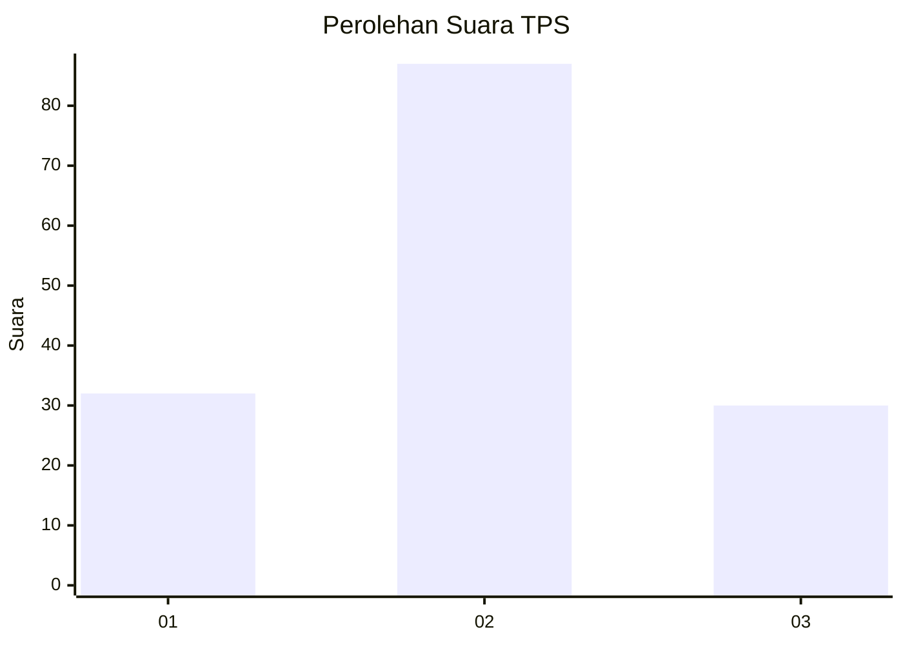
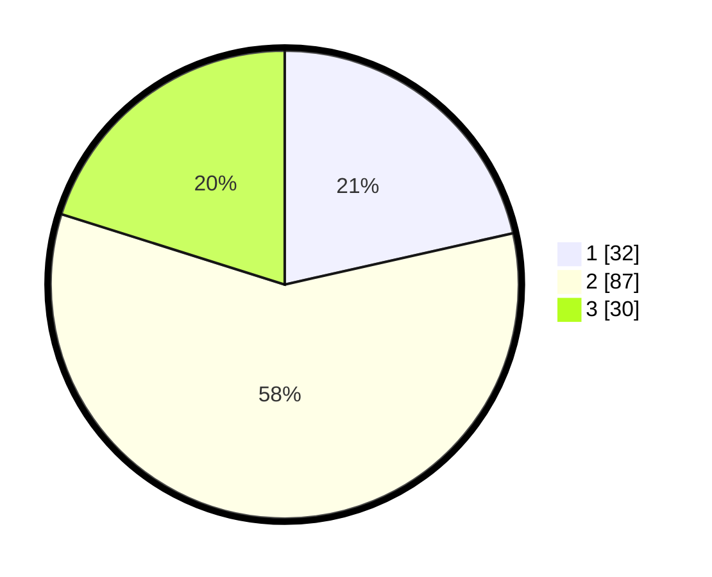

# Hasil

## Grafik

## Tabel

| No. | Nama Paslon    | Suara | Suara (raw) | Persentase |
|:--- |:-------------- | -----:| -----------:| ----------:|
| 1   | ANIES MUHAIMIN | 32    | [32][p-1]   | 21,48      |
| 2   | PRABOWO GIBRAN | 87    | [87][p-2]   | 58,39      |
| 3   | GANJAR MAHFUD  | 30    | [30][p-3]   | 20,13      |

[p-1]: https://github.com/gigit-pemilu/pemilu-2024/blob/main/pilpres/hitung-suara/sub/12-sumatera-utara/sub/08-simalungun/sub/28-tapian-dolok/sub/2010-negeri-bayu-muslimin/sub/006-tps/sub/paslon-1.txt
[p-2]: https://github.com/gigit-pemilu/pemilu-2024/blob/main/pilpres/hitung-suara/sub/12-sumatera-utara/sub/08-simalungun/sub/28-tapian-dolok/sub/2010-negeri-bayu-muslimin/sub/006-tps/sub/paslon-2.txt
[p-3]: https://github.com/gigit-pemilu/pemilu-2024/blob/main/pilpres/hitung-suara/sub/12-sumatera-utara/sub/08-simalungun/sub/28-tapian-dolok/sub/2010-negeri-bayu-muslimin/sub/006-tps/sub/paslon-3.txt

## Foto C Plano

https://sirekap-obj-formc.kpu.go.id/e355/pemilu/ppwp/12/08/28/20/10/1208282010006-20240214-141720--e55a4a20-35b6-46de-862e-f7ac1e2a1be5.jpg

https://sirekap-obj-formc.kpu.go.id/e355/pemilu/ppwp/12/08/28/20/10/1208282010006-20240215-002058--deecf7bb-db11-4663-a45b-8f934e62499e.jpg

https://sirekap-obj-formc.kpu.go.id/e355/pemilu/ppwp/12/08/28/20/10/1208282010006-20240215-004540--7c9b1f1e-6234-4796-9a1c-47b16ae326e4.jpg

## Metadata

| Key        | Value               |
| ---------- | ------------------- |
| Time Stamp | 2024-02-17 13:37:34 |

