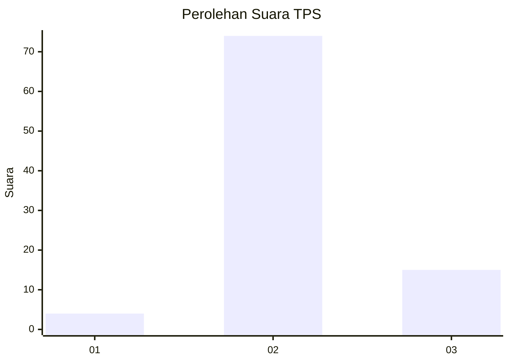
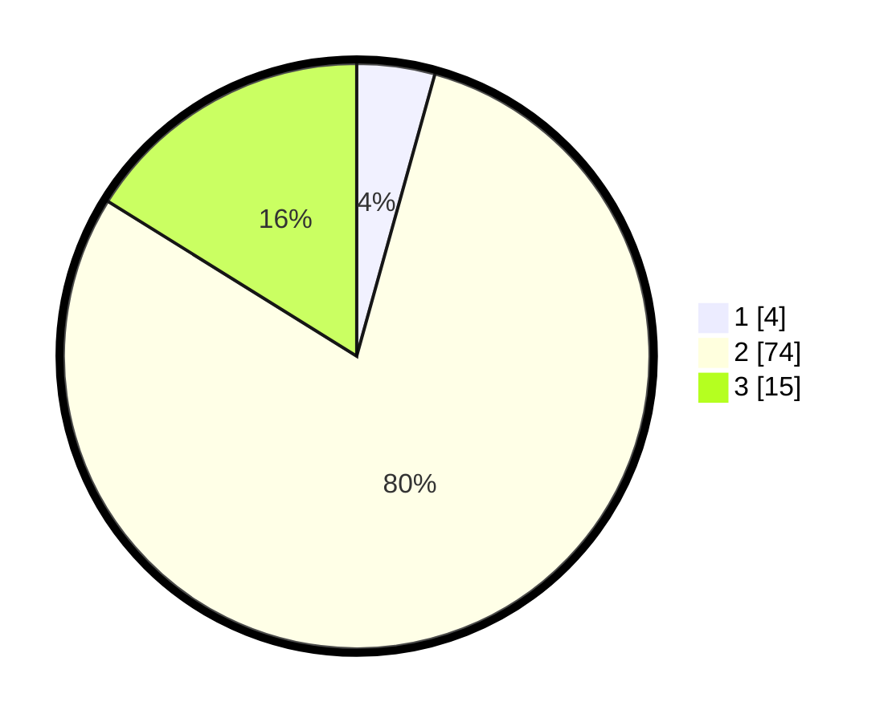

# Hasil

## Grafik

## Tabel

| No. | Nama Paslon    | Suara | Suara (raw) | Persentase |
|:--- |:-------------- | -----:| -----------:| ----------:|
| 1   | ANIES MUHAIMIN | 4     | [4][p-1]    | 4,30       |
| 2   | PRABOWO GIBRAN | 74    | [74][p-2]   | 79,57      |
| 3   | GANJAR MAHFUD  | 15    | [15][p-3]   | 16,13      |

[p-1]: https://github.com/gigit-pemilu/pemilu-2024/blob/main/pilpres/hitung-suara/sub/12-sumatera-utara/sub/08-simalungun/sub/29-raya/sub/1011-pamatang-raya/sub/014-tps/sub/paslon-1.txt
[p-2]: https://github.com/gigit-pemilu/pemilu-2024/blob/main/pilpres/hitung-suara/sub/12-sumatera-utara/sub/08-simalungun/sub/29-raya/sub/1011-pamatang-raya/sub/014-tps/sub/paslon-2.txt
[p-3]: https://github.com/gigit-pemilu/pemilu-2024/blob/main/pilpres/hitung-suara/sub/12-sumatera-utara/sub/08-simalungun/sub/29-raya/sub/1011-pamatang-raya/sub/014-tps/sub/paslon-3.txt

## Foto C Plano

https://sirekap-obj-formc.kpu.go.id/2354/pemilu/ppwp/12/08/29/10/11/1208291011014-20240214-141759--8c2dd851-b65b-41b1-a815-48206aabc9ce.jpg

https://sirekap-obj-formc.kpu.go.id/2354/pemilu/ppwp/12/08/29/10/11/1208291011014-20240214-141833--802c666c-871e-4a17-97c0-a0a8b18ea5c7.jpg

https://sirekap-obj-formc.kpu.go.id/2354/pemilu/ppwp/12/08/29/10/11/1208291011014-20240214-141908--40bed432-4781-4550-b1e5-7debaa588246.jpg

## Metadata

| Key        | Value               |
| ---------- | ------------------- |
| Time Stamp | 2024-02-24 22:31:28 |

