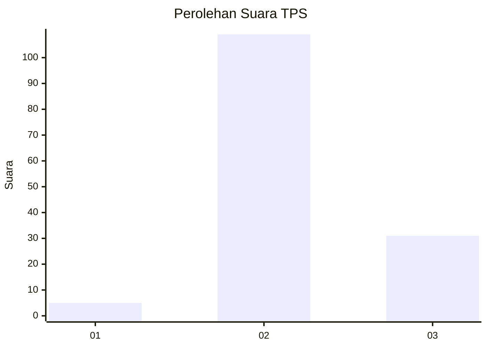

# Hasil

## Grafik

## Tabel

| No. | Nama Paslon    | Suara | Suara (raw) | Persentase |
|:--- |:-------------- | -----:| -----------:| ----------:|
| 1   | ANIES MUHAIMIN | 5     | [5][p-1]    | 3,45       |
| 2   | PRABOWO GIBRAN | 109   | [109][p-2]  | 75,17      |
| 3   | GANJAR MAHFUD  | 31    | [31][p-3]   | 21,38      |

[p-1]: https://github.com/gigit-pemilu/pemilu-2024/blob/main/pilpres/hitung-suara/sub/12-sumatera-utara/sub/08-simalungun/sub/29-raya/sub/2014-silou-huluan/sub/002-tps/sub/paslon-1.txt
[p-2]: https://github.com/gigit-pemilu/pemilu-2024/blob/main/pilpres/hitung-suara/sub/12-sumatera-utara/sub/08-simalungun/sub/29-raya/sub/2014-silou-huluan/sub/002-tps/sub/paslon-2.txt
[p-3]: https://github.com/gigit-pemilu/pemilu-2024/blob/main/pilpres/hitung-suara/sub/12-sumatera-utara/sub/08-simalungun/sub/29-raya/sub/2014-silou-huluan/sub/002-tps/sub/paslon-3.txt

## Foto C Plano

https://sirekap-obj-formc.kpu.go.id/7496/pemilu/ppwp/12/08/29/20/14/1208292014002-20240215-091705--a1ced0fe-71c6-4964-adcd-942abbf54bb7.jpg

https://sirekap-obj-formc.kpu.go.id/7496/pemilu/ppwp/12/08/29/20/14/1208292014002-20240215-091713--dd6ec226-799f-495f-aaaa-81d529a20f54.jpg

https://sirekap-obj-formc.kpu.go.id/7496/pemilu/ppwp/12/08/29/20/14/1208292014002-20240215-091725--e40577df-f7aa-4dff-8864-88e7c8e9cab8.jpg

## Metadata

| Key        | Value               |
| ---------- | ------------------- |
| Time Stamp | 2024-02-25 18:00:00 |

