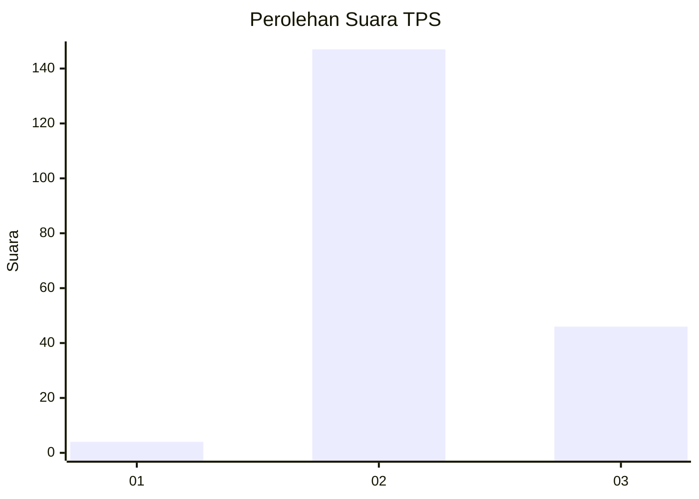
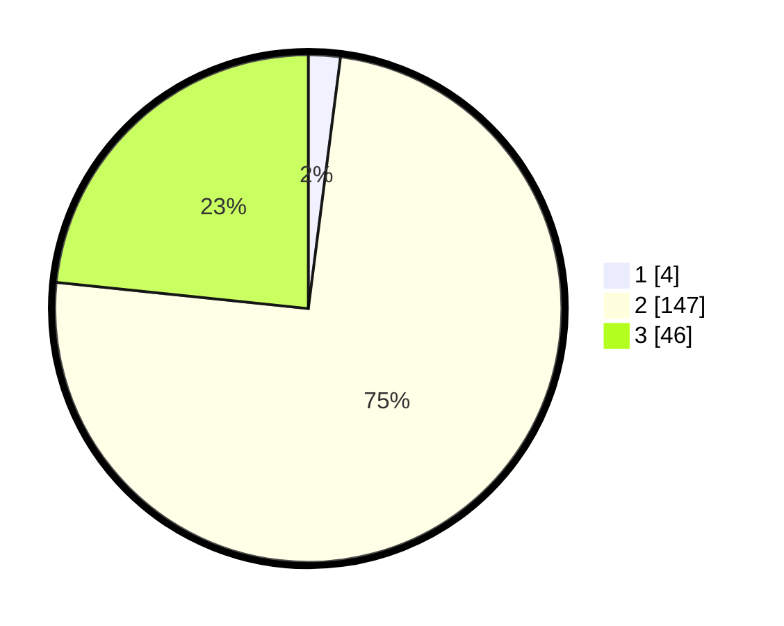

# Hasil

## Grafik

## Tabel

| No. | Nama Paslon    | Suara | Suara (raw) | Persentase |
|:--- |:-------------- | -----:| -----------:| ----------:|
| 1   | ANIES MUHAIMIN | 4     | [4][p-1]    | 2,03       |
| 2   | PRABOWO GIBRAN | 147   | [147][p-2]  | 74,62      |
| 3   | GANJAR MAHFUD  | 46    | [46][p-3]   | 23,35      |

[p-1]: https://github.com/gigit-pemilu/pemilu-2024/blob/main/pilpres/hitung-suara/sub/12-sumatera-utara/sub/08-simalungun/sub/29-raya/sub/2015-silou-buttu/sub/002-tps/sub/paslon-1.txt
[p-2]: https://github.com/gigit-pemilu/pemilu-2024/blob/main/pilpres/hitung-suara/sub/12-sumatera-utara/sub/08-simalungun/sub/29-raya/sub/2015-silou-buttu/sub/002-tps/sub/paslon-2.txt
[p-3]: https://github.com/gigit-pemilu/pemilu-2024/blob/main/pilpres/hitung-suara/sub/12-sumatera-utara/sub/08-simalungun/sub/29-raya/sub/2015-silou-buttu/sub/002-tps/sub/paslon-3.txt

## Foto C Plano

https://sirekap-obj-formc.kpu.go.id/adad/pemilu/ppwp/12/08/29/20/15/1208292015002-20240215-062100--6506ee05-4677-42c9-8ec2-427b8322db42.jpg

https://sirekap-obj-formc.kpu.go.id/adad/pemilu/ppwp/12/08/29/20/15/1208292015002-20240215-065740--fec98b8f-5180-43a6-a657-a3fe7402f78b.jpg

https://sirekap-obj-formc.kpu.go.id/adad/pemilu/ppwp/12/08/29/20/15/1208292015002-20240215-055817--96889b3c-e3b5-4018-b8d3-bc86e93d25c3.jpg

## Metadata

| Key        | Value               |
| ---------- | ------------------- |
| Time Stamp | 2024-02-25 18:00:00 |

